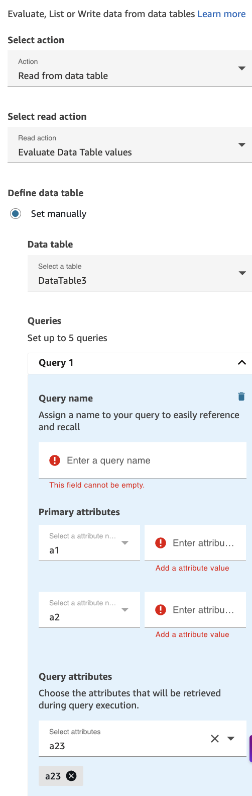
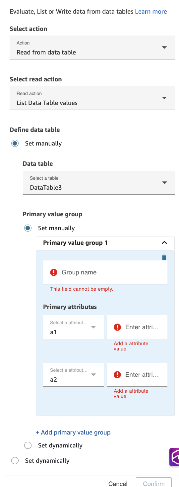
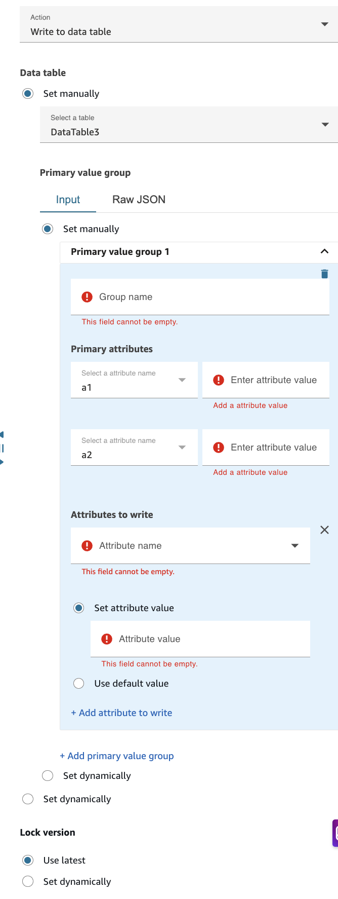

# Flow block in Amazon Connect: Data Table

## Description

The Data Table block in Amazon Connect enables you to evaluate, list, or write data from data tables within your contact flows. This block facilitates dynamic decision-making, personalized customer experiences, and data management by interacting with structured data stored in your Amazon Connect data tables.

## Use cases

Data Table blocks are useful for:

- **Configuration retrieval** – Access business rules, routing parameters, or operational settings stored in data tables.
- **Dynamic routing decisions** – Query data tables to determine the appropriate queue, agent, or flow path based on customer attributes.
- **Status checks** – Verify account status, eligibility, or other conditions before proceeding with specific actions.

## Supported channels

The following table lists how this block routes a contact who is using the specified channel.

| Channel | Supported? |
| ------- | ---------- |
| Voice   | Yes        |
| Chat    | Yes        |
| Task    | Yes        |
| Email   | Yes        |

## Flow types

You can use this block in the following [flow
types](create-contact-flow.md#contact-flow-types "create-contact-flow.md#contact-flow-types"):

- All flows

## Configuration overview

### Select action

Choose the type of operation you want to perform:

- Read from data table – Query or retrieve data (Evaluate or List actions)
- Write to data table – Create new records or update existing records

### Define data table

- Choose **Set manually** to directly select a data table
- Select your target data table from the dropdown
- Important: Once you select a specific data table, the interface automatically populates the available attributes from that table in the relevant configuration sections

## Evaluate Data Table values

Use the Evaluate action to query data tables and retrieve specific attribute values based on defined criteria.

The following image shows the **Properties** page of the **Data Table** block configured to evaluate data table values.

### Configuration steps

1. Select **Read from data table** as the Action.
2. Select **Evaluate Data Table values** from the read action dropdown.
3. Configure Queries:
   - You can set up to 5 queries per Data Table block. At least one query is required for each Evaluate Data Table block.
   - For each query:
     - **Query Name (Required)** – Provide a descriptive name for the query. Important: Query names must be unique throughout the entire flow, not just within this specific block.
     - **Primary Attributes** – When you manually select a data table, the UI automatically populates the list of primary attributes from that table's schema. All primary attribute fields are required - you must provide values for each primary attribute displayed. These attributes act as filters to identify the specific row(s) in your data table.
     - **Query Attributes** – When you manually select a data table, the dropdown is automatically populated with all available attributes from that table. Select one or more attributes from the dropdown. These are the data fields that will be returned and made available for use in your flow. Retrieved values can be referenced in subsequent blocks using the query name.

### Key details for Evaluate

- **Query limit** – Up to 5 queries per block
- **Minimum requirement** – At least one query must be configured
- **Query name uniqueness** – Must be unique across the entire contact flow
- **Attribute matching** – Primary attributes use exact matching to locate rows
- **Required fields** – All primary attributes are mandatory

### Accessing retrieved data for Evaluate

After executing an Evaluate action, you can access the retrieved attribute values using the following namespace format: `$.DataTables.`QueryName`.`AttributeName``. Use brackets and single quotes to reference attribute names with special characters. For example, `$.DataTables.CustomQuery['my attribute name with spaces']`. If using the **Data tables** namespace dynamic dropdown selection, the root namespace, `$.DataTables.`, can be ommitted.

- **Components:**
  - `QueryName` – The unique name you assigned to the query in the configuration
  - `AttributeName` – The name of the attribute you selected to retrieve

- **Usage** – These values can be referenced in subsequent flow blocks such as:
  - Check contact attributes blocks (for conditional branching)
  - Set contact attributes blocks (to store in other namespaces)
  - Play prompt blocks (to provide personalized messages)
  - Invoke Lambda function blocks (to pass as input parameters)

- **Example** – If you configured a query named "CustomerLookup" that retrieves attributes "accountStatus" and "loyaltyTier":
  - Access account status: `$.DataTables.CustomerLookup.accountStatus`
  - Access loyalty tier: `$.DataTables.CustomerLookup.loyaltyTier`

- **Note:**
  - If the query returns no results or the attribute is not found, the reference will be empty or null.
  - Data table values of type list are not supported.
  - Subsequent data table blocks will clear previous queries from the data tables namespace.
  - Query results in the data tables namespace are only available in the flow that contains the data table flow block.

## List Data Table values

Use the List action to retrieve whole rows from a data table that match specified criteria.

The following image shows the **Properties** page of the **Data Table** block configured to list data table values.

### Configuration steps

1.  Select **Read from data table** as the Action.
2.  Select **List Data Table values** from the read action dropdown.
3.  Configure Primary Value Groups:

        * You can add up to 5 primary value groups to define different sets of filtering criteria.
        * For each primary value group:

        	+ **Group Name (Required)** – Provide a descriptive name for the primary value group. This name will be used to reference the retrieved record set in subsequent flow blocks. Important: Group names must be unique throughout the entire flow, not just within this specific block.
        	+ **Primary Attributes** – When you manually select a data table, the UI automatically populates the list of primary attributes from that table's schema. All primary attribute fields are required - you must provide values for each primary attribute displayed. These attributes act as filters to identify the specific rows in your data table that will be returned.

    Note: Unlike the Evaluate action which retrieves specific attribute values, the List action returns entire records (all attributes) that match the primary attribute criteria.

### Key details for List

- **Primary value group limit** – Up to 5 primary value groups per block
- **Group name uniqueness** – Must be unique across the entire contact flow
- **Attribute matching** – Primary attributes use exact matching to locate rows
- **Return behavior** – Returns complete records, not just selected attributes. If no primary value group is configured, the entire table will be loaded with in 32KB limit.

### Accessing retrieved data for List

After executing a List action, the retrieved data is stored in a structured format. You can access the data using the following namespace patterns:

- **Metadata Access:**
  - Data table ID: `$.DataTableList.ResultData.dataTableId`
  - Lock version: `$.DataTableList.ResultData.lockVersion.dataTable`

- **List Data Access** – To access specific data from the list:
  - Access a specific row by index: `$.DataTableList.ResultData.primaryKeyGroups.`GroupName`[`index`]`
  - Access primary key value: `$.DataTableList.ResultData.primaryKeyGroups.`GroupName`[`index`].primaryKeys[`index`].attributeValue`
  - Access attribute value: `$.DataTableList.ResultData.primaryKeyGroups.`GroupName`[`index`].attributes[`index`].attributeValue`

- **Usage** – These values can be referenced in subsequent flow blocks such as:
  - Set contact attributes blocks (to extract and store specific values)
  - Invoke Lambda function blocks or module (to pass the entire result set for processing)

- **Example** – If you configured a primary value group named "OrderHistory":
  - Access first row: `$.DataTableList.ResultData.primaryKeyGroups.OrderHistory[0]`
  - Access first row's first attribute value: `$.DataTableList.ResultData.primaryKeyGroups.OrderHistory[0].attributes[0].attributeValue`

- **Note:**
  - The list returns complete records (all attributes), not just selected ones
  - If no matching records are found, the primaryKeyGroups array will be empty
  - When no primary key group is configured, the entire table is loaded and results are accessible under a "default" group name: `$.DataTableList.ResultData.primaryKeyGroups.default[index]`
  - When accessing array elements in flow blocks, use backticks to wrap the JSONPath reference: `$.DataTableList.ResultData.primaryKeyGroups.<GroupName>[index]`

## Write to Data Table

Use the Write action to create new records or update existing records in a data table.

The following image shows the **Properties** page of the **Data Table** block configured to write to a data table.

### Configuration steps

1. Select **Write to data table** as the Action.
2. Configure Primary Value Groups:
   - You can add multiple primary value groups to define different records to write or update. At least one primary value group is required for each Write Data Table block.
   - The interface provides two input methods via tabs:
     - Input tab – Structured form-based configuration (recommended for most users)
     - Raw JSON tab – Direct JSON input for advanced users

   - For each primary value group:
     - **Group Name (Required)** – Provide a descriptive name for the primary value group. This name will be used to reference the write operation in subsequent flow blocks. Important: Group names must be unique throughout the entire flow, not just within this specific block.
     - **Primary Attributes** – When you manually select a data table, the UI automatically populates the list of primary attributes from that table's schema. All primary attribute fields are required - you must provide values for each primary attribute displayed. These attributes function as the key fields that determine which record will be created or updated. If a record with matching primary attribute values exists, it will be updated; otherwise, a new record will be created.
     - **Configure Attributes to Write**
       - **Attribute Name (Required)** – When you manually select a data table, the dropdown is automatically populated with all available attributes from that table. Select the attribute you want to write or update. You can add multiple attributes by clicking **Add attribute to write**.
       - **Attribute Value Configuration** – For each attribute, choose one of the following options:
         - Set attribute value (selected by default) – Specify the value to write to the attribute. This field is required when this option is selected. Values can be static text, contact attributes, or system variables.
         - Use default value – Uses the default value defined in the data table schema. No additional value input is required when this option is selected.

     - **Configure Lock Version** – The lock version setting controls how concurrent write operations to datatable are handled:
       - Use Latest option – Always writes to the most recent version of the record. Suitable for most use cases where concurrent updates are unlikely or acceptable.
       - Set dynamically option – Allows you to specify the version number dynamically at runtime via Lambda or module.

### Attribute limit for Write

The Write action has a total attribute limit of 25 across all primary value groups in a single block. This limit is calculated as follows:

- If a primary value group has no "Attributes to write" configured – The count of primary attribute values in that group is counted toward the total limit
- If a primary value group has "Attributes to write" configured – The count of attributes to write is counted toward the total limit (primary attributes are not counted in this case)

**Examples:**

- Example 1: A primary value group with 3 primary attributes and no attributes to write = 3 toward the limit
- Example 2: A primary value group with 3 primary attributes and 5 attributes to write = 5 toward the limit
- Example 3: Three primary value groups, each with 3 primary attributes and 5 attributes to write = 15 (5 + 5 + 5) toward the limit

Important: The sum of all counted attributes across all primary value groups must not exceed 25.

### Key details for Write

- **Minimum requirement** – At least one primary value group must be configured
- **No limit on primary value groups** – Unlike the List action, there is no fixed limit on the number of primary value groups
- **Attribute limit** – The total sum of counted attributes across all primary value groups must not exceed 25
- **Attribute matching** – Primary attributes use exact matching to identify the target record
- **Required fields** – All primary attributes and selected attribute values (when "Set attribute value" is chosen) are mandatory
- **Upsert behavior** – If a record with matching primary attributes exists, it will be updated; otherwise, a new record will be created

## Configured block

When configured, this block has branches for **Success** and **Error**.
