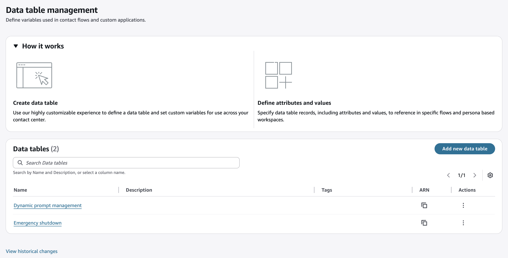

# Create and configure data tables

###### Understanding data tables

Data tables allow you to store and manage data that impacts your configurations within Amazon Connect. Data tables can be referenced by other resources, for example Flows and Views. When changes or additions are made to data tables, they are available immediately via public APIs and on-screen, no redeployment necessary.

Use data tables to support scenarios ranging from simple routing rules to complex, time-based configurations, accessible and modifiable in real time. In contrast to [Predefined Attributes](predefined-attributes.md "predefined-attributes.md") which store simple key-value pairs, data tables support multiple columns, various data types, and complex relationships.

A Data Table consists of:

- Table metadata (structure and validation rules)
- Table values (the actual data)
  Table metadata includes:

- Attributes (columns) with defined data types
- Primary keys to identify unique records
- Optional default values that can be applied across records
- Optional validation rules for data integrity
  Table values are stored in records (rows) that contain values for each attribute (column).

**Creating data tables**

1. Go to the Routing menu and select **Data tables**.
2. Select **Add new data table**.
   1. Provide a **Name**.
   2. Optionally provide a **Description**.
   3. Indicate a **Time zone** to support time-based use cases.
   4. Define a **Lock level**. Locking prevents multiple editors from overwriting changes at the data table, record (row), attribute (column), or value (cell) level.

3. After saving, select Add attribute to define the first column in the table.

###### Note

As attributes are added, they are inserted into the table in the leftmost column.

    1. Provide a **Name**
    2. Select a **Type**, choosing from

    	1. **Single** text, number or boolean (yes/no) attribute
    	2. **List** of text or numbers
    3. Optionally select **Use as primary attribute**.

    	1. Primary keys help identify and reference specific records. They also enable granular access control to table data. One or more attributes can be designated as primary, and become the first column(s) of the table. If no primary attribute is defined, the table can contain only one record.

    	###### Note

    	Primary attributes cannot be added or removed if the table contains data. For example, if a table's primary attributes are first name, last name and middle initial, you cannot add SSN as another primary attribute or remove middle initial, without first deleting all rows. However, you can edit the values in a primary attribute, for example a last name can be changed. You can also add non-primary attributes after a table is populated with data.
    4. Optionally provide **Basic validation** if the type is text or numeric (e.g. max length).
    5. Optionally update **Collection validation** if the type is text or numeric, to provide a choice of predefined values for this attribute, and even restrict to those values.
    6. Upon saving, your table will display with its first attribute (column).
    7. Repeat as needed.

4. When ready, select **Add value** to insert a row into your table.
   1. When adding the first value, you must acknowledge that primary attributes cannot be changed if values exist in the table.
   2. Data inputs are automatically validated (type, length, etc.).
   3. As values are added, they are sorted based on primary value(s), for example if the first column is text, the values (rows) will be sequenced from A-Z.

Example of a table structure where two primary attributes are used to uniquely identify each record, and two attributes have been defined.

| Primary Attribute 1 | Primary Attribute 2 | Attribute 1 | Attribute 2 |
| ------------------- | ------------------- | ----------- | ----------- |
| Primary Value       | Primary Value       | Value       | Value       |
| Primary Value       | Primary Value       | Value       | Value       |
| ...                 | ...                 | ...         | ...         |

###### Add Records to data tables

Connect enforces required fields, data types, length limits and other requirements specified in the table definition.

###### Note

Always test configurations that impact flows before impacting production workloads, and monitor system behavior immediately after significant changes.

###### Edit data tables and their records

Connect enforces required fields, data types, length limits and other requirements specified in the table definition.

**Safeguards are provided for simultaneous edits to the same data.** The system automatically alerts users when changes occur outside their current session, prompting them to refresh their view to see the latest data.

###### Note

For scenarios where preventing conflicts is critical, you can implement optimistic locking strategies, ensuring that updates are only applied if the data hasn't changed since it was last read.

**Changes take place _almost_ immediately**. Changes made to data tables take effect in subsequent flow executions and API calls. Data is not cached in flows, so there is no lag required for refresh after a change.

###### Note

While changes propagate rapidly, in rare cases, there might be a brief delay—typically just milliseconds—before all system components reflect the change. When feasible, plan updates during operational windows to minimize impact.

###### Sample use case

Follow the steps below to create a simple translations table for prompts.

1. Create a new data table with a new primary attribute called “Language”. The primary attribute determines the key needed to access a record from the data table.
2. Create a new attribute for each message type, “Greeting” for example. If you need to create more than 99 types of messages, see the advanced example below.
3. Add the translations to your table.
4. Your table should look like this:

| Language (primary attribute) | Greeting |
| ---------------------------- | -------- |
| English                      | Hello    |
| Spanish                      | Hola     |

For advanced cases where more than one dimension is needed when querying a data table, additional primary attributes can be added.

| Language (primary attribute) | Department (primary attribute) | Greeting                              |
| ---------------------------- | ------------------------------ | ------------------------------------- |
| English                      | Sales                          | Hello. This is sales.                 |
| Spanish                      | Sales                          | Hola. Soy del departamento de ventas. |
| English                      | Marketing                      | Hi. You've reached marketing.         |

It's also possible to query for the exact message by adding a third dimension for the message type.

| Language (primary attribute) | Department (primary attribute) | Message type (primary attribute) | Message                               |
| ---------------------------- | ------------------------------ | -------------------------------- | ------------------------------------- |
| English                      | Sales                          | Greeting                         | Hello. This is sales.                 |
| Spanish                      | Sales                          | Greeting                         | Hola. Soy del departamento de ventas. |
| English                      | Marketing                      | Greeting                         | Hi. You've reached marketing.         |
| English                      | Marketing                      | Farewell                         | Thanks for contacting marketing.      |

###### Using data tables for dynamic lookups in flows

Flows can read and write values from data tables. For more information, see [Flow block in Amazon Connect: Data Table](data-table-block.md "data-table-block.md").

###### Leverage Data tables to build custom user interfaces

Data tables can empower business users to make routine contact center operational adjustments without requiring direct access to underlying Amazon Connect systems. Custom interfaces can be created from Data tables using the Views no-code UI builder, then assigned to workspaces. Operations teams can then use the custom UIs to respond quickly to changing conditions, without requiring IT intervention and working within approved governance and security frameworks. Data tables can combine multiple resources, so business users do not need permission to each (e.g. flows, prompts, queues).

Purpose-built interfaces can allow authorized business users to control scenarios such as:

- Managing queue assignments, operating hours, skill mappings, and escalation rules
- Modifying routing by language, location or VIP status
- Activating emergency protocols
  For more information about building custom interfaces, see the [Views no-code UI builder](no-code-ui-builder.md "no-code-ui-builder.md").

###### Access Control and Security for Data Tables

Control access to table primary values so business users are only allowed view or modify fields that relate to their responsibilities.

- Security profile permissions provide view, edit, create, and delete choices for managing the data table resource in the Routing section.
- Tag-based access control (TBAC) provides record-based restrictions. Use if multiple teams need to access different subsets of data within large, multi-purpose tables.

###### Service quotas for Data Tables

Connect provides:

- Tables — 100 total per instance
- Attributes (columns) — 100 per table
- Values (cells) — 1000 per table
- Character count for text values — 5k for TEXT, 1k for TEXT_LIST items.
  To learn more about service quotas and how to manage them, see [Amazon Connect service quotas](amazon-connect-service-limits.md "amazon-connect-service-limits.md").

###### Track changes to Data tables

On-screen audit history provides recent changes to a resource and its before and after values. Data table audit history includes new or changed table structure (attributes, primary keys, default values), as well as new or changed records (rows) within each data table.

###### Note

AWS CloudTrail tracks the history of all resource changes. For more information, see [Log Amazon Connect API calls with AWS CloudTrail](logging-using-cloudtrail.md "logging-using-cloudtrail.md").
