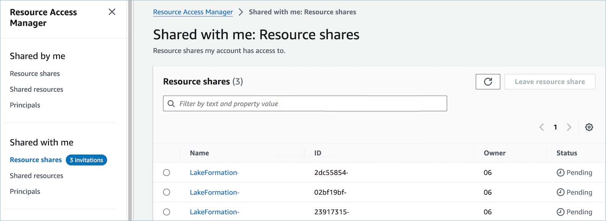
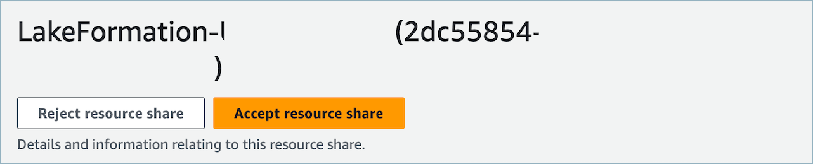
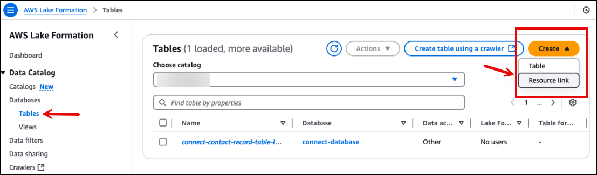
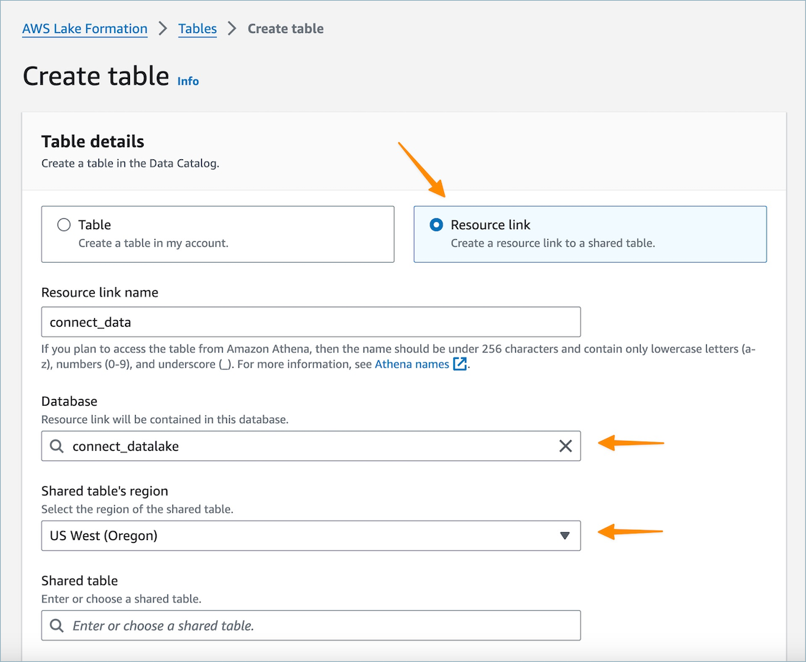

# Associate tables for the Amazon Connect analytics data

lake

Configuration of data sharing creates a RAM invitation to the consumer
account. [RAM](https://aws.amazon.com/ram/ "https://aws.amazon.com/ram/") is a service to help
you securely share resources across AWS accounts. Ensure that you have
the required AWS Identity and Access Management (IAM) permissions to view and accept
resource share invitations.

For information about the suggested IAM policies for data lake administrators, see
[Data lake
administrator permissions](../../../lake-formation/latest/dg/permissions-reference.md#persona-dl-admin "../../../lake-formation/latest/dg/permissions-reference.md#persona-dl-admin").

1. Open the RAM console  at [https://console.aws.amazon.com/ram/](https://console.aws.amazon.com/ram/ "https://console.aws.amazon.com/ram/").
2. Under **Shared with me** select **Resource shares**

 3. Select the name of the resource share and **Accept
resource share**.

###### Important

    * An initial RAM request is created only for the first share.
    * Lake Formation optimizes subsequent shares by reusing existing
     accepted RAM requests when possible.
    * RAM requests expire after 12 hours if not accepted.
    * For more information about RAM requests, see [Accepting and rejecting resource share invitations](../../../ram/latest/userguide/working-with-shared-invitations.md "../../../ram/latest/userguide/working-with-shared-invitations.md") and
     [Optimize AWS RAM resource shares](../../../lake-formation/latest/dg/optimize-ram.md#optimize-version "../../../lake-formation/latest/dg/optimize-ram.md#optimize-version").

 4. After the resource shares have been accepted, in the consumer account navigate
to the AWS Lake Formation console at [https://console.aws.amazon.com/lakeformation](https://console.aws.amazon.com/lakeformation "https://console.aws.amazon.com/lakeformation"). To configure access
to the Amazon Connect analytics data lake tables, be certain the user configuring the
following resources has Data lake administrator permissions in Lake Formation.
For more information, see the - [Lake Formation personas and IAM permissions reference](../../../lake-formation/latest/dg/permissions-reference.md "../../../lake-formation/latest/dg/permissions-reference.md"). 5. Either use an existing lake formation database or create a new database for
the Amazon Connect analytics data lake tables. For more information, see [Creating a database](../../../lake-formation/latest/dg/creating-database.md "../../../lake-formation/latest/dg/creating-database.md"). 6. In the AWS Lake Formation console, choose **Tables** on the left navigation menu.

 7. Select **Create table** from the upper right to
[create a new Resource link](../../../lake-formation/latest/dg/creating-resource-links.md "../../../lake-formation/latest/dg/creating-resource-links.md").

 8. In the create table dialog, select the **Resource
link** radio button. **Resource link
name** can be any value you wish to name the linked table. For
example, for the **contact record** data type you
may want to define the link name as contact_record. 9. Specify the **Database** previously created
from step 5. 10. In the **Shared table** choose the shared
table whose RAM invite was previously accepted and you wish to map to this
Resource link name.  For example, select the `contact_record` shared
table to map to the contact record resource link. 11. Information for the Shared table's database and owner ID will automatically
be populated. 12. Choose **Create**. 13. Repeat for all data types shared to the consumer account. 14. Open the Amazon Athena [console](https://console.aws.amazon.com/athena/home "https://console.aws.amazon.com/athena/home"), and run a
query to check if the data with the shared instance_id is provided in the
request file. For example:

`select * from
 `database_name`.`linked_table`
 limit 10`.

Where:

    * `database_name` is the name of the database
     that you created in step 5.
    * `linked_table` is one of the resource link
     names you created in step 8.
