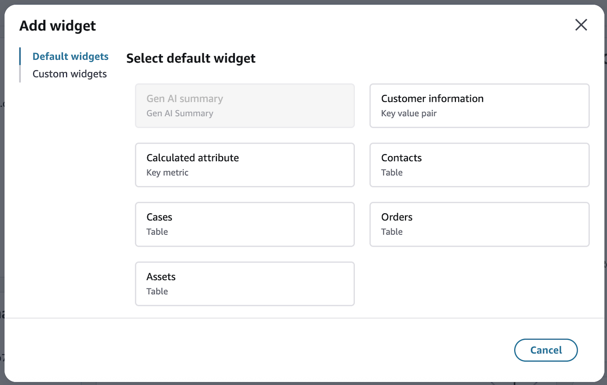
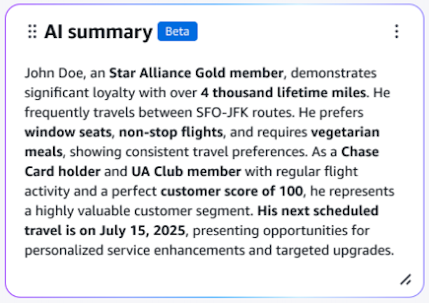

# Default widgets

Profile explorer comes with a collection of pre-configured widgets designed to
work seamlessly with Customer Profiles data. These default widgets offer
immediate value with minimal setup, allowing you to build sophisticated
dashboards in a few clicks.

## Ready-to-use widgets

- [Generative AI summary](#generative-ai-summary "#generative-ai-summary")
- [Customer information](#customer-information "#customer-information")
- [Calculated attribute](#calculated-attribute "#calculated-attribute")
- [Contacts](#contacts "#contacts")
- [Cases](#cases-cp "#cases-cp")
- [Orders](#orders-cp "#orders-cp")
- [Assets](#assets-cp "#assets-cp")

###### Note

While these widgets come pre-configured, you can still customize them
to better match your specific needs. They serve as a starting point to
allow for easy onboarding.

## Generative AI summary

Profile explorer delivers default AI-powered customer insights that
generate concise summaries highlighting key behavioral patterns, provides
personalized customer insights based on interaction history and surface
actionable recommendations from customer 360 data. The AI-generated
summaries help organizations make data-driven decisions by identifying
patterns across multiple customer touchpoints, delivering personalized
behavioral insights specific to each customer and supporting improved
customer experiences and increased loyalty.

## Customer information

The Customer Information widget provides a clear, organized view of
standard Customer Profile data using key-value pair components. This default
widget automatically displays essential customer information in an easily
scannable format.

### Overview

This widget utilizes the key value pair component to display customer
attributes in a structured layout.

- First name
- Last name
- Email Address
- Phone Number
- Address
- Account number
- Profile ID

### Data

The widget automatically connects to your Customer Profiles domain and
pulls information from standard profile attributes. No additional
configuration is required for basic functionality.

**Note**: While this widget comes
pre-configured with standard profile attributes, you can customize which
attributes from the standard Profile are displayed based on your
specific needs.

#### Learn more

- [Standard
  Profile Definition](standard-profile-definition.md "standard-profile-definition.md")
- Key value pair

## Calculated attribute

The Calculated Attribute widget enables you to display a key metrics
component utilizing data from your customer profiles' calculated
attributes.

### Overview

The Calculated Attribute widget enables you to display a key metrics
component utilizing data from your customer profiles' calculated
attributes.

### Component Features

- Display calculated metrics as single value indicators

### Example use cases could be

- Campaigns delivered
- Cases opened
- Average call time
- Channel Preference

### Configuration

Simply select your calculated attribute and choose your preferred
display format

###### Note

Calculated attributes must be configured in your Customer Profiles
domain before they can be used in this widget.

**Learn more**

- Key metric
- [Set up calculated attributes](customerprofiles-calculated-attributes-admin-website.md "customerprofiles-calculated-attributes-admin-website.md")

## Contacts

Built using the Table JSON component, the Contacts widget displays your
Customer Profiles contact object data in an organized, tabular format. This
widget automatically connects to the Customer Profiles CTR data, showing key
contact information and interaction history.

### Features

- View all customer contact events
- Sort and filter contact records
- Customize displayed contact fields
- Access detailed contact information

For more information about Customer Profiles CTR objects, see [Contact record templates in Amazon Connect
Customer Profiles](ctr-contact-record-template.md "ctr-contact-record-template.md")

## Cases

Built using the Table JSON component, the Cases widget displays your
Customer Profiles case object data in an organized, tabular format. This
widget automatically connects to the Customer Profiles Case data, showing
support interactions and case management details.

### Features

- View all customer cases
- Sort and filter case records
- Customize displayed case fields
- Access detailed case information

For more information about Customer Profiles Case objects, see [Object type mapping for the
standard case in Customer Profiles](object-type-mapping-standard-case.md "object-type-mapping-standard-case.md").

## Orders

Built using the Table JSON component, the Orders widget displays your
Customer Profiles order object data in an organized, tabular format. This
widget automatically connects to the Customer Profiles Order data, showing
purchase history and transaction details.

### Features

- View all customer order events
- Sort and filter order records
- Customize displayed order fields
- Access detailed order information

For more information about Customer Profiles Order objects, see [Object type mapping for the
standard order in Amazon Connect Customer Profiles](object-type-mapping-standard-order.md "object-type-mapping-standard-order.md")

## Assets

Built using the Table JSON component, the Assets widget displays your
Customer Profiles asset object data in an organized, tabular format. This
widget automatically connects to the Customer Profiles Asset data, showing
customer-owned products and services.

### Features

- View all customer asset records
- Sort and filter asset data
- Customize displayed asset fields
- Access detailed asset information

For more information about Customer Profiles Asset objects, see [Object type mapping for the
standard asset in Customer Profiles](object-type-mapping-standard-asset.md "object-type-mapping-standard-asset.md")
