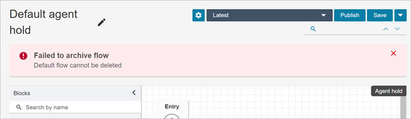
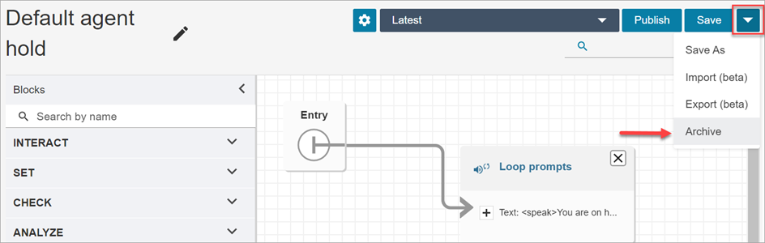
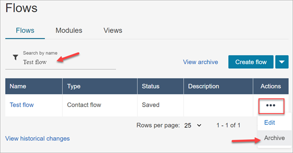
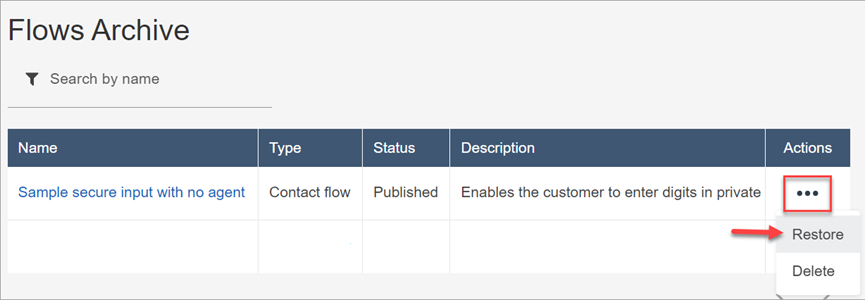
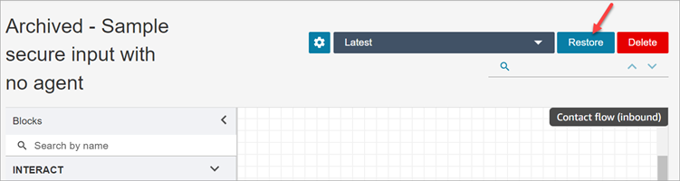

# Archive, delete, and restore flows in

Amazon Connect

Flows and modules must be archived before you can delete them from your Amazon Connect
instance. Archived flows and modules can be restored.

###### Warning

Deleted flows and modules cannot be restored. They are permanently deleted from
your Amazon Connect instance.

## Important things to know

- **Use caution when archiving flows or
  modules**. Amazon Connect does not validate whether the flow or module
  you are archiving is being used in other published flows. It does not warn
  you that the flow is in use.
- Default flows cannot be archived or deleted. If you attempt to archive a
  default flow, you'll get message similar to the following image.

- Flows and modules that are associated with queues, quick connects, or
  phone numbers cannot be archived. You need to disassociate the resources
  from the flows before you can archive them.
- Archived flows and modules count towards your **Flows per
  instance** and **Modules per instance**
  service quotas. You must delete them to not have them counted. For more
  information about quotas, see [Amazon Connect service quotas](amazon-connect-service-limits.md "amazon-connect-service-limits.md").

## Archive a flow or module

There are two ways you can archive flows or modules.

###### Option 1: Open the flow or module and then archive it

1. Log in to Amazon Connect with a user account that has the **Numbers and
   flows** - **Flows** -
   **Edit** permission in its security profile. If you are
   archiving a flow module, you need **Flow modules** -
   **Edit** permission.
2. On the navigation menu, choose **Routing**,
   **Flows**.
3. Open the flow or module you want to archive.
4. On the flow designer page, choose the dropdown menu, and then choose
   **Archive**, as shown in the following image.

 5. Confirm you want to archive the flow or module. 6. To locate the archived flow or module, choose **View
archive**.

###### Option 2: Search for flow or module and then archive it

- On the **Flows** page, search for the flow or module you
  want archive, and then choose **Archive** from the
  **...** menu, as shown in the following image.

## Restore an archived flow or module

There are two ways you can restore flows or modules.

###### Option 1: View list of archived flows or modules, and choose Restore

1. Log in to the Amazon Connect admin website with a user account that
   has the **Numbers and flows** - **Flows**

- **Edit** permission in its security profile. If you are
  restoring a flow module, you need **Flow modules** -
  **Edit** permission.

2. On the navigation menu, choose **Routing**,
   **Flows**.
3. On the **Flows** page, choose **View
   archive**.
   1. To restore archived modules, on the **Flows**
      page, choose the **Modules** tab, and then choose
      **View archive**.

4. On the **Flows Archive** page, next to the flow or module
   you want to restore, under **Actions**, choose
   **...** and then choose **Restore**.
   This option is shown in the following image.

###### Option 2: Restore the archived flow or module from the flow designer

1. Open the archived flow or module in the flow designer.
2. From the dropdown menu, choose **Restore**, as shown in
   the following image.

## Delete an archived flow or module

You can delete archived flows and modules manually by using the Amazon Connect admin
website, or programmatically by using the [DeleteContactFlow](../APIReference/API_DeleteContactFlow.md "../APIReference/API_DeleteContactFlow.md") API.

###### Warning

Deleted flows and modules cannot be restored. They are permanently deleted
from your Amazon Connect instance.

###### Option 1: View list of archived flows or modules, and choose Delete

1. Log in to the Amazon Connect admin website with a user account that
   has the **Numbers and flows** - **Flows**

- **Remove** permission in its security profile. If you are
  deleting a flow module, you need **Flow modules** -
  **Remove** permission.

2. On the navigation menu, choose **Routing**,
   **Flows**.
3. On the **Flows** page, choose **View
   archive**.
   1. To delete modules, on the **Flows** page, choose
      the **Modules** tab, and then choose **View
      archive**.

4. On the **Flows Archive** page, next to the flow or module
   you want to delete, under **Actions**, choose
   **...** and then choose **Delete**.
5. Confirm that you want to delete the flow or module.

###### Option 2: Delete the archived flow or module from the flow designer

1. Open the archived flow or module in the flow designer.
2. From the dropdown menu, choose **Delete**.
3. Confirm that you want to delete the flow or module.
