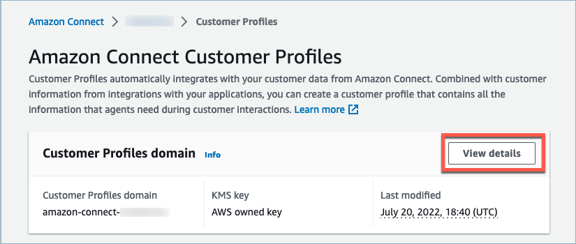
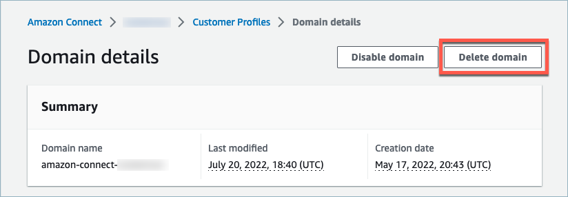
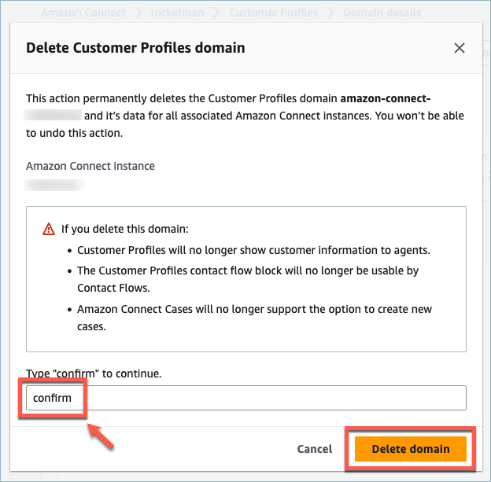

# Delete an Amazon Connect Customer Profiles domain

Deleting mappings will only delete objects and data associated with that specific
mapping. If there are multiple objects associated with a profile, then deleting a
specific mapping may not clear the profile data. If you want to delete specific data,
you would then delete the mapping, but your profiles may still exist if they contain
data from other mappings. This could result in additional charges for the existing
profiles. To avoid this from occurring, you can delete your Customer Profiles domain using the
Amazon Connect console by following these steps.

1. Login to the Amazon Connect console and select Customer Profiles from the left
   navigation pane. Choose your Customer Profiles domain and then choose **View
   details**.

 2. Choose **Delete domain**.

 3. To delete your domain, enter _confirm_ in the box and
choose **Delete domain**.

