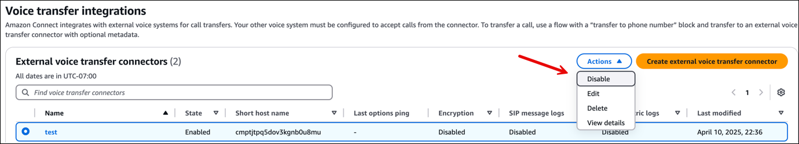
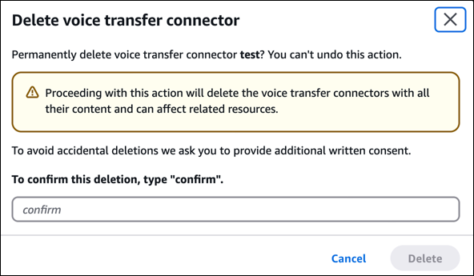

# Delete an external voice

transfer connector from your Amazon Connect instance

This topic explains how to disable and then delete an external voice transfer
connector in your Amazon Connect instance. There are two ways you can do this:

- Use the Amazon Connect console. This option is explained below.
- Use the [ListIntegrationAssociations](../APIReference/API_ListIntegrationAssociations.md "../APIReference/API_ListIntegrationAssociations.md") API to retrieve all active external
  voice transfer connector integrations. Then use the [DeleteIntegrationAssociation](../APIReference/API_DeleteIntegrationAssociation.md "../APIReference/API_DeleteIntegrationAssociation.md") API.

###### Contents

- [Important things to
  know](#delete-external-voice-transfer-important "#delete-external-voice-transfer-important")
- [Step 1: Verify the connector is not
  referenced in any active flows](#verify-connector-flows "#verify-connector-flows")
- [Step 2: Disable the connector (optional but
  recommended)](#disable-connector "#disable-connector")
- [Step 3: Delete the connector](#delete-connector "#delete-connector")

## Important things to

know

- Deleting your Amazon Connect instance does NOT automatically delete external voice
  transfer connector integrations. You will still incur **External
  voice transfer connector** billing charges after deleting your
  Amazon Connect instance unless you complete the steps in this topic to explicitly
  delete the integration.
- To fully stop billing related to the external voice transfer feature, you
  must delete all connectors associated with your Amazon Connect instance.
- You must have the required external voice transfer connector permissions
  to perform disable and delete operations. For a list of permissions, see
  [Voice transfer integrations
  page](security-iam-amazon-connect-permissions.md#voice-transfer-integrations-page "security-iam-amazon-connect-permissions.md#voice-transfer-integrations-page") in the [Required permissions
  for custom IAM policies](security-iam-amazon-connect-permissions.md "security-iam-amazon-connect-permissions.md") topic.

## Step 1: Verify the connector is not

referenced in any active flows

When you disable and delete a connector, you permanently remove its configuration.
This can have immediate effects on your contact center operations. To help minimize
the potential impact/outage of your contact center operations:

- Verify that the connector is not referenced in any active flows.
- Plan the deletion during a low-traffic period to minimize potential
  customer impact.
- Update all affected flows to ensure service continuity.

## Step 2: Disable the connector (optional but

recommended)

Before deleting a connector, we recommend that you disable it first. This stops
the connector from handling new calls, and allows you to verify that there are no
adverse impacts on your environment.

###### Note

This step—disabling the connector—turns off **External
voice transfer connector** from handling incoming calls. However,
it does NOT stop billing. To stop incurring charges, you must complete Step 3 to
explicitly delete the integration.

1. Open the Amazon Connect console at
   [https://console.aws.amazon.com/connect/](https://console.aws.amazon.com/connect/ "https://console.aws.amazon.com/connect/").
2. Choose the instance alias you want to configure.
3. In the left navigation pane, choose **External voice
   systems**, and then choose **Voice transfer
   integrations**.
4. From the list of connectors, choose the connector you want to
   disable.
5. Choose **Actions**, and then choose
   **Disable**, as shown in the following image.

 6. Wait a sufficient amount of time to verify that there is no adverse impact
to your environment.

## Step 3: Delete the connector

After disabling the connector and verifying no adverse impact occurred on your
environment, you can delete it.

1. During a low-traffic period in your contact center: From the list of
   connectors, choose the connector you disabled.
2. Choose **Actions**, and then choose
   **Delete**.
3. In the confirmation dialog box, type **Confirm** to
   confirm this deletion and then choose **Delete**. An
   example dialog box is shown below.

 4. You are no longer charged for the connector. If needed, you can now delete
your Amazon Connect instance.
