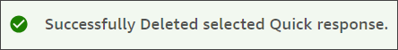

# Delete quick responses in Connect Customer

This topic explains how to use the Connect Customer admin website to delete a quick response. To delete a quick
response programmatically, see [DeleteQuickResponse](../../../amazon-q-connect/latest/APIReference/API_DeleteQuickResponse.md "../../../amazon-q-connect/latest/APIReference/API_DeleteQuickResponse.md") in the _agent assist API Reference Guide_.

###### Important

- You can't undo a deletion.
- Agents can't see or use deleted quick responses.

###### To delete a response

1. Log in to the Connect Customer admin website at https://_instance
   name_.my.connect.aws/. Use an **Admin** account, or an
   account assigned to a security profile that has **Content Management - Quick responses

- Delete** permission.

2. On the navigation bar, choose **Content Management**, then
   **Quick responses**.

 3. On the **Quick responses** page, select the checkbox next to the response
that you want to delete. You can select a maximum of 20 responses. 4. Choose **Delete**.

A success message appears:

###### Note

- If the **Delete** button is inactive, sign in to a Connect Customer account
  that has the required security profile, or ask another admin for help.
- Remain on the page until the delete operation finishes.
