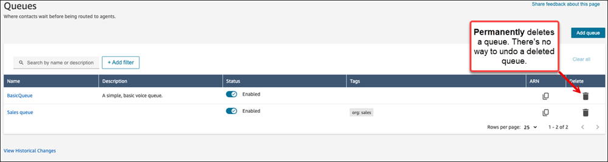

# Delete a queue from your Amazon Connect instance

There are three ways to delete a queue from your Amazon Connect instance:

- Amazon Connect admin website
  1.  Log in to the Amazon Connect admin website at https://`instance name`.my.connect.aws/. Use an **Admin** account, or an
      account that has **Routing** -
      **Queues** - **Delete** permission
      in its security profile.
  2.  On the Amazon Connect admin website, on the navigation menu, choose
      **Routing**, **Queues** and then
      select the delete icon.

  

  ###### Important

  You cannot undo a deleted queue. To temporarily disable a queue,
  toggle its status to **Disabled**.

- [DeleteQueue](../APIReference/API_DeleteQueue.md "../APIReference/API_DeleteQueue.md")
  API
- [delete-queue](../../../cli/latest/reference/connect/delete-queue.md "../../../cli/latest/reference/connect/delete-queue.md")
  AWS CLI
