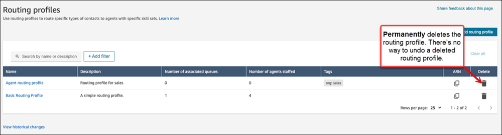

# Delete a routing profile from an Amazon Connect

instance

There are three ways to delete a routing profile from your Amazon Connect instance:

- Amazon Connect admin website: On the left side menu, choose **Users**,
  **Routing profiles** and then select the delete
  icon.

###### Important

You cannot undo a deleted routing profile.

- [DeleteRoutingProfile](../APIReference/API_DeleteRoutingProfile.md "../APIReference/API_DeleteRoutingProfile.md") API
- [delete-routing-profile](../../../cli/latest/reference/connect/delete-routing-profile.md "../../../cli/latest/reference/connect/delete-routing-profile.md") AWS CLI
