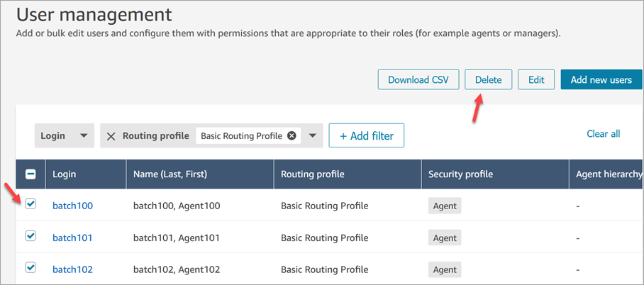
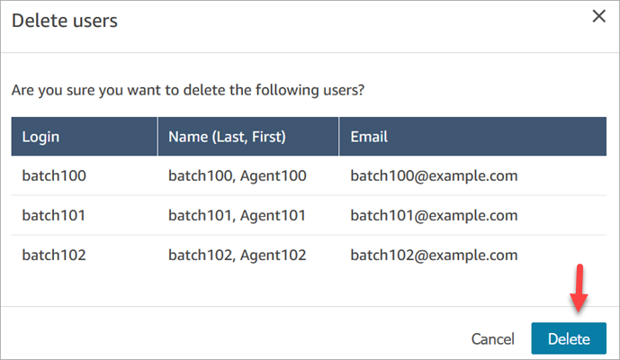
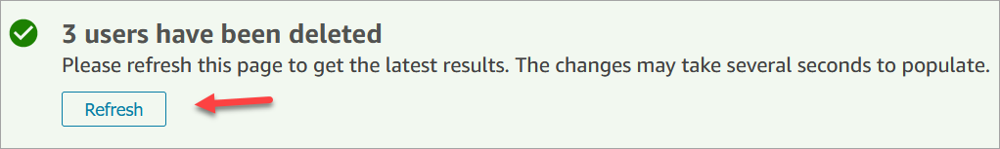
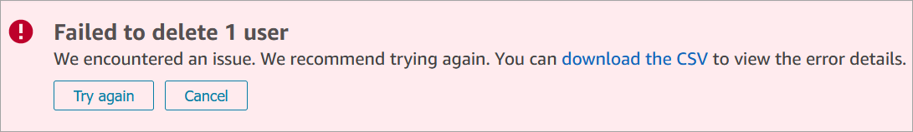
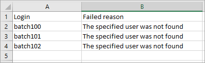
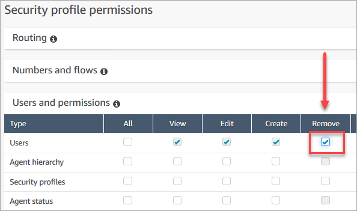

# Delete users from your Amazon Connect

instance

###### Important

- You can't undo a deletion.
- When a user is deleted from Amazon Connect, you won't be able to
  configure their agent settings any more. For example, you won't be able to
  assign a routing profile to them.
- If you delete a user record that has an associated quick connect, you need
  to [delete the quick connect](quick-connects-delete.md "quick-connects-delete.md"),
  too. Otherwise it will be orphaned. When agents attempt to transfer calls to
  it, no one is there to answer the call.
- Orphaned quick connects can disrupt other Amazon Connect processes such as instance
  replication and syncing processes that are done as part of [Amazon Connect Global
  Resiliency](setup-connect-global-resiliency.md "setup-connect-global-resiliency.md").
  This topic explains how to delete user records using the Amazon Connect admin website. To delete user records
  programmatically, see [DeleteUser](../APIReference/API_DeleteUser.md "../APIReference/API_DeleteUser.md") in the
  _Amazon Connect API Reference Guide_. To use the CLI, see [delete-user](../../../cli/latest/reference/connect/delete-user.md "../../../cli/latest/reference/connect/delete-user.md").

## What happens to the user's metrics?

The user's data in contact records and reports is retained. The data is preserved
for the consistency of the historical metrics. For example, when you search for
contact records, you'll still see the agent's username, any contact recordings
involving the agent, etc.

In the historical metrics reports, the agent's data will be included in the
**Agent performance** metrics report. However, you won't be
able to see an **Agent activity audit** of the deleted agent
because their name won't appear in the drop-down list.

## How to delete users

###### Tip

- While a batch of deletions is being processed, you can continue
  working on the **User management** page, choosing
  another batch of user records to create, edit, or delete, in bulk or
  individually. This is useful for quickly updating settings such as
  routing profiles.
-

1. Log in to Amazon Connect using an **Admin** account,
   or an account assigned to a security profile that has **Users -
   Remove** permission.
2. In Amazon Connect, on the left navigation menu, choose **Users**,
   **User management**. Choose one or more users you want
   to delete, and then choose **Delete**.

 3. Confirm you want to delete the users.

 4. The following image shows and example of the message when a user is
deleted successfully. Choose **Refresh** to update the list
of users on the **User management** page.

 5. If Amazon Connect fails to delete one or more user records, it displays a message
similar to the following image.

When you get a failed to delete message, you have the following
options:

    * Choose **download the CSV** to view the error
     details. The following details show the user records had already
     been deleted. In this case, I hadn't refreshed the **User
     management** page and tried to delete the records
     again.

    
    * Choose **Try again** to resubmit those records
     that failed to be deleted. The other records were successfully
     deleted.
    * Choose **Cancel** to not do anything with the
     user records that weren't deleted.

## Required permissions to delete

users

Before you can update permissions in a security profile, you must be logged in
with an Amazon Connect account that has the following permissions:
**Users - Remove**.

By default, the Amazon Connect
**Admin** security profile has these permissions.
