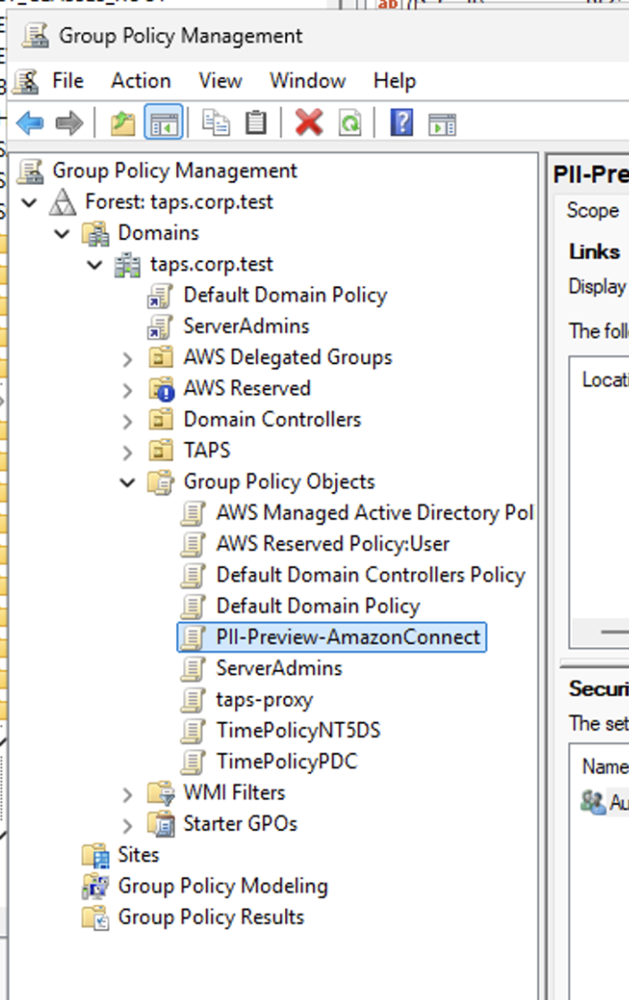
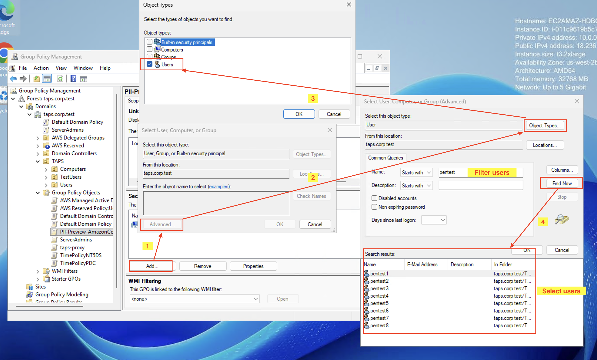
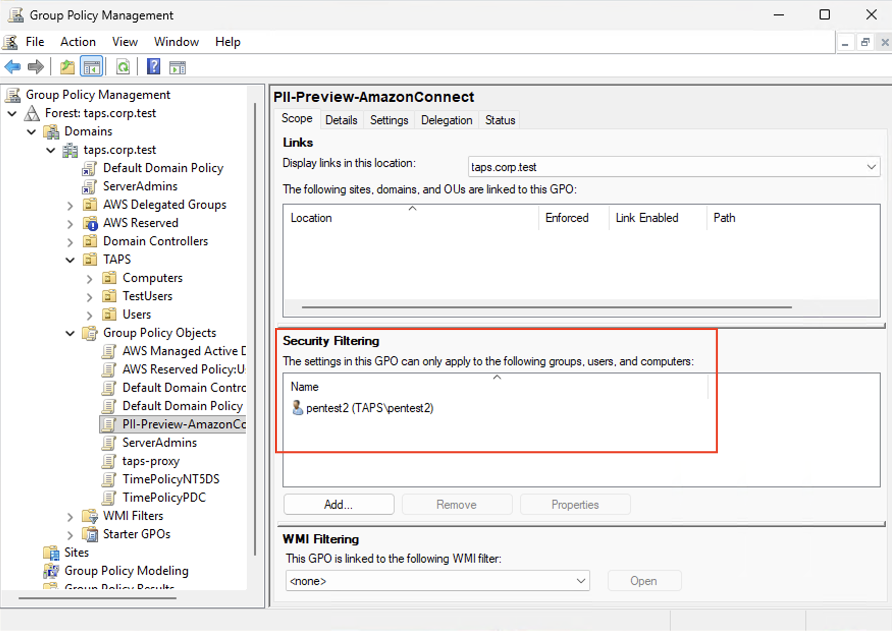
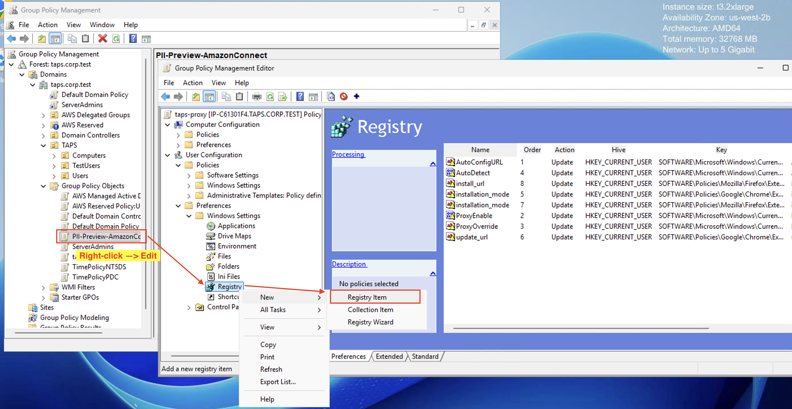
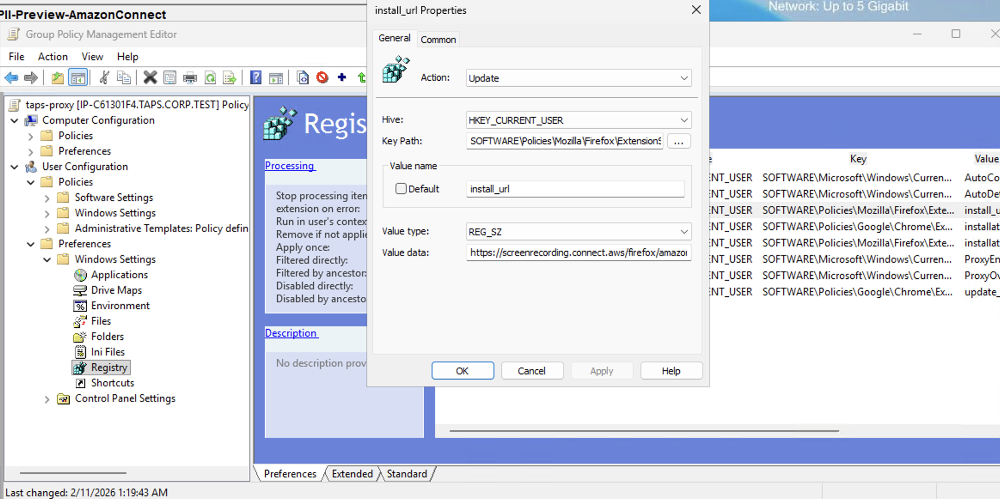

# Deploy the Connect Customer browser extension

The Connect Customer browser extension reports the URL of each browser window to the Connect Customer Client Application so
that URL rules configured in your flow block can be evaluated. Without the extension, URLs
are not reported and URL rules cannot match, so browser pages that should be redacted by
URL might appear in the recording. Window title rules do not depend on the extension; they
match on native window titles and work without the extension installed.

If any of your flow blocks use URL rules, install the extension on every browser that
agents use during recorded contacts. The extension is distributed by AWS and installed
on agent workstations through your browser's enterprise extension policy. It is not
published to the Chrome Web Store or Firefox Add-ons.

For an overview of rule-based redaction, see [Rule-based redaction
for screen recordings](rule-based-redaction-screen-recording.md "rule-based-redaction-screen-recording.md").

###### Contents

- [Supported browsers](#extension-supported-browsers "#extension-supported-browsers")
- [Prerequisites](#extension-prerequisites "#extension-prerequisites")
- [Extension identifiers and update URLs](#extension-identifiers "#extension-identifiers")
- [Deploy the extension through enterprise policy](#extension-deploy-policy "#extension-deploy-policy")
- [Example: Deploying extensions to a list of users by using GPO](#extension-gpo-example "#extension-gpo-example")
- [Verify the extension is installed](#extension-verify "#extension-verify")
- [Remove the extension](#extension-remove "#extension-remove")
- [What happens if the extension is disabled during a contact](#extension-disabled-during-contact "#extension-disabled-during-contact")

## Supported browsers

Rule-based redaction supports the following browsers. Use any combination of these
browsers on agent workstations.

| Browser                         | Minimum version |
| ------------------------------- | --------------- |
| Google Chrome                   | 120             |
| Microsoft Edge (Chromium-based) | 120             |
| Mozilla Firefox                 | 120             |

Browsers other than Chrome, Edge, and Firefox do not report URLs to the Connect Customer Client Application, so
URL rules cannot match pages in those browsers. You can still cover windows in those
browsers by adding window title rules to your flow block.

## Prerequisites

- Supported browser and version from the preceding table.
- Connect Customer Client Application version 3.0.2 or later. See [Connect Customer Client Application](amazon-connect-client-app.md "amazon-connect-client-app.md").
- (Optional) An enterprise deployment tool that can push browser extension
  policies to specific users, such as Microsoft Group Policy Preferences (User
  Configuration), Microsoft Intune, Jamf Pro, or Google Chrome Browser Cloud
  Management. The extension is deployed at user scope.
- Outbound HTTPS access from each agent workstation to the extension update
  URL listed in the next section.

## Extension identifiers and update URLs

Use the following values when you configure your enterprise browser extension
policy.

###### Note

As a prerequisite, add the appropriate extension hosting URLs to your firewall
allow list, depending on which browsers your agents use. For the firewall
allow list, see [Network requirements](sr-system-req.md#network-requirements "sr-system-req.md#network-requirements").

| Browser                          | Extension ID                          | Update URL                                                                                                   |
| -------------------------------- | ------------------------------------- | ------------------------------------------------------------------------------------------------------------ |
| Google Chrome and Microsoft Edge | `cjmichfmnimgeoadokmeaiclklkdccod`    | `https://screenrecording.connect.aws/chromeos/amazon-connect-extension/releases/updates.xml`                 |
| Mozilla Firefox                  | `amazon_connect_extension@amazon.com` | `https://screenrecording.connect.aws/firefox/amazon-connect-extension/releases/amazon-connect-extension.xpi` |

## Deploy the extension through enterprise policy

The Connect Customer browser extension is deployed at user scope. With user-scope deployment, you can target the
extension to the specific users or groups who handle recorded contacts, without
modifying per-machine settings on agent workstations.

Use any enterprise policy tool that can push per-user browser extension settings.
Common options include:

- Microsoft Group Policy Preferences, scoped to **User
  Configuration** and filtered to a security group of agent
  users.
- Microsoft Intune, targeted to an Entra ID group of agent users through a
  user-assigned configuration profile.
- Jamf Pro or another MDM that supports per-user configuration profiles.
- Google Chrome Browser Cloud Management, scoped to an organizational unit of
  agent users.

For general information about browser policies, see:

- [Chrome Enterprise
  policy list](https://chromeenterprise.google/policies/ "https://chromeenterprise.google/policies/")
- [Microsoft Edge
  enterprise policy documentation](https://learn.microsoft.com/deployedge/ "https://learn.microsoft.com/deployedge/")
- [Enterprise policies for Firefox](https://support.mozilla.org/kb/customizing-firefox-using-policiesjson "https://support.mozilla.org/kb/customizing-firefox-using-policiesjson")

### Policy payload

Configure the **ExtensionSettings** policy for each browser
with the following properties.

**Google Chrome and Microsoft Edge**

```
{
  "cjmichfmnimgeoadokmeaiclklkdccod": {
    "installation_mode": "force_installed",
    "update_url": "https://screenrecording.connect.aws/chromeos/amazon-connect-extension/releases/updates.xml"
  }
}
```

**Mozilla Firefox**

```
{
  "amazon_connect_extension@amazon.com": {
    "installation_mode": "force_installed",
    "install_url": "https://screenrecording.connect.aws/firefox/amazon-connect-extension/releases/amazon-connect-extension.xpi"
  }
}
```

### Windows user-scope registry example

If you deploy policies through the Windows registry under **User
Configuration**, create string values under the per-user policy path
for each browser. The same pattern applies to Chrome, Edge, and Firefox.

| Browser         | Registry path (under HKEY\_CURRENT\_USER)                                                      |
| --------------- | ---------------------------------------------------------------------------------------------- |
| Google Chrome   | `HKCU\SOFTWARE\Policies\Google\Chrome\ExtensionSettings\cjmichfmnimgeoadokmeaiclklkdccod`      |
| Microsoft Edge  | `HKCU\SOFTWARE\Policies\Microsoft\Edge\ExtensionSettings\cjmichfmnimgeoadokmeaiclklkdccod`     |
| Mozilla Firefox | `HKCU\SOFTWARE\Policies\Mozilla\Firefox\ExtensionSettings\amazon_connect_extension@amazon.com` |

Create the following string values under each key.

| Browser        | Value name          | Value data                                                                                                   |
| -------------- | ------------------- | ------------------------------------------------------------------------------------------------------------ |
| Chrome or Edge | `installation_mode` | `force_installed`                                                                                            |
| Chrome or Edge | `update_url`        | `https://screenrecording.connect.aws/chromeos/amazon-connect-extension/releases/updates.xml`                 |
| Firefox        | `installation_mode` | `force_installed`                                                                                            |
| Firefox        | `install_url`       | `https://screenrecording.connect.aws/firefox/amazon-connect-extension/releases/amazon-connect-extension.xpi` |

All values use the `REG_SZ` type.

## Example: Deploying extensions to a list of users by using GPO

### Step 1: Create the dedicated policy

###### Note

We recommend that you create a new, separate GPO rather than editing your
primary domain policy. With a separate GPO, you can link or unlink the Connect Customer extension
safely.

- Open **Group Policy Management**
  (`gpmc.msc`).
- Right-click **Group Policy Objects** and select
  **New**. For the name, enter
  `PII-AmazonConnect` (or similar).



- Set the targeting (scope):

  - Select the new GPO.
  - In the **Scope** tab, under **Security
    Filtering**, remove **Authenticated
    Users**.
  - Choose **Add** and select the security group
    containing your target agent computers.



- Verify that the security filtering only contains machines that you
  intend to install extensions on.



### Step 2: Configure the registry injection

This step creates the specific registry key that the browser reads to install
the extension.

- Right-click your new GPO and select **Edit**.
- Navigate to the following path: **User Configuration**,
  **Preferences**, **Windows
  Settings**, **Registry**.
- Right-click in the empty space on the right and select
  **New**, **Registry Item**.



- Configure the properties as shown in the following tables.

The following values are common to all three browsers.

| Property   | Value               |
| ---------- | ------------------- |
| Action     | Update              |
| Hive       | HKEY\_CURRENT\_USER |
| Value type | `REG_SZ`            |

For each browser, use the following key path and the two values it
needs.

**Google Chrome** – key path
`SOFTWARE\Policies\Google\Chrome\ExtensionSettings\cjmichfmnimgeoadokmeaiclklkdccod`

| Value name          | Value data                                                                                   |
| ------------------- | -------------------------------------------------------------------------------------------- |
| `installation_mode` | `force_installed`                                                                            |
| `update_url`        | `https://screenrecording.connect.aws/chromeos/amazon-connect-extension/releases/updates.xml` |

**Microsoft Edge** – key path
`SOFTWARE\Policies\Microsoft\Edge\ExtensionSettings\cjmichfmnimgeoadokmeaiclklkdccod`

| Value name          | Value data                                                                                   |
| ------------------- | -------------------------------------------------------------------------------------------- |
| `installation_mode` | `force_installed`                                                                            |
| `update_url`        | `https://screenrecording.connect.aws/chromeos/amazon-connect-extension/releases/updates.xml` |

**Mozilla Firefox** – key path
`SOFTWARE\Policies\Mozilla\Firefox\ExtensionSettings\amazon_connect_extension@amazon.com`

| Value name          | Value data                                                                                                   |
| ------------------- | ------------------------------------------------------------------------------------------------------------ |
| `installation_mode` | `force_installed`                                                                                            |
| `install_url`       | `https://screenrecording.connect.aws/firefox/amazon-connect-extension/releases/amazon-connect-extension.xpi` |



## Verify the extension is installed

After you deploy the extension, verify on a test workstation that the extension is
installed, enabled, and running the expected version before you roll it out
broadly.

**Chrome or Microsoft Edge**

- Open `chrome://extensions` (Chrome) or
  `edge://extensions` (Edge).
- Confirm that **Amazon Connect Client** appears in the list
  and is enabled.
- Confirm that the version is 2.1.0 or later.
- Open `chrome://policy` or `edge://policy`, choose
  **Reload policies**, and confirm that
  `ExtensionSettings` contains the Connect Customer extension ID with status
  **OK**.

**Firefox**

- Open `about:addons`. Confirm that **Amazon Connect
  Client** appears under **Extensions** and is
  enabled.
- Confirm that the version is 2.1.0 or later.
- Open `about:policies`. On the **Active** tab,
  confirm that `ExtensionSettings` contains the Connect Customer extension
  ID.

If any of these checks fail, see [Download log files for the screen
recording app](troubleshoot-sr.md "troubleshoot-sr.md").

## Remove the extension

To stop using the Connect Customer browser extension on agent workstations, for example at the
end of a pilot or when users change roles, remove the extension by reversing the
deployment policy. You have two options.

### Option 1: Remove users from the target group

Remove agent users from the security group or Entra ID group that your extension
policy targets. When the next policy refresh runs, the extension is uninstalled
from those users' browsers. Users who remain in the group continue to receive the
extension.

This is the recommended approach for routine lifecycle changes such as role
reassignments.

### Option 2: Block the extension

To actively prevent the extension from being installed or used, change the
policy payload's `installation_mode` from `force_installed`
to `blocked`. The browser uninstalls the extension at the next policy
refresh and prevents future installations.

**Google Chrome and Microsoft Edge**

```
{
  "cjmichfmnimgeoadokmeaiclklkdccod": {
    "installation_mode": "blocked"
  }
}
```

**Mozilla Firefox**

```
{
  "amazon_connect_extension@amazon.com": {
    "installation_mode": "blocked"
  }
}
```

If you deploy through the Windows registry, change the
`installation_mode` value from `force_installed` to
`blocked` under the user-scope registry paths listed in [Windows user-scope registry example](#extension-registry-example "#extension-registry-example"). You can leave the other values in
place; `blocked` takes precedence.

### Effect on recordings after removal

After the extension is removed or blocked, contacts handled by those agents are
recorded without redaction applied. The contact records flag these recordings as
unredacted. If rule-based redaction is required for compliance, route contacts
only to agents whose security profile and browser still have the extension
deployed.

## What happens if the extension is disabled during a contact

If the extension is uninstalled or disabled while a recorded contact is active,
browser URLs stop being reported to the Connect Customer Client Application for the remainder of the contact.
URL rules can no longer match, and browser pages that should be redacted by URL might
appear in the recording. Window title rules continue to match as normal.

To restore redaction for new contacts, reinstall or re-enable the extension before
the next contact begins.
