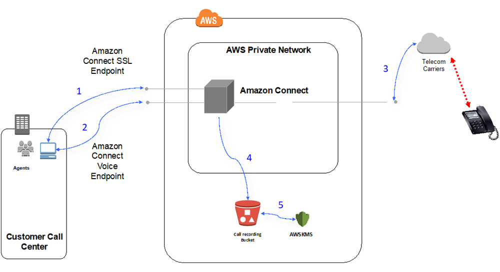
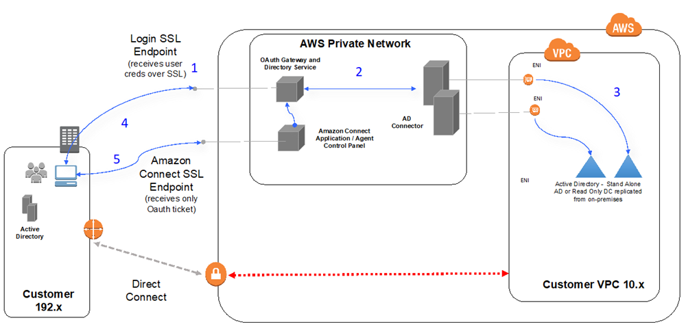

# Detailed network paths for Amazon Connect

## Voice calls

The following diagram shows how voice calls flow through Amazon Connect

1. Users access the Amazon Connect application using a web browser. All communications
   are encrypted in transit using TLS.
2. Users establish voice connectivity to Amazon Connect from their browser using
   WebRTC. Signaling communication is encrypted in transit using TLS. Audio is
   encrypted in transit using SRTP.
3. Voice connectivity to traditional phones (PSTN) is established between
   Amazon Connect and AWS telecommunications carrier partners using private network
   connectivity. In cases where shared network connectivity is used, signaling
   communication is encrypted in transit using TLS and audio is encrypted in
   transit using SRTP.
4. Call recordings are stored in your Amazon S3 bucket that Amazon Connect has been given
   permissions to access. This data is encrypted between Amazon Connect and Amazon S3 using
   TLS.
5. Amazon S3 server-side encryption is used to encrypt call recordings at rest
   using a customer-owned KMS key.

## Authentication

The following diagram shows using the AD Connector with Directory Service to connect to an
existing customer Active Directory installation. The flow is similar to using
AWS Managed Microsoft AD.

1. The user's web browser initiates authentication to an OAuth gateway over
   TLS using the public internet with user credentials (Amazon Connect login
   page).
2. OAuth gateway sends the authentication request over TLS to
   AD Connector.
3. AD Connector does LDAP authentication to Active Directory.
4. The user's web browser receives OAuth ticket back from gateway based on
   authentication request.
5. The client loads the Contact Control Panel (CCP). The request is over TLS
   and uses OAuth ticket to identify user/directory.
