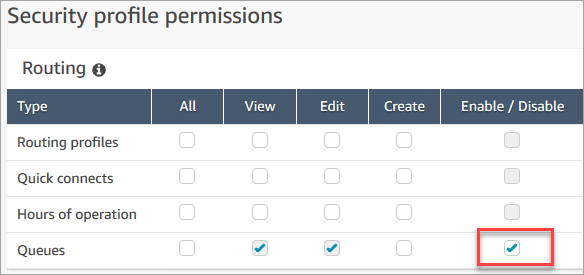
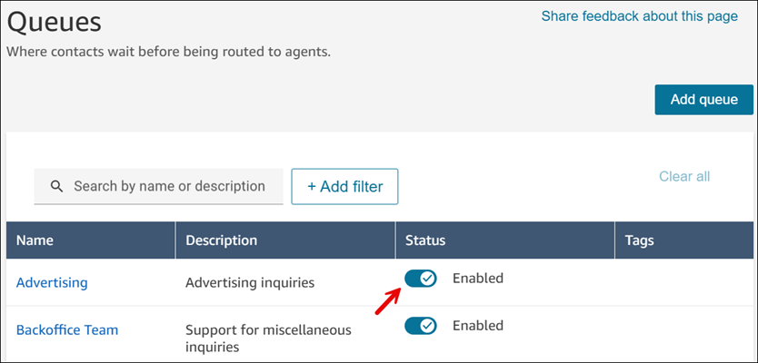
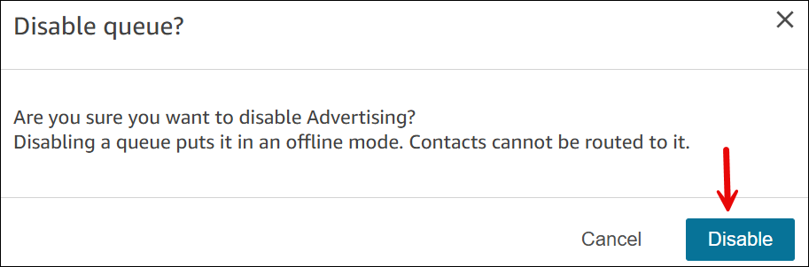

# Disable a queue temporarily using Amazon Connect

You can quickly control the flow of contacts to queues by temporarily disabling a
queue. When a queue is disabled, it's put in an offline mode. No new contacts are routed
to the queue, but any existing contacts already in the queue are routed to agents.

Only users who have a security profile with **Routing** -
**Queues** - **Enable/Disable** permission can
disable a queue.

###### To temporarily disable an active queue

1. Log in to the Amazon Connect admin website at https://`instance name`.my.connect.aws/. Use an **Admin** account, or an account that
   has **Routing** - **Queues** - **Enable/Disable** permission in its security profile.
2. On the Amazon Connect admin website, on the navigation menu, choose **Routing**,
   **Queues**.
3. For the queue you want to disable, toggle the **Status** to
   **Disabled**, as shown in the following image.

 4. Choose **Disable** to confirm you want to disable the queue,
as shown in the following image. You can immediately re-enable the queue if
needed by toggling the button back to **Enabled**.

