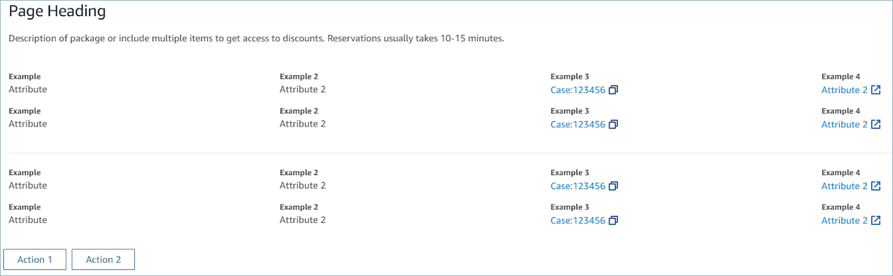

# Display contact context in the agent

workspace when a contact begins in Amazon Connect

When you design step-by-step guides for the agent workspace, you can set them up to
display contact attributes at the start of the contact. This gives agents the context
they need at the start of the contact so they can dive right into problem solving. This
feature is sometimes referred to as a screen pop.

To display contact attributes at the start of a contact, you configure a
**Detail view**, which is an [AWS managed view](view-resources-managed-view.md "view-resources-managed-view.md").

The **Detail view** is for displaying information to the agent and
providing them with a list of actions that they can take. A common use case of the
**Detail view** is to surface a screen pop to the agent at the
start of a call.

- Actions in this view can be used to let an agent continue to the next step in
  a step-by-step guide. The actions can also be used to invoke entirely new
  workflows.
- **Sections** is the only required component. It is where you
  can configure the body of the page you want to show to your agent.
- Optional components such as the **AttributeBar**
  are supported by this view.

###### Tip

For interactive documentation that shows a preview of a **Detail
view**, see [Detail](https://d3irlmavjxd3d8.cloudfront.net/?path=/docs/aws-managed-views-detail--with-all "https://d3irlmavjxd3d8.cloudfront.net/?path=/docs/aws-managed-views-detail--with-all").

The following image shows an example of a **Detail view**. It has a
page heading, description, and four examples.


**Sections**

- Content can be a static string, a TemplateString or a key-value pair. It can
  be a single data point or a list. For more information, see [TemplateString](https://d3irlmavjxd3d8.cloudfront.net/?path=/docs/aws-managed-views-common-configuration--page#templatestring "https://d3irlmavjxd3d8.cloudfront.net/?path=/docs/aws-managed-views-common-configuration--page#templatestring") or [AtrributeSection](https://d3irlmavjxd3d8.cloudfront.net/?path=/docs/aws-managed-views-common-configuration--page#attribute-section "https://d3irlmavjxd3d8.cloudfront.net/?path=/docs/aws-managed-views-common-configuration--page#attribute-section").
  **AttributeBar (Optional)**

- Optional, if provided it displays the Attribute bar at the top of the
  view.
- A list of objects with required properties, **Label**,
  **Value**, and optional properties
  **LinkType**, **ResourceId**,
  **Copyable** and **Url**. For more
  information see, [Attribute](https://d3irlmavjxd3d8.cloudfront.net/?path=/docs/aws-managed-views-common-configuration--page#attribute "https://d3irlmavjxd3d8.cloudfront.net/?path=/docs/aws-managed-views-common-configuration--page#attribute").

      + **LinkType** can be external or an Amazon Connect application
       such as Amazon Connect Cases.


      	- When it is *external*, an agent can
      	 navigate to a new browser page, which is configured with
      	 **Url**.
      	- When it is *case*, an agent can navigate to
      	 a new case detail on the agent workspace, which configured with
      	 ResourceId.
      + **Copyable** allows agents to copy the ResourceId by
       choosing it with your input device.

  **Back (Optional)**

- Optional, but required if no actions are included. If provided will display
  the back navigation link.
- Is an object with a _Label_ which will control what is
  displayed in the link text.
  **Heading (Optional)**

- Optional, if provided will display Text as the title.
  **Description (Optional)**

- Optional, if provided will display description text under the title.
  **Actions (Optional)**

- Optional. If provided, will display a list of action at the bottom of the
  page.
  **Input example**

```

{
  "AttributeBar": [
    {"Label": "Example", "Value": "Attribute"},
    { "Label": "Example 2", "Value": "Attribute 3", "LinkType": "case", "ResourceId": "123456", "Copyable": true }
  ],
  "Back": {
    "Label": "Back"
  },
  "Heading": "Hello world",
  "Description": "This view is showing off the wonders of a detail page",
  "Sections": [{
    "TemplateString": "This is an intro paragraph"
  }, "abc"],
  "Actions": ["Do thing!", "Update thing 2!"],
}

```

**Output example**

```

{
    Action: "ActionSelected",
    ViewResultData: {
        actionName: "Action 2"
    }
}
```
