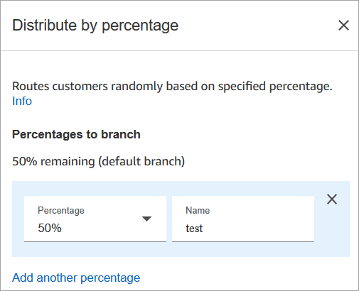
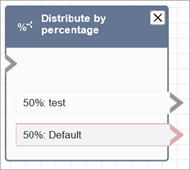

# Flow block in Amazon Connect: Distribute by

percentage

This topic defines the flow block for routing customers randomly to a queue based on a
percentage.

## Description

- This block is useful for doing A/B testing. It routes customers randomly
  based on a percentage.
- Contacts are distributed randomly, so exact percentage splits may or may
  not occur.

## Supported channels

The following table lists how this block routes a contact who is using the
specified channel.

| Channel | Supported? |
| ------- | ---------- | ---------------------------------------------------------------------------------------------------------------------------------------------------------------------------------------------------------------------------------------------------------------------------------------------------------------------------------------------------------------------------------------------------------------------------------------------------------------------------------------------------------------------------------------------------------------------------------------------------------------------------------------------------------------------------------------------------------------------------------------------------------------------------------------------------------------------------------------------------------------------------------------------------------------------------------------------------------------------------------------------------------------------------------------------------------------------------------------------------------------------------------------------------------------------------------------------------------------------------------------------------------------------------------------------------------------------------------------------------------------------------------------------------------------------------------------------------------------------------------------------------------------------------------------------------------------------------------------------------------------------------------------------------------------------------------------------------------------------------------------------------------------------------------------------------------------------------------------------------------------------------------------------------------------------------------------------------------------------- |
| Voice   | Yes        |
| Chat    | Yes        |
| Task    | Yes        |
| Email   | Yes        | ## Flow types You can use this block in the following [flow types](create-contact-flow.md#contact-flow-types "create-contact-flow.md#contact-flow-types"):  • Inbound flow  • Customer queue flow  • Outbound Whisper flow  • Transfer to Agent flow  • Transfer to Queue flow ## Properties The following image shows the **Properties** page of the **Distribute by percentage** block. It is configured to route 50% of contacts to the test branch.  ## How it works This block creates static allocation rules based on how you configure it. Internal logic generates a random number between 1-100. This number identifies which branch to take. It doesn't use current or historical volume as part of it's logic. For example, say a block is configure like this:  • 20% = A  • 40% = B  • 40% remaining = Default When contact a is being routed through a flow, Amazon Connect generates the random number.  • If number is between 0-20, the contact is routed down the A branch.  • Between 21-60 it's routed down the B branch.  • Greater than 60 it's routed down the Default branch. ## Configured block The following image shows an example of what this block looks like when it is configured. It shows two branches: **50% test** and **50% default**.  ## Sample flows Amazon Connect includes a set of sample flows. For instructions that explain how to access the sample flows in the flow designer, see [Sample flows in Amazon Connect](contact-flow-samples.md "contact-flow-samples.md"). Following are topics that describe the sample flows which include this block.  • [Sample flow in Amazon Connect for A/B contact distribution testing](sample-ab-test.md "sample-ab-test.md") |
