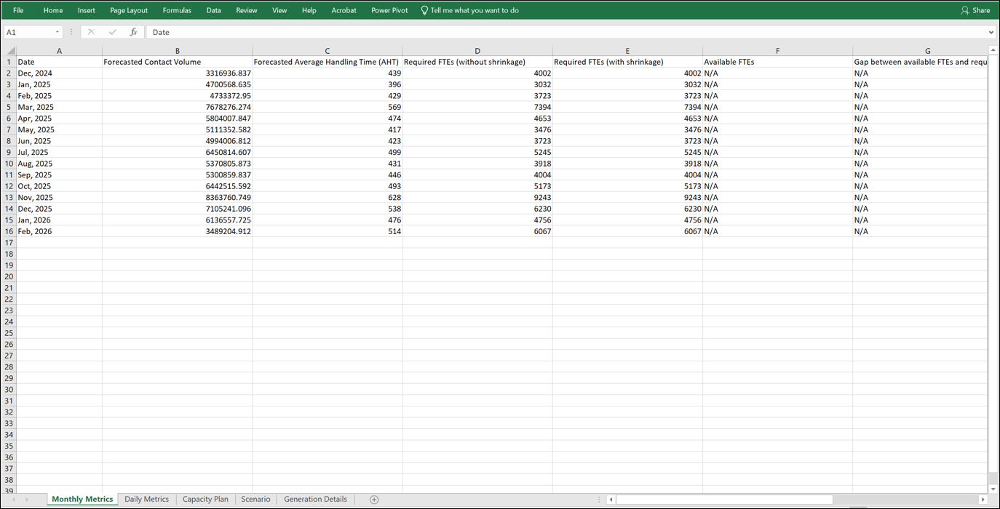

# Download a capacity plan in Amazon Connect

When you download a capacity plan file, it downloads as a .csv file type with
multiple tabs. It's helpful to open this file using Excel. The following image shows
an example of what a capacity plan file looks like in Excel.

Following is a description of each worksheet:

- **Metrics**: When you download the Monthly view, the
  capacity plan output shows Monthly and Daily granularities. When you
  download the Weekly view, it shows Weekly and Daily granularities.
- **Capacity Plan**: The capacity plan metadata, such as
  name, starting date, and ending date of the plan.
- **Scenario**: The input defined for the capacity plan.
- **Generation Details**: The metadata indicating when
  someone last changed the capacity plan.

## How to download capacity plan

results

1. Log in to the Amazon Connect admin website with an account that has security profile
   permissions for **Analytics**, **Capacity
   planning - Edit**.

For more information, see [Assign
permissions](required-optimization-permissions.md "required-optimization-permissions.md"). 2. On the Amazon Connect navigation menu, select **Analytics and
optimization**, **Capacity
Planning**. 3. On the **Capacity Plans** tab, choose the plan. 4. On the detailed page for the capacity plan, choose
**Actions**, **Download capacity
plan**.
