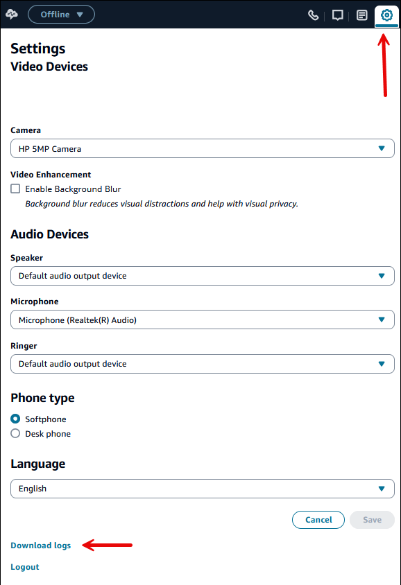
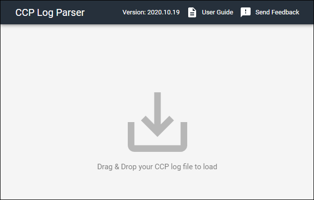
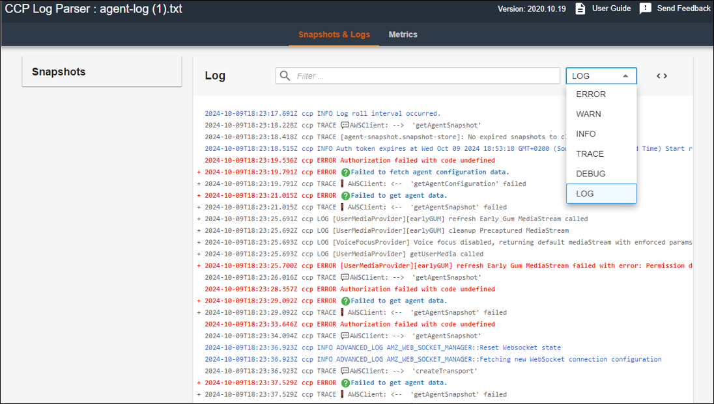
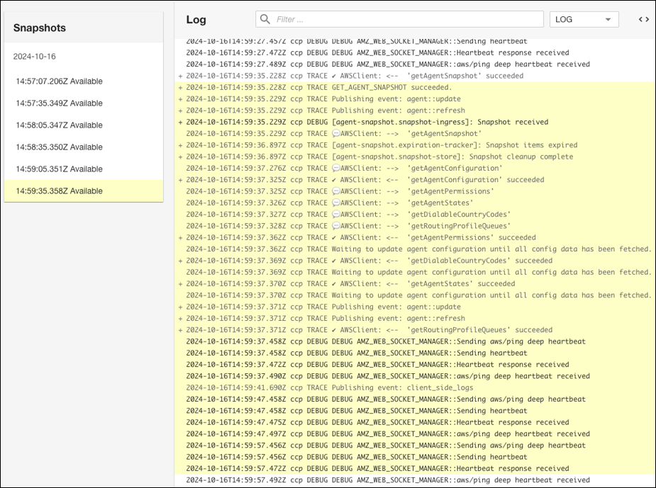
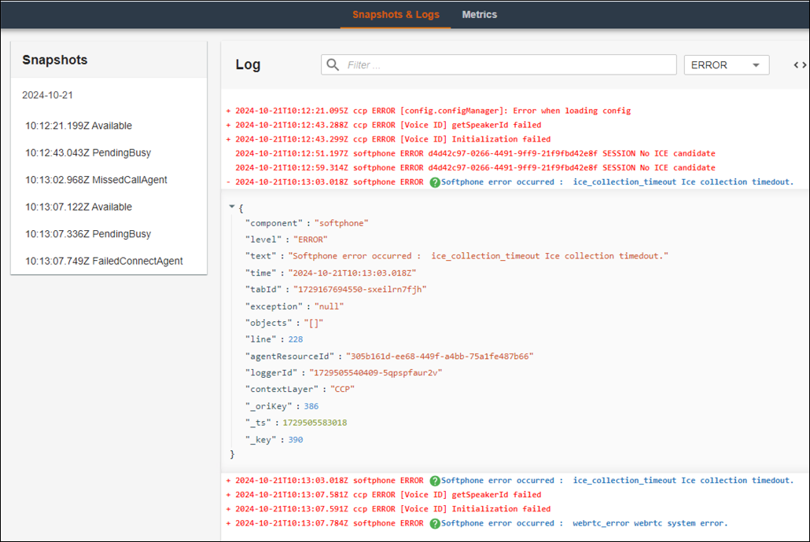
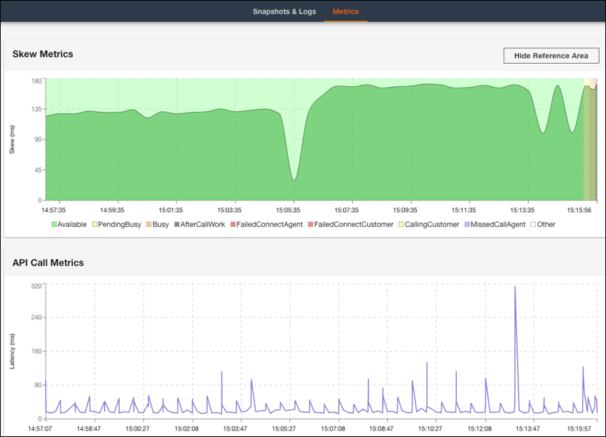
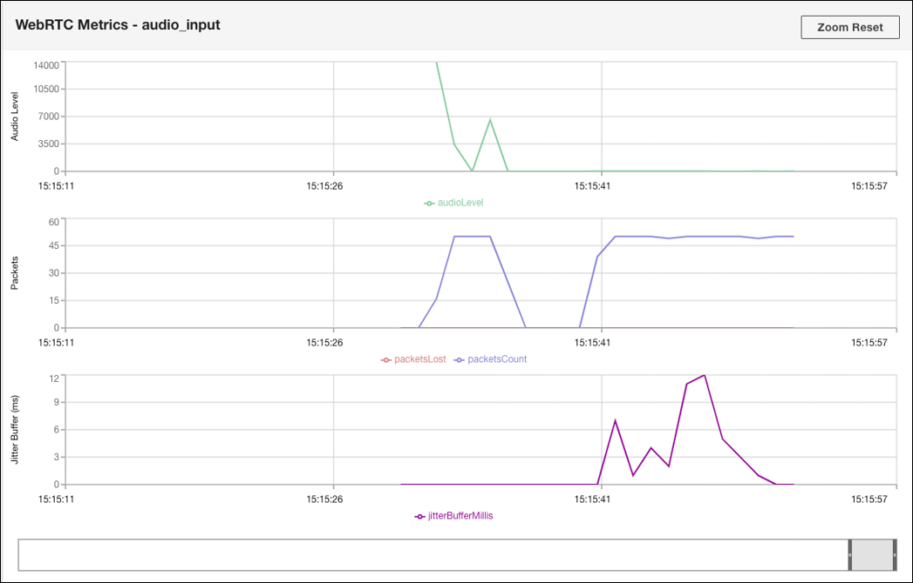

# Download and review Amazon Connect Contact Control Panel

(CCP) logs

This topic is for IT admins and developers who need to troubleshoot issues with an
agent's Contact Control Panel (CCP).

## Download CCP logs

1. On the agent's desktop, in their CCP, choose
   **Settings**, **Download logs**.

 2. The `agent-log.txt` file is saved to your browser's default
directory. After the file is downloaded, you can change the name of the file
the same way you rename any other file on your computer. You can't customize
the file name before the file is
downloaded.

## Review CCP logs using Amazon Connect CCP Log

Parser

After downloading the agent's CCP logs, you can use the Amazon Connect CCP Log Parser to
troubleshoot further and get a better view of the errors and verbose details on how
the error occurs. Viewing CCP logs will also enable you to identify errors and
resolve where possible.

###### To load the CCP log file into the CCP log parser and view logs

1. Open the [CCP Log
   Parser](https://tools.connect.aws/ccp-log-parser/ "https://tools.connect.aws/ccp-log-parser/")
   (`https://tools.connect.aws/ccp-log-parser/`).
2. Drag and drop your log file, for example, `agent-log.txt` into
   the parser. The following image shows the log parser.

 3. On the **Snapshots & Logs** tab you can see the logs
recorded during the agent session.

Normally log entries are collapsed but most log entries contain more
information. To see the original log object in JSON format, click the + to
expand or collapse the log lines with more information.

###### Note

CCP logs do not persist through browser refreshes.

 4. On the left side of log entry, you can choose Snapshots. CCP periodically
retrieves an AgentSnapshot from Amazon Connect. The Snapshot displays the agent
status that was captured during these retrieval periods. Clicking on one
Snapshot highlights the section from that snapshot until the subsequent
snapshot.

 5. The following image shows a Snapshot log, with a softphone error.

 6. On the **Metrics** tab, you can view the following
metrics:

    * **Skew Metrics** shows difference between the
     client-side (agent's workstation) local timestamp and server-side
     (Amazon Connect service) timestamp in milliseconds.
    * **API Call Metrics** shows the latency of the API
     call from CCP.
    * **WebRTC Metrics**: Available if the call was
     made with CCP. **WebRTC Metrics** shows the media
     stream condition during a call.

For instructions about troubleshooting call quality issues, see [Troubleshoot audio quality issues by using
QualityMetrics in the contact record](sop-audio-qa.md "sop-audio-qa.md").
