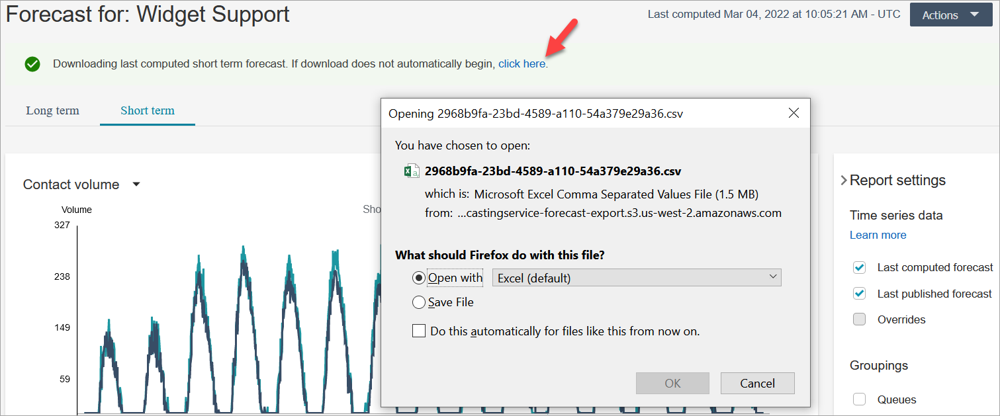

# Download a forecast from Amazon Connect to view

offline

You can download a forecast so you can inspect it offline. A forecast is
downloaded as a .csv file of the forecast data. It has the queue name, channel type,
timestamp, incoming contact volume and average handle time data.

1. Log in to the Amazon Connect admin website with an account that has security profile permissions
   for **Analytics**, **Forecasting - Edit**.

For more information, see [Assign
permissions](required-optimization-permissions.md "required-optimization-permissions.md"). 2. On the Amazon Connect navigation menu, choose **Analytics and
optimization**, **Forecasting**. 3. On the **Forecasts** tab, choose the forecast. 4. Choose **Actions**, and then download either the last
computed forecast or the last published forecast. 5. We recommend choosing **click here**. This enables you to
choose the name of the file download and where to save it, as shown in the
following image. Otherwise, the file is saved to your
**Downloads** folder and its name is a generated
number.

