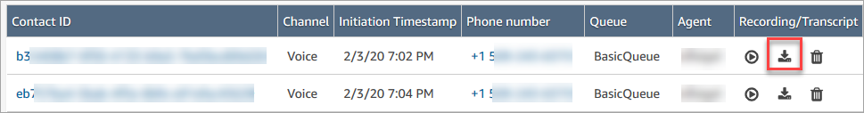
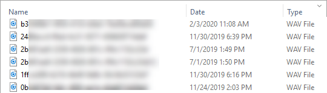
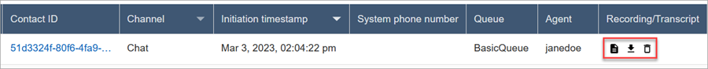
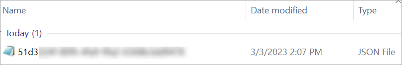
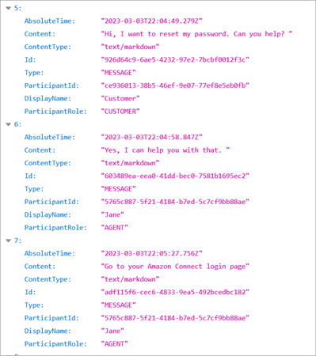

# Download recordings and transcripts of past

conversations in Amazon Connect

These are the steps that a manager does to download past recordings or transcripts of
conversations.

- If the contact reached you by phone call (the Voice channel), you can download
  a .wav file.
- If the contact reached you by chat (the Chat channel), you can download a
  .json file.

###### Tip

To have Amazon Connect create transcripts of phone calls, see the Contact Lens
feature.

## Download a voice recording as a .wav

file

1. Log in to the Amazon Connect admin website with a user account that has [permissions to access
   recordings](assign-permissions-to-review-recordings.md "assign-permissions-to-review-recordings.md").
2. In Amazon Connect choose **Analytics and optimization**,
   **Contact search**.
3. Filter the list of contacts by date, agent login, phone number, or other
   criteria. Choose **Search**.
4. Conversations that were recorded have icons in the
   **Recording/Transcript** column. If you don't have the
   appropriate permissions, you won't see these icons.

The following image shows what the icons look like for a voice recording.
Note the play icon that indicates it's a voice recording.

 5. Choose the **Download** icon, as shown in the following
image.

 6. A voice recording is saved automatically to your
**Downloads** folder as a .wav file.

The following image shows a list of .wav files in a Downloads folder. The
name of the .wav file is the contact ID.

###### Tip

In the recording, you may hear only the agent, only the customer, or
both the agent and customer. This is determined by how the [Set recording and analytics
behavior](set-recording-behavior.md "set-recording-behavior.md") block is configured.

## Download a chat transcript as a .json

file

1. The following image shows what the icons look like for a chat
   transcript.

A chat transcript is saved to the Downloads folder as a .json file.

The following image shows a .json file in the Downloads folder. The name
of the .json file is the contact ID.

 2. To view a downloaded chat transcript, right-click the .json file, and then
open it with another app that enables you to view the contents in a readable
format.

The following image shows a sample downloaded transcript that has been
opened using Firefox. The image shows the middle of the transcript, where
the agent and customer are chatting.

## Events in a chat transcript

If you have a process that consumes events in S3 transcripts, note that chat
transcripts contain the following event content types if the event has occurred
during the chat session:

- `application/vnd.amazonaws.connect.event.participant.left`
- `application/vnd.amazonaws.connect.event.participant.joined`
- `application/vnd.amazonaws.connect.event.chat.ended`
- `application/vnd.amazonaws.connect.event.transfer.succeeded`
- `application/vnd.amazonaws.connect.event.transfer.failed`
- `application/vnd.amazonaws.connect.event.participant.invited`
