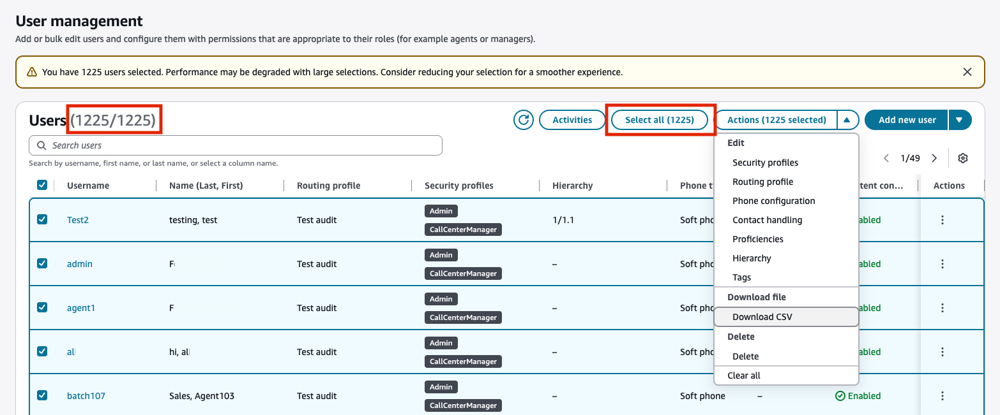

# Download a user list from your Connect Customer instance

You can export a list of users from Connect Customer to a CSV file. Use
**Select all** to select all users from the search results,
regardless of page. You can export over 1,000 users at once.

1. Log in to the Connect Customer admin website at https://`instance name`.my.connect.aws/. Use an **Admin** account, or an account
   assigned to a security profile that has **Users and permissions - Users

- View** permissions.

2. In Connect Customer, on the left navigation menu, choose **Users**.
3. Select the users you want to export. To select all users from the search
   results, choose **Select all**. Then choose
   **Download CSV**.

