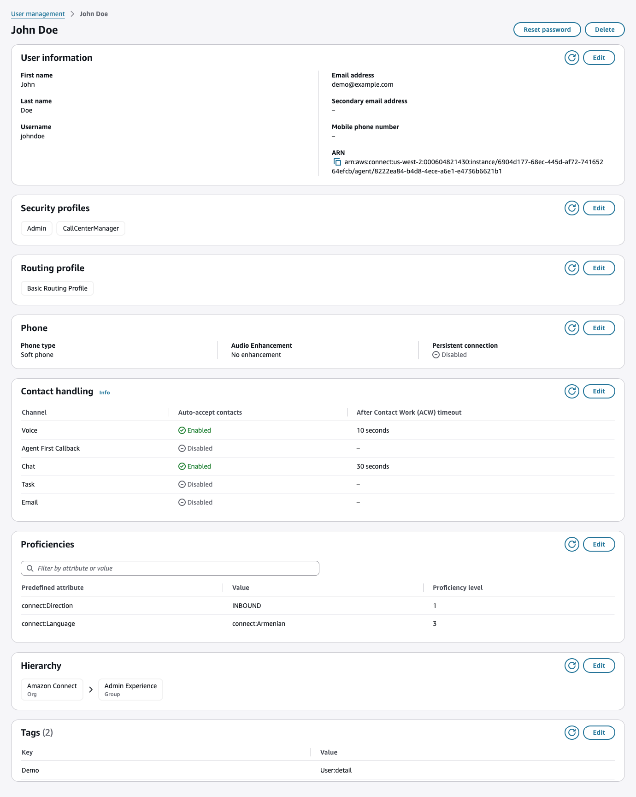
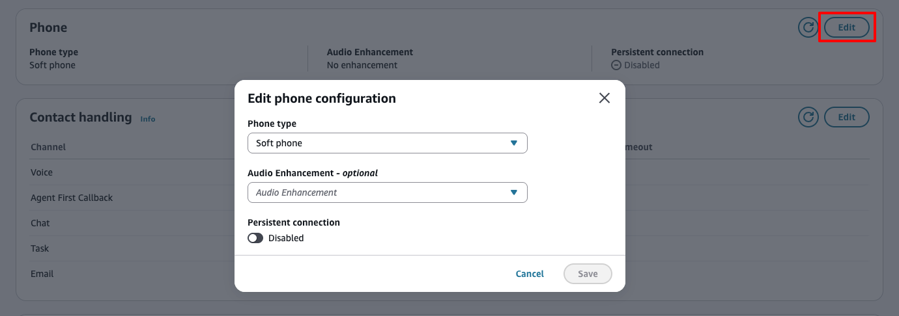
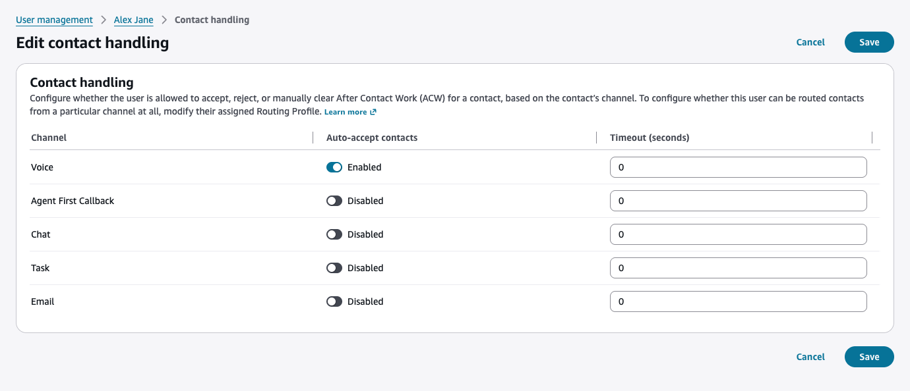

# Edit a user

When you choose a user from the **User management** page, the user
detail page opens. The detail page organizes settings into sections,
including **User information**, **Routing
profile**, and **Phone configuration**. To edit a
section, choose **Edit** in the section header.

The following image shows the user detail page with its configuration
sections.

Depending on the setting, the edit experience differs:

- **Dialog-based settings**: For user information,
  routing profile, phone configuration, and hierarchy, choose
  **Edit** in the section header to open a dialog where you can
  update the settings.

- **Page-based settings**: For contact handling
  and proficiencies, choose **Edit** in the section header to
  navigate to a dedicated page where you can configure the settings directly.

After making your changes, choose **Save**.
