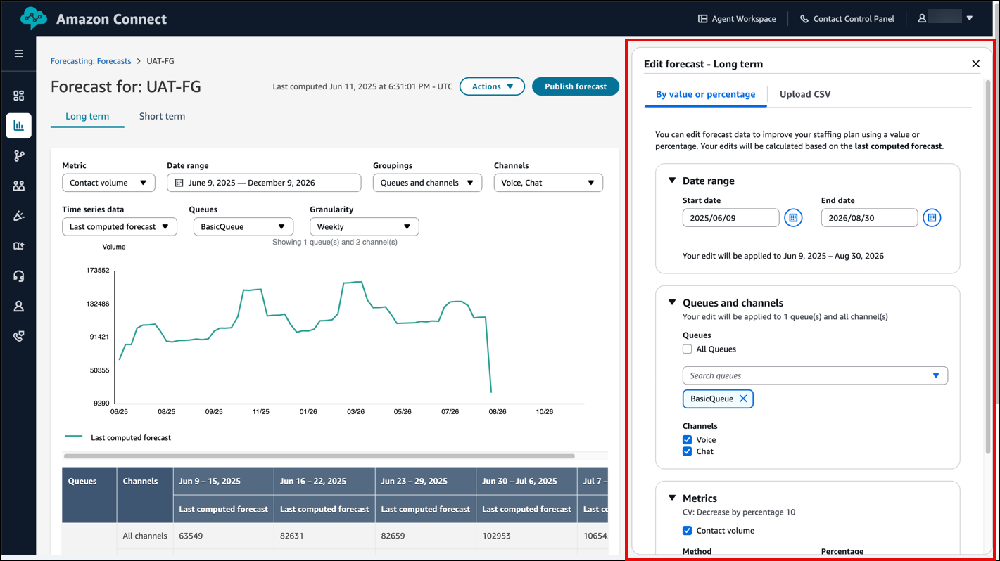
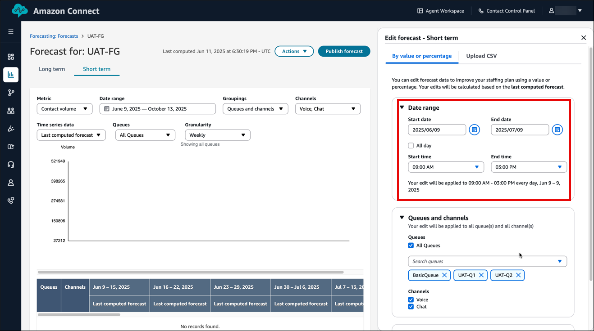
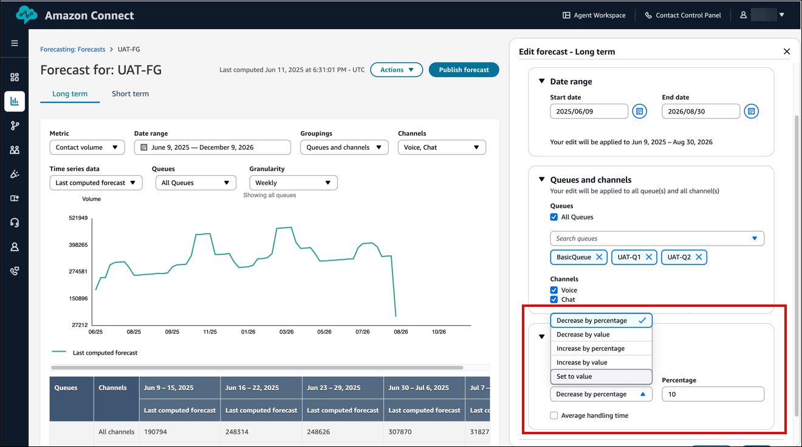
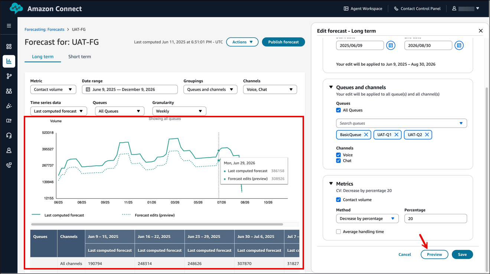
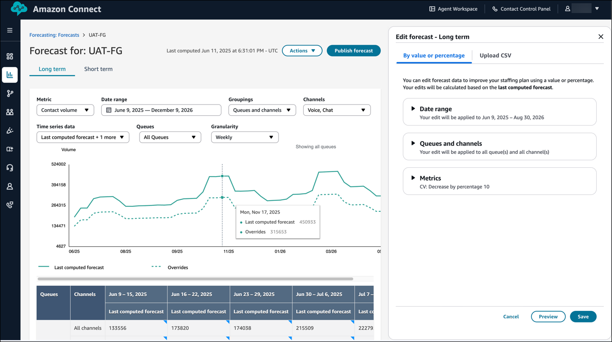
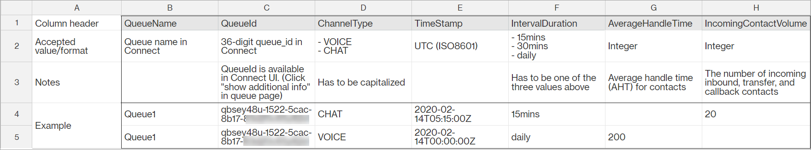
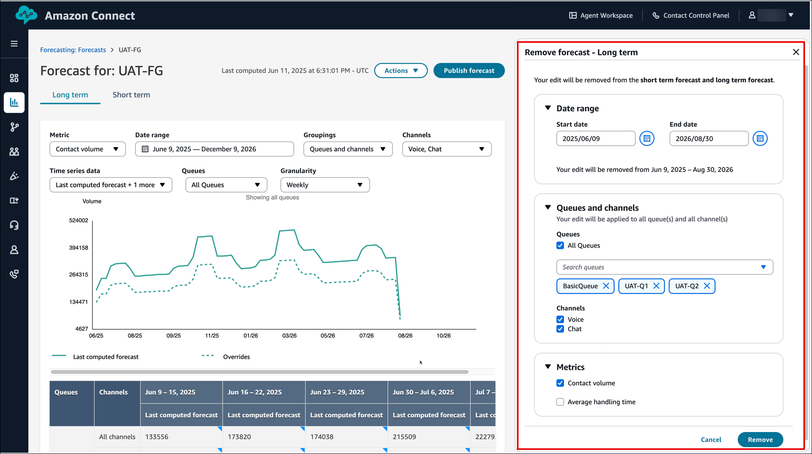

# Edit a forecast in Amazon Connect

In the Amazon Connect admin website, there are two ways you can edit a forecast at the queue channel
level: you can make your edits directly in the user interface, or you can upload a
CSV file that contains your edits.

Editing the forecast allows you to modify the forecast values to better reflect
changes in contact patterns, such as a special event that could increase volume by
10 percent during a specific week. If the edited forecast is no longer applicable,
you can also remove the changes.

###### Contents

- [How to edit a forecast](#howto-edit-forecast "#howto-edit-forecast")
- [Important things to
  know about using a CSV file to edit forecasts](#important-things-to-know-edit-forecast "#important-things-to-know-edit-forecast")
- [How to edit a forecast using a CSV
  upload](#howto-edit-forecast-csv "#howto-edit-forecast-csv")
- [How to remove your forecast
  edits](#howto-remove-forecast-edits "#howto-remove-forecast-edits")

## How to edit a forecast

1. Log in to the Amazon Connect admin website with an account that has security profile
   permissions for **Analytics and Optimization**,
   **Forecasting - Edit**.

For more information, see [Assign
permissions](required-optimization-permissions.md "required-optimization-permissions.md"). 2. On the Amazon Connect navigation menu, select **Analytics and
optimization**, **Forecasting**, and then
choose the **Forecast** tab. 3. Choose the forecast to edit, and then choose
**Actions**, **Edit
forecast**. 4. The **Edit forecast** pane opens. It displays
pre-filled values based on your selections from the currently selected
forecast, as shown in the following image.

For example, the above image shows a long-term forecast selected with
**BasicQueue** and the **Voice**
and **Chat** channels. The **Edit
forecast** pane is automatically populated with these
selections. 5. You can further configure the date range, queues, channels, and
metrics, depending on the type of operation you want to use for editing
the forecast:

    1. **Date range**:

    	* For short-term forecasts, you can select a 31-day
    	 range for editing at a time. The changes are applied to
    	 each interval (either 15 minutes or 30 minutes,
    	 depending on your default settings) within the selected
    	 date range.

    	You can also limit the edits to a specific time range
    	 by clearing **All day** and instead
    	 selecting a start and end time. This feature allows you
    	 to adjust the forecast for a specific time window.

    	The following image shows the **Data
    	 range** section of the **Edit
    	 forecast - Short term** pane.

    	
    	* For long-term forecasts, you can select a date range
    	 of up to 64 weeks. Edits are applied at a daily
    	 granularity.
    2. **Queues and channels**: You can choose
     **All queues** or search and add individual
     queues one by one. You also have the option of removing any
     selected queues. Similarly, you can select channels such as
     **Voice** or **Chat** as
     needed.
    3. **Metrics**: Metrics allow you to apply
     specific operations to your selection based on the type of edit
     you want to make. You can apply these operations to either [Contact volume](metrics-definitions.md#contact-volume "metrics-definitions.md#contact-volume"), [Average handle time](metrics-definitions.md#average-handle-time "metrics-definitions.md#average-handle-time"), or
     both, depending on your needs.

    The following image shows the location of
     **Metrics** on the page, and the dropdown
     list of options.

    

    Choose from the following operation types:

    	* **Decrease by percentage**: The
    	 percentage decrease is applied based on the distribution
    	 of the last computed forecast value across the selected
    	 time range intervals.

    	 For example, if you have 100 contacts in a 15-minute
    	 interval and apply a 10% decrease, the new value will be
    	 90 contacts.
    	* **Increase by percentage**: The
    	 percentage increase is applied based on the distribution
    	 of the last computed forecast value across the selected
    	 time range intervals.

    	 For example, if you have 100 contacts in a 15-minute
    	 interval and apply a 10% increase, the new value will be
    	 110 contacts.
    	* **Decrease by value**: The decrease
    	 is applied based on the distribution of the last
    	 computed values across the selected time range
    	 intervals.

    	 For example, if you're editing a long-term forecast
    	 spanning two days with intervals showing 40 contacts on
    	 day 1 and 60 contacts on day 2, and you want to decrease
    	 the value by 10, the decrease will be proportionally
    	 distributed across both days. For interval 1, the
    	 decrease would be 10 \* (40 / (40+60)) = 4, resulting in
    	 a final value of 36. Similarly for interval 2, the final
    	 value would be 54.
    	* **Increase by value**: The increase
    	 is applied based on the distribution of the last
    	 computed values across the selected time range
    	 intervals, similar to the decrease by value
    	 operation.

    	For example, Interval 1 will increase to 44, and
    	 Interval 2 will increase to 66.
    	* **Set by value**: The selected value
    	 is applied based on the distribution of contact volume
    	 or average handle time across intervals, similar to the
    	 decrease by value operation.

    	For example, in this case, Interval 1 will be set to
    	 4, and Interval 2 will be set to 6.

    	###### Note

    	Any operation resulting in a value of less than 0
    	 will automatically set the value to 0.

6. After you've made your selection, choose **Preview**
   to view the changes on your screen, as shown in the following
   image

 7. Choose **Save** to apply your changes. Your edits are
reflected as overrides. You can make edits as many times as needed.

    * For overlapping intervals, the most recent edit persists.
    * For non-overlapping intervals, all interval edits
     persist.

The following image shows an example of edits saved to the UAT-FG
forecast.

## Important things to

know about using a CSV file to edit forecasts

- The override data file be must a CSV file and it must be in the
  required format. If the file format and data don't meet the
  requirements, the upload does not work. We recommend downloading and
  using the template provided to help you prepare the historical data.

The following image shows an example CSV file with data in it.

Following are the requirements for imported data:

    + `QueueName`: Enter the Amazon Connect queue name.
    + `QueueId`: Enter the Amazon Connect queue ID. To find the
     queue ID in the Amazon Connect admin website, on the left navigation, go to
     **Routing**, **Queues**,
     choose the queue, select **Show additional queue
     information**. The queue ID is the last number
     after `/queue/`.
    + `ChannelType`: Enter `CHAT` or
     `VOICE`.
    + `TimeStamp`: Enter the timestamp in ISO8601 format.
     For long-term forecast overrides, the time value must be
     midnight in the [selected
     time zone](set-forecast-timezone.md "set-forecast-timezone.md").
    + `IntervalDuration`: Enter `15mins` or
     `30mins` for short-term forecast, depending on
     your forecast and schedule interval. Enter `daily`
     for long-term forecast.
    + `IncomingContactVolume`: Enter the number of
     inbound, transfer, and callback contacts as an integer.
    + `AverageHandleTime`: Enter the amount of average
     handle time (in seconds) as type double/decimal.

- You can upload only one override file for a forecast group.
  - This means if you previously uploaded an override file (for
    example, with 120 lines of overrides), you must add new
    overrides to this override file (for example, add 50 new lines
    of overrides) and re-upload the file that now has 170 lines of
    overrides.
  - This also means you need to include overrides for both
    short-term and long-term forecasts in one file.

- Both [Contact volume](metrics-definitions.md#contact-volume "metrics-definitions.md#contact-volume") and [Average handle time](metrics-definitions.md#average-handle-time "metrics-definitions.md#average-handle-time") are
  included in one override file. Both columns must be populated in the
  override file.
- The following special characters are allowed in the CSV file: -, \_, .,
  (, and ). Space is allowed.

## How to edit a forecast using a CSV

upload

1. Review [Important
   things to know about using CSV upload to edit forecasts](#important-things-to-know-edit-forecast "#important-things-to-know-edit-forecast") if
   you have not yet already done so.
2. On the **Forecasts** page, choose the forecast you
   want to edit, and then choose **Actions**,
   **Edit forecast**.
3. In the **Edit forecast** pane, choose the
   **Upload CSV** tab.
4. Choose **Download the .csv template for override
   data**.

###### Note

Amazon Connect supports one, which would be the latest, override file per
forecast group.

    * When you choose to download a template, your template will
     contain headings but no data.
    * When you choose to download forecast edits, you will
     receive the file that was previously uploaded. This option
     is only visible if a file has been uploaded.

If you need to make changes later on to the same forecast, you must
download the last uploaded file, make your changes, and then upload the
file. Amazon Connect retains only the last uploaded file. 5. Add override data, and then choose **Upload CSV** to
upload it. Choose **Save** to confirm forecast
override.

## How to remove your forecast

edits

1.  On the **Forecasts** page, choose the forecast you
    want to change, and then choose **Actions**,
    **Remove forecast edits**.
2.  In the **Remove forecast** pane, select a date range,
    queues, channels, and metrics (Contact volume and Average handle time)
    from which to remove your edits.

        * The **Date range** works the same way as
         when you [edit a
         forecast](#howto-edit-forecast "#howto-edit-forecast").
        * You can apply multiple edits across different time ranges, and
         all changes will be applied.

    The following image shows an example **Remove
    forecasts** pane. Edits made between 2025/06/06 and
    2026/08/30 for all queues, for the voice and chat channels, and for only
    the **Contact volume** metric will be removed.

 3. Choose **Remove** to apply the changes.
