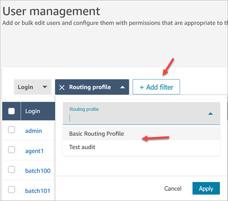
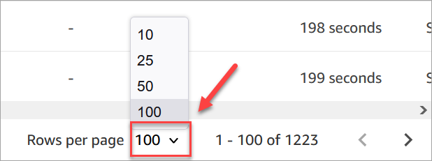
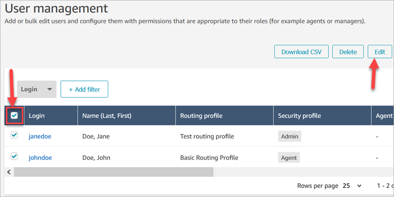
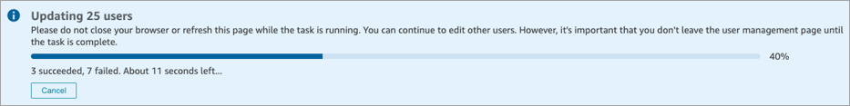
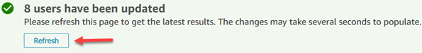
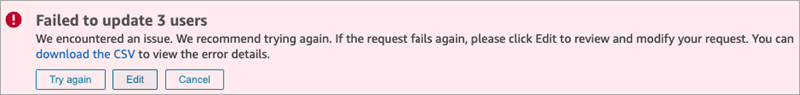
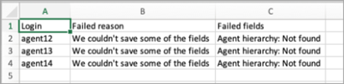
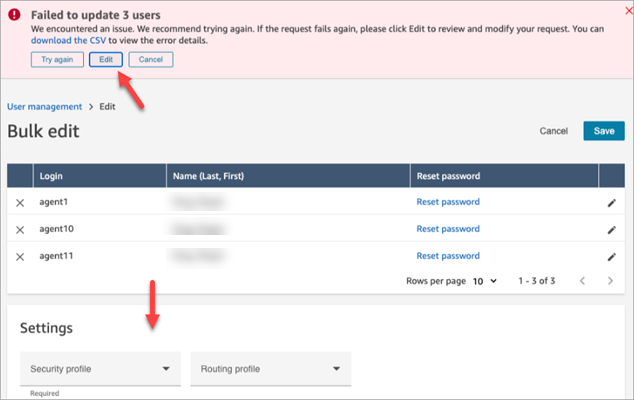
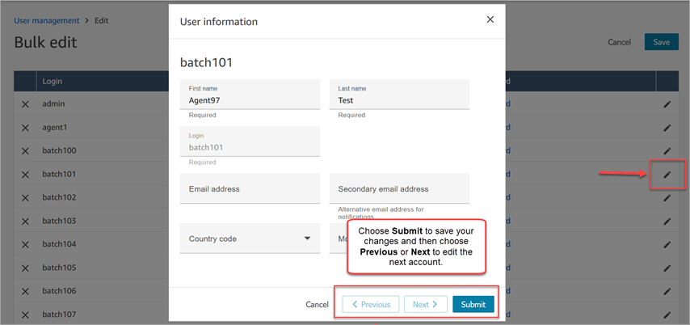

# Edit users in bulk in Amazon Connect

Bulk edit mode enables you to quickly edit the attributes that are common across user
records, such as routing profiles, security profiles, and tags.

###### Tip

While a batch of bulk edits is being processed, you can continue working on the
**User management** page, such as selecting more records to
edit or delete, in bulk or individually. This is useful for quickly updating
settings, such as routing profiles for groups of agents.

1. Log in to Amazon Connect with an Admin account, or an account assigned to
   a security profile that has **Users - Edit** permission.
2. In Amazon Connect, on the left navigation menu, choose **Users**,
   **User management**.
3. If needed, choose **Add filter** to specify a subset of
   users, such as users with a specific **Routing profile**. This
   option is shown in the following image.

 4. To quickly update a large number of users, at the bottom of the table choose
to display **100** rows per page, as shown in the following
image.

 5. To edit all the records on the page, choose the top box. Otherwise, select one
or more records you want to edit at the same time. Choose
**Edit**.

 6. On the **Bulk edit** page, in the
**Settings** section, you can choose the following settings
for all of the selected users:

    * Security profile
    * Routing profile
    * Phone type
    * Auto accept per channel
    * After Call Work (ACW) timeout per channel
    * Agent hierarchy, if this has been set up
    * Tags

7. Choose **Save** to apply your changes to the selected
   records.
8. While that batch of user records is being updated, you can continue working on
   the **User management** page, performing other create, edit,
   and delete tasks on user records.

## Perform other edit tasks while a batch of bulk

edits is being processed

After saving an update for a group of users, you can either make additional
changes on the **Bulk edit** page (for example, [edit other user details](#edit-other-user-details "#edit-other-user-details") such as contact
information) or you can choose different user records to edit.

###### Important

As long as you remain on the **User management** page, your
update request will continue to be processed. Review the messages at the top of
the page for the status of the update.

The following image shows an example of message at the top of the **User
management** page that Amazon Connect is updating a batch of user records.

When you perform additional tasks on the **User management**
page, Amazon Connect appends the next request to create, edit, or delete user records to the
existing status message at the top of the page. Amazon Connect sequentially processes them in
bulk.

Following are some tips about how Amazon Connect processes bulk edit requests.

- If you choose **Cancel** during a bulk create, edit, or
  delete, **only those requests not yet processed are
  canceled**.
- A message displays how many users were successfully updated. Choose
  **Refresh** to refresh the page with the list of the
  updated users.

- If some user records fail to be updated, a message similar to the
  following image is displayed:

You have the following options:

    + Choose **download the CSV** to discover the
     reason changes weren't updated. In the following example, the agent
     hierarchy was deleted before the user records were saved.

    
    + Choose **Try again** to resubmit only those user
     records that failed. The others were already successfully updated.
    + Choose **Edit** to be directed to the
     **Bulk edit** page so you can change the input
     for the user records that failed.

    
    + Choose **Cancel** to not do anything with the 3
     user records that weren't updated.

## Edit other user details

You can page through selected user records to make updates to contact information,
rather than choosing and opening each record individually.

1. On the **Bulk edit** page, select the user records you
   want to edit.
2. Choose the **Edit** (pencil) icon next to individual
   users to make updates.
3. A dialog box opens for the individual user. Make your changes, and choose
   **Submit**.
4. If needed, choose **Previous** and
   **Next** to open the next user record in the list. The
   following image shows the **Edit** dialog box for a single
   user while in bulk edit mode.

## Edit user settings

programmatically

You can change the following values programmatically across selected users. The
users are changed to the same value.

| Property           | API                                                                                                                                                                                    | CLI                                                                                                                                                                                                                                                                  |
| ------------------ | -------------------------------------------------------------------------------------------------------------------------------------------------------------------------------------- | -------------------------------------------------------------------------------------------------------------------------------------------------------------------------------------------------------------------------------------------------------------------- |
| Routing profiles   | [UpdateUserRoutingProfile](../APIReference/API_UpdateUserRoutingProfile.md "../APIReference/API_UpdateUserRoutingProfile.md")                                                          | [update-user-routing-profiles](../../../cli/latest/reference/connect/update-user-routing-profiles.md "../../../cli/latest/reference/connect/update-user-routing-profiles.md")                                                                                        |
| Security profiles  | [UpdateUserSecurityProfiles](../APIReference/API_UpdateUserSecurityProfiles.md "../APIReference/API_UpdateUserSecurityProfiles.md")                                                    | [update-user-security-profiles](../../../cli/latest/reference/connect/update-user-security-profiles.md "../../../cli/latest/reference/connect/update-user-security-profiles.md")                                                                                     |
| Tags               | [TagResource](../APIReference/API_TagResource.md "../APIReference/API_TagResource.md") [UntagResource](../APIReference/API_UntagResource.md "../APIReference/API_UntagResource.md") | [tag-resource](../../../cli/latest/reference/connect/tag-resource.md "../../../cli/latest/reference/connect/tag-resource.md") [untag-resource](../../../cli/latest/reference/connect/untag-resource.md "../../../cli/latest/reference/connect/untag-resource.md") |
| User hierarchies   | [UpdateUserHierarchy](../APIReference/API_UpdateUserHierarchy.md "../APIReference/API_UpdateUserHierarchy.md")                                                                         | [update-user-hierarchy](../../../cli/latest/reference/connect/update-user-hierarchy.md "../../../cli/latest/reference/connect/update-user-hierarchy.md")                                                                                                             |
| User configuration | [UpdateUserConfig](../APIReference/API_UpdateUserConfig.md "../APIReference/API_UpdateUserConfig.md")                                                                                  | [update-user-config](../../../cli/latest/reference/connect/update-user-config.md "../../../cli/latest/reference/connect/update-user-config.md")                                                                                                                      |

You can edit the following identity and contact information programmatically for
an individual user: first name, last name, email address, mobile number, secondary
email address. Use the following API or CLI:

| Property                         | API                                                                                                                     | CLI                                                                                                                                                                  |
| -------------------------------- | ----------------------------------------------------------------------------------------------------------------------- | -------------------------------------------------------------------------------------------------------------------------------------------------------------------- |
| Identify and contact information | [UpdateUserIdentityInfo](../APIReference/API_UpdateUserIdentityInfo.md "../APIReference/API_UpdateUserIdentityInfo.md") | [update-user-identity-info](../../../cli/latest/reference/connect/update-user-identity-info.md "../../../cli/latest/reference/connect/update-user-identity-info.md") |
