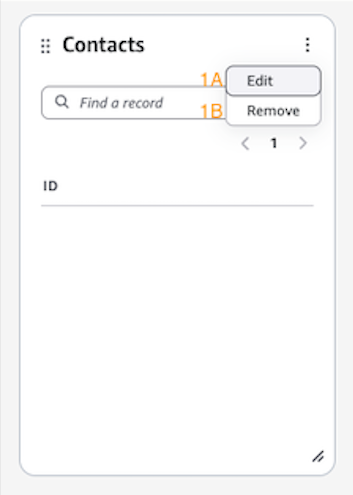
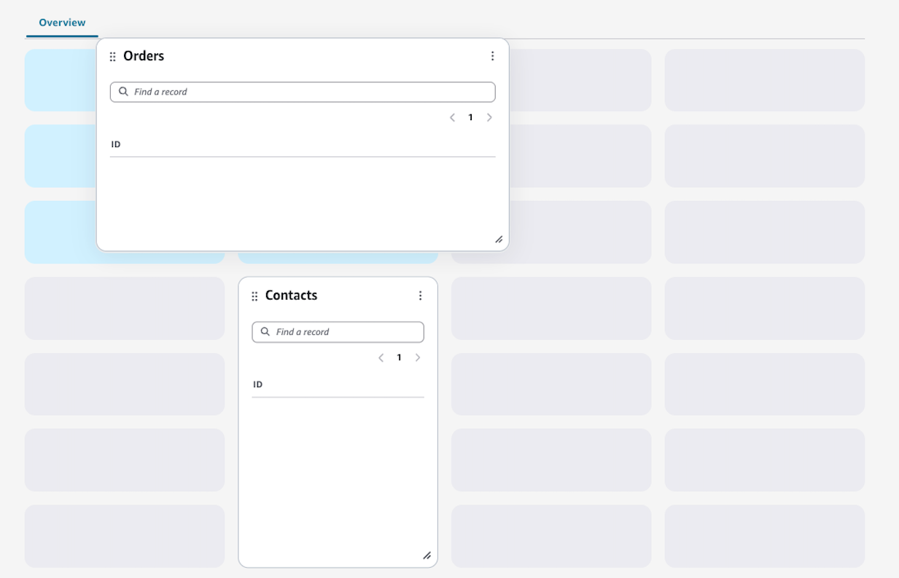

# Editing your explorer layout

Customize your Profile explorer layout through simple, intuitive controls for
managing widgets and their placement.

## Widget controls

Each widget features a three-dot menu in the upper right corner, providing two
primary options:

- **1A Edit**: Opens the configuration
  panel for that specific widget
- **1B Remove**: Deletes the widget from
  your layout

## Widget customization

- **Drag & Drop**: Reposition widgets
  anywhere on your dashboard
- **Resize**: Chose and drag widget borders
  to adjust dimensions
- **Configuration**: Access detailed
  settings through the edit panel specific to each widget type

###### Note

Each widget type has unique configuration options. For detailed information
about specific widget settings, refer to the widgets documentation.

## Adding new widgets

To add new components to your layout, use the **Add
Widgets** button in the control panel.
