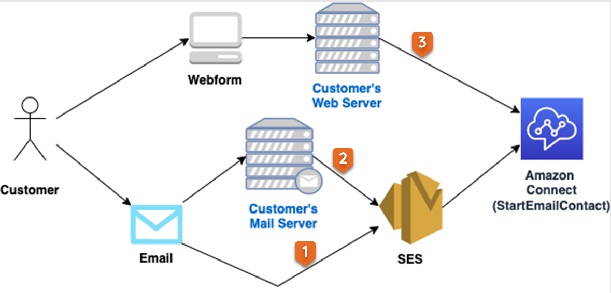
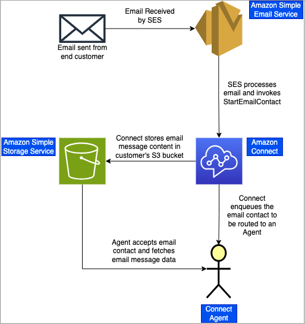
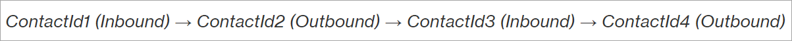
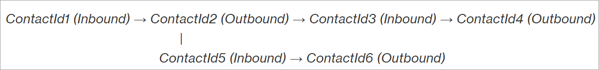
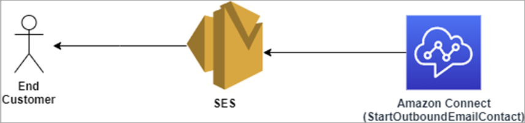

# How Amazon Connect email works

Amazon Connect Email provides built-in capabilities that make it easy for you to prioritize,
assign, and automate the resolution of customer service emails, improving customer
satisfaction and agent productivity. You can receive and respond to emails sent by
customers to your [configured email
addresses](create-email-address1.md "create-email-address1.md"), or submitted by using web forms on your website or mobile app by
using the [StartEmailContact](../APIReference/API_StartEmailContact.md "../APIReference/API_StartEmailContact.md") API.

Amazon Connect Email integrates with [Amazon Simple Email Service (SES)](../../../ses/latest/dg/Welcome.md "../../../ses/latest/dg/Welcome.md") to send, receive, and
monitor emails for [content marked as spam or containing viruses](../../../ses/latest/dg/receiving-email-concepts.md#receiving-email-auth-and-scan "../../../ses/latest/dg/receiving-email-concepts.md#receiving-email-auth-and-scan"), [delivery success rates](../../../ses/latest/dg/monitor-sending-activity.md "../../../ses/latest/dg/monitor-sending-activity.md"),
and [sender reputation results](../../../ses/latest/dg/monitor-sender-reputation.md "../../../ses/latest/dg/monitor-sender-reputation.md").

This topic explains how Amazon Connect Email, along with Amazon SES, work to enable a seamless
customer experience.

###### Contents

- [Receive
  emails](#email-capabilities-howreceived "#email-capabilities-howreceived")
- [Email
  contacts](#email-capabilities-howtranslated "#email-capabilities-howtranslated")
- [Every email message is a
  unique email contact](#email-capabilities-howmanaged "#email-capabilities-howmanaged")
- [Email
  threads](#email-capabilities-howthreadsmanaged "#email-capabilities-howthreadsmanaged")
- [Send
  email](#email-capabilities-howemailssent "#email-capabilities-howemailssent")

## Receive emails

There are three main ways that Amazon Connect can receive emails:

- **Method 1**: By an [email address](create-email-address1.md "create-email-address1.md") defined in Amazon Connect
  (for example, support@`customer-domain`.com) using
  a [verified email domain from Amazon SES](../../../ses/latest/dg/creating-identities.md#just-verify-domain-proc "../../../ses/latest/dg/creating-identities.md#just-verify-domain-proc"), such as the email domain
  provided with your Amazon Connect instance (for example,
  @`instance-alias`.email.connect.aws) or a
  custom verified domain that you own or is provided by your company (for
  example, @`customer-domain`.com). See [Step 3: Use your own custom email
  domains](enable-email1.md#use-custom-email "enable-email1.md#use-custom-email") in [Enable email for your instance](enable-email1.md "enable-email1.md") for details about onboarding
  custom email domains.
- **Method 2**: By using a routing rule on your
  email server (for example, [Microsoft 365 Connectors](https://learn.microsoft.com/en-us/exchange/mail-flow-best-practices/use-connectors-to-configure-mail-flow/set-up-connectors-to-route-mail "https://learn.microsoft.com/en-us/exchange/mail-flow-best-practices/use-connectors-to-configure-mail-flow/set-up-connectors-to-route-mail"), [Google Workspace Mail Routes](https://support.google.com/a/answer/2614757?hl=en&ref_topic=2921034&sjid=9077065025577504786-NC "https://support.google.com/a/answer/2614757?hl=en&ref_topic=2921034&sjid=9077065025577504786-NC")) to send the incoming email to one
  of [Amazon SES's SMTP
  endpoints](../../../general/latest/gr/ses.md "../../../general/latest/gr/ses.md") using a verified email domain onboarded to Amazon SES (for
  example, @`customer-domain`.com).
- **Method 3**: By using the [StartEmailContact](../APIReference/API_StartEmailContact.md "../APIReference/API_StartEmailContact.md") API to start an email contact by using a
  webform on your website or in your mobile app. This starts inbound email
  contacts similar to customers sending emails to your email addresses.

The following diagram illustrates how emails sent from your customers are received
by Amazon Connect using the [StartEmailContact](../APIReference/API_StartEmailContact.md "../APIReference/API_StartEmailContact.md") API for each of the methods mentioned above.

To integrate Methods 1 or 2, you need to verify an email domain on Amazon SES before
you can use the email domain in Amazon Connect. For instructions, see [Verifying a
DKIM domain identity with your DNS provider](../../../ses/latest/dg/creating-identities.md#just-verify-domain-proc "../../../ses/latest/dg/creating-identities.md#just-verify-domain-proc").

To integrate Method 3, you use the [StartEmailContact](../APIReference/API_StartEmailContact.md "../APIReference/API_StartEmailContact.md") API. This is the primary API of all integration
methods for inbound email contacts. It functions similarly to [StartTaskContact](../APIReference/API_StartTaskContact.md "../APIReference/API_StartTaskContact.md"). It requires you to do one of the following
steps:

- Include at least one email address from your Amazon Connect instance in either the
  To or CC attributes of the inbound email contact.

—OR—

- Define an inbound flow from your Amazon Connect instance to route the inbound email
  contact created.

If both are defined, the default behavior prioritizes the inbound flow from your
Amazon Connect instance to handle the inbound email contact created. If multiple email
addresses from your Amazon Connect instance are included in the To or CC email address
attributes, multiple inbound email contacts will be created in your Amazon Connect
instance.

## How email messages become email

contacts

For general email receiving in Amazon Connect, including webform based email, the [StartEmailContact](../APIReference/API_StartEmailContact.md "../APIReference/API_StartEmailContact.md") API exposes basic email fields on the request object.
This object is used to populate email information and start an email contact in
Amazon Connect. The following fields are included:

- A From email address
- To email address(es)
- CC email address(es)
- A subject
- A plain or HTML message body
- Attachment(s)

For more information about how the email contact information is populated into the
email contact, see the Amazon Connect email contact data model .

After the [StartEmailContact](../APIReference/API_StartEmailContact.md "../APIReference/API_StartEmailContact.md") API has performed request parameter validation and
ensured that at least one To or CC email address is valid and exists in the Amazon Connect
instance, here's what happens:

1. A contact ID is generated and returned as part of the API response
   body.
2. An asynchronous workflow is triggered to perform additional email message
   processing.
3. The flow is started. This is the flow that's associated with the email
   address found in the Amazon Connect instance.

As part of this, you need to setup your email message and attachment storage for
your Amazon Connect instance.

- Both email messages and attachments are stored and accessed in your own
  Amazon SES S3 bucket.
- The remaining email contact attributes such as To, CC, Subject, and other
  attributes are stored on the email contact; see [Data model for Amazon Connect contact records](ctr-data-model.md "ctr-data-model.md").

The following diagram illustrates the flow of the email message from the customer
to Amazon SES and then to Amazon Connect. It shows the email message content stored in your S3
bucket, and then getting data from that bucket to display it to the agent.

## Every email message is a unique

email contact

Amazon Connect email differs from voice, chat, and tasks.

- Every email message, inbound to or outbound from Amazon Connect, is its own unique
  email contact.
- Each email contact contains details specific to that email message such as
  From address, To address(es), CC address(es), subject, relatedContactId,
  links to email body and attachment(s) storage locations, and other details
  relevant to the individual email contact.

However, like other channels in Amazon Connect, an email contact has similar initiation
methods, such as `INBOUND`, `OUTBOUND`, `TRANSFER`,
`API`, `QUEUE_TRANSFER` and `END/DISCONNECT`.
It also has similar states, such as `CREATED`, `QUEUED`,
`CONNECTING`, `CONNECTED`, `MISSED`,
`TRANSFERRED`, `ERROR`, `ENDED/DISCONNECTED`,
`REJECTED`.

For information about how the email contact information is populated into the
email contact, see [Data model for Amazon Connect contact records](ctr-data-model.md "ctr-data-model.md").

## Email threads

Email threading ensures that outgoing emails and incoming responses related to a
customer inquiry are associated with each other in a chronological and organized
fashion.

In order to maintain the whole email conversation, Amazon Connect links the email contacts
together using a few fields on the email contact such as the relatedContactId and a
list of email headers that follow conventional email client standards (RFC 5256).

Most email clients such as Gmail, Apple Mail, and Outlook, support email
threading. However, keep in mind that there are some that don't support it.

If your customer replies to the latest email message in the thread, the thread
follows a straightforward pattern as shown in the following image:

If the customer replies to an older message in the email thread, an email thread
tree is formed, and the email thread pattern looks something like the example in the
following image:

In both scenarios Amazon Connect keeps a record of each of the email messages that are
related to a thread. Each email message can be accessed by the email that succeeded
it.

## Send email

All email messages from Amazon Connect are sent from Amazon SES directly to your customer.
Whether you're using the email domain provided with your Amazon Connect instance (for
example, @`instance-alias`.email.connect.aws) or a custom
verified domain (for example, @`customer`.com), Amazon SES is
authorized by verifying a domain identity to send emails directly to your
customers.

The following diagram shows that the [StartOutboundEmailContact](../APIReference/API_StartOutboundEmailContact.md "../APIReference/API_StartOutboundEmailContact.md") API sends email to Amazon SES, and Amazon SES sends it
to your customer.

The [StartOutboundEmailContact](../APIReference/API_StartOutboundEmailContact.md "../APIReference/API_StartOutboundEmailContact.md") API is the primary API of all integration
methods for outbound email contacts including agent replies to inbound contact and
agent-initiated outbound email contacts.

- It functions similarly to [StartEmailContact](../APIReference/API_StartEmailContact.md "../APIReference/API_StartEmailContact.md") API, however it is the inverse since it is
  outbound.
- It requires at least one email address in either the To or CC email
  address attributes and it requires an outbound whisper flow for handling the
  outbound contact.
