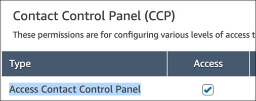

# Security profiles do not affect agent

authorization for viewing an email thread

Any user with the following permission in their security profile has access to read
emails that they handle or emails that are part of a thread where they are a
participant: **Contact Control Panel (CCP)** - **Access Contact
Control Panel** - **Access**.

This authorization behavior is enabled by default. It does not require setting up any
additional permission or configuration.

This behavior is driven by the following context keys:

1. `connect:UserArn`: Represents the user that has access to an
   individual contact.
2. `connect:ContactAssociationId`: Represents the contact association
   the user has access to. For the email channel, a contact association always
   represents an email thread.
3. `connect:Channel`: Represents the contact channel the user has
   access to. For the email channel, this contextKey is always
   `EMAIL`.
   We don't recommend using `connect:ContactAssociationId` in the same policy
   as `connect:UserArn` because it might result in a no-op. Because the
   `connect:UserArn` condition key is more restrictive, it will
   `Deny` access for all contacts not handled by the corresponding user,
   regardless of the access they have to email threads.

You can use `connect:Channel` in isolation to restrict access to specific
channels. Accepted values are: `VOICE`, `CHAT`, `TASK`,
or `EMAIL`. See the [Contact](../APIReference/API_Contact.md "../APIReference/API_Contact.md") API.

Following are the contact-related APIs that support these context keys:

1. [DescribeContact](../APIReference/API_DescribeContact.md "../APIReference/API_DescribeContact.md")
2. [UpdateContact](../APIReference/API_UpdateContact.md "../APIReference/API_UpdateContact.md")
3. [ListContactReferences](../APIReference/API_ListContactReferences.md "../APIReference/API_ListContactReferences.md")
4. [TagContact](../APIReference/API_TagContact.md "../APIReference/API_TagContact.md")
5. [UntagContact](../APIReference/API_UntagContact.md "../APIReference/API_UntagContact.md")
6. [UpdateContactRoutingData](../APIReference/API_UpdateContactRoutingData.md "../APIReference/API_UpdateContactRoutingData.md")
7. [GetContactAttributes](../APIReference/API_GetContactAttributes.md "../APIReference/API_GetContactAttributes.md")
8. [UpdateContactAttributes](../APIReference/API_UpdateContactAttributes.md "../APIReference/API_UpdateContactAttributes.md")
9. [StopContact](../APIReference/API_StopContact.md "../APIReference/API_StopContact.md")
10. [StartContactRecording](../APIReference/API_StartContactRecording.md "../APIReference/API_StartContactRecording.md")
11. [StopContactRecording](../APIReference/API_StopContactRecording.md "../APIReference/API_StopContactRecording.md")
12. [ResumeContactRecording](../APIReference/API_ResumeContactRecording.md "../APIReference/API_ResumeContactRecording.md")
13. [SuspendContactRecording](../APIReference/API_SuspendContactRecording.md "../APIReference/API_SuspendContactRecording.md")
14. [UpdateContactSchedule](../APIReference/API_UpdateContactSchedule.md "../APIReference/API_UpdateContactSchedule.md")
15. [TransferContact](../APIReference/API_TransferContact.md "../APIReference/API_TransferContact.md")
16. [StartScreenSharing](../APIReference/API_StartScreenSharing.md "../APIReference/API_StartScreenSharing.md")
