# Enable conversational analytics in

Amazon Connect Contact Lens

You can enable Contact Lens conversational analytics in a few steps:

1. Enable Contact Lens on your Amazon Connect instance.
2. Add a [Set recording and analytics
   behavior](set-recording-behavior.md "set-recording-behavior.md") block to a flow, and
   configure it to enable conversational analytics for voice, chat, or
   both.
   The following image shows a block that's configured for call recording and speech
   analytics. The **Call recording** option is set
   to **Agent and customer**. In the **Analytics**
   section, the options are selected for automated interactions and agent interactions.

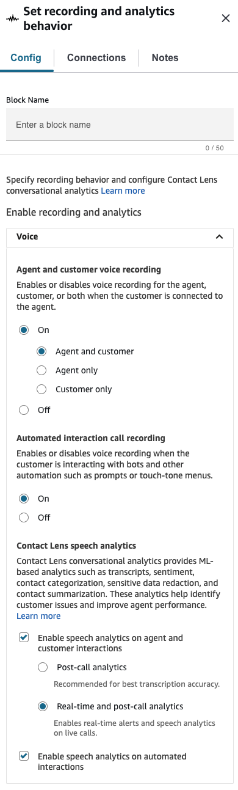
The procedures in this topic describe the steps to enable conversational analytics
for calls or chats.

###### Contents

- [Important things to
  know](#important-set-behaviorblock "#important-set-behaviorblock")
- [Enable Contact Lens for your
  Amazon Connect instance](#enable-cl "#enable-cl")
- [Enable call
  recording and speech analytics](#enable-callrecording-speechanalytics "#enable-callrecording-speechanalytics")
- [Enable chat
  analytics](#enable-chatanalytics "#enable-chatanalytics")
- [Enable redaction](#enable-redaction "#enable-redaction")
- [Review redaction
  for accuracy](#review-sensitive-data-redaction "#review-sensitive-data-redaction")
- [Disable
  sentiment analysis](#disable-sentiment-analysis-voice-and-chat "#disable-sentiment-analysis-voice-and-chat")
- [Dynamically enable redaction based on the customer's language](#dynamically-enable-analytics-contact-flow "#dynamically-enable-analytics-contact-flow")
- [Design a flow for key
  highlights](#call-summarization-agent "#call-summarization-agent")
- [What if the
  flow block fails to enable conversational analytics?](#troubleshoot-contactlens-enablement "#troubleshoot-contactlens-enablement")
- [Multi-party
  calls](#multiparty-calls-contactlens "#multiparty-calls-contactlens")

## Important things to know

- **Collect data after transferring a
  contact**: If you want to continue using conversational
  analytics to collect data after transferring a contact to another agent
  or queue, you need to add another [Set recording and analytics
  behavior](set-recording-behavior.md "set-recording-behavior.md") block with
  **Enable analytics** enabled for the flow. This is
  because a transfer generates a second contact ID and contact record.
  Conversational analytics needs to run on that contact record as
  well.

###### Note

For [queue-to-queue
transfers](queue-to-queue-transfer.md "queue-to-queue-transfer.md") the configuration information for
conversational analytics is copied to the transferred
contact.

- When you choose a language that is supported by sentiment analysis,
  AND select **Enable Contact Lens speech
  analytics** or **Enable chat analytics**
  in the [Set recording and analytics
  behavior](set-recording-behavior.md "set-recording-behavior.md") block, sentiment
  analysis is enabled by default. You can choose to [disable
  sentiment analysis](#disable-sentiment-analysis-voice-and-chat "#disable-sentiment-analysis-voice-and-chat").
- Where you place the [Set recording and analytics
  behavior](set-recording-behavior.md "set-recording-behavior.md") block in a flow
  affects the agent's experience with key highlights. For more
  information, see [Design a flow for key
  highlights](#call-summarization-agent "#call-summarization-agent").

## Enable Contact Lens for your Amazon Connect

instance

Before you can enable conversational analytics, you first need to enable
Contact Lens for your instance.

1. Open the Amazon Connect console at
   [https://console.aws.amazon.com/connect/](https://console.aws.amazon.com/connect/ "https://console.aws.amazon.com/connect/").
2. On the instances page, choose the instance alias. The instance alias is also
   your **instance name**, which appears in your Amazon Connect
   URL. The following image shows the **Amazon Connect virtual contact center instances** page, with a box
   around the instance alias.

 3. In the Amazon Connect console, in the navigation pane, choose
**Analytics tools**, and then choose
**Enable Contact Lens**. 4. Choose **Save**.

## Enable call recording and

speech analytics

After Contact Lens is enabled for your instance, you can add [Set recording and analytics
behavior](set-recording-behavior.md "set-recording-behavior.md") blocks to your flows. You
then enable conversational analytics when you configure the **Set
recording and analytics behavior** block.

1. In the flow designer add a [Set recording and analytics
   behavior](set-recording-behavior.md "set-recording-behavior.md") block to your flow.

For information about which flow types you can use with this block and
other tips, see [Set recording and analytics
behavior](set-recording-behavior.md "set-recording-behavior.md"). 2. Open the **Set recording and analytics behavior**
properties page. Under **Call recording**, choose
**On**, **Agent and
Customer**.

Both agent and customer call recordings are required to use
conversational analytics for voice contacts. 3. Under **Analytics**, choose **Enable
Contact Lens conversational analytics**,
**Enable speech analytics**.

If you don't see this option, Amazon Connect Contact Lens hasn't been
enabled for your instance. For instructions to enable it, see [Enable Contact Lens for your
Amazon Connect instance](#enable-cl "#enable-cl"). 4. Choose one of the following:

    1. **Post-call analytics**: Contact Lens
     analyzes the call recording after the conversation and After
     Contact Work (ACW) is complete. This option provides the best
     transcription accuracy.
    2. **Real-time analytics**: Contact Lens
     provides both real-time insights during the call, and post-call
     analytics after the conversation has ended and After Contact
     Work (ACW) is complete.


    If you choose this option, we recommend setting up alerts
     based on keywords and phrases that the customer may utter during
     the call. Contact Lens analyzes the conversation
     real-time to detect the specified keywords or phrases, and
     alerts supervisors. From there, supervisors can listen in on the
     live call and provide guidance to the agent to help them resolve
     the issue faster.


    For information about setting up alerts, see [Alert supervisors in
     real-time for calls](add-rules-for-alerts.md "add-rules-for-alerts.md").


    If your instance was created before October 2018, additional
     configuration is needed to access real-time call analytics. For
     more information, see [Service-linked role permissions](connect-slr.md#slr-permissions "connect-slr.md#slr-permissions").

5. Choose from the [list
   of available languages](supported-languages.md#supported-languages-contact-lens "supported-languages.md#supported-languages-contact-lens").

For instructions about specifying the language dynamically, see [Dynamically enable redaction based on the customer's language](#dynamically-enable-analytics-contact-flow "#dynamically-enable-analytics-contact-flow"). 6. Optionally, enable redaction of sensitive data. For more information,
see the next section, [Enable redaction](#enable-redaction "#enable-redaction"). 7. Choose **Save**. 8. If the contact is going to be transferred to another agent or queue,
repeat these steps to add another [Set recording and analytics
behavior](set-recording-behavior.md "set-recording-behavior.md") block with
**Enable Contact Lens for conversational
analytics** enabled.

## Enable chat analytics

1. In the [Set recording and analytics
   behavior](set-recording-behavior.md "set-recording-behavior.md") block, under
   **Analytics**, choose **Enable
   Contact Lens conversational analytics**, and
   **Enable chat analytics**.

###### Note

By choosing this option you will receive both real-time and
post-chat analytics.

If you don't see this option, Amazon Connect Contact Lens hasn't been
enabled for your instance. For instructions to enable it, see [Enable Contact Lens for your
Amazon Connect instance](#enable-cl "#enable-cl"). 2. Choose from the [list
of available languages](supported-languages.md#supported-languages-contact-lens "supported-languages.md#supported-languages-contact-lens").

For instructions on choosing the language and redaction dynamically,
see [Dynamically enable redaction based on the customer's language](#dynamically-enable-analytics-contact-flow "#dynamically-enable-analytics-contact-flow"). 3. Optionally, enable redaction of sensitive data. For more information,
see the next section, [Enable redaction](#enable-redaction "#enable-redaction"). 4. Choose **Save**. 5. If the contact is going to be transferred to another agent or queue,
repeat these steps to add another [Set recording and analytics
behavior](set-recording-behavior.md "set-recording-behavior.md") block with
**Enable Contact Lens for conversational
analytics** enabled.

## Enable redaction of sensitive data

When you configure the [Set recording and analytics
behavior](set-recording-behavior.md "set-recording-behavior.md") block for conversational
analytics, you also have the option to enable redaction of sensitive data in a
flow. When redaction is enabled you can choose from the following
options:

- Redact all personally identifiable information (PII) data (all PII
  entities supported).
- Choose which PII entities to redact from the list of supported
  entities.

If you accept the default settings, Contact Lens conversational
analytics redacts all personally identifiable information (PII) it identifies,
and replaces it with **[PII]** in the transcript. The default
settings are shown in the following image because the following options are
selected: **Redact sensitive data**, **Redact All PII
data**, and **Replace with placeholder
PII**.

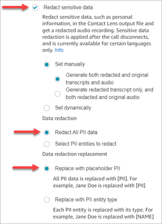

### Select PII entities to

redact

Under the **Data redaction** section, you can select
specific PII entities to redact. The following image shows that
**Credit/Debit Card Number** is going to be
redacted.

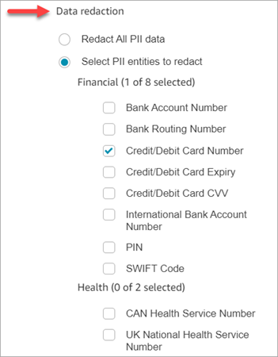

### Choose data redaction replacement

Under the **Data redaction replacement** section, you can
choose the mask to be used as data redaction replacement. For example, in
the following image, the **Replace with placeholder PII**
option indicates that **PII** will replace the data.

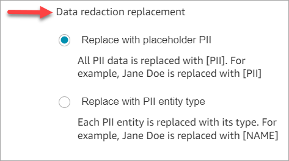

For more information about using redaction, see [Use sensitive data
redaction](sensitive-data-redaction.md "sensitive-data-redaction.md").

## Review sensitive data

redaction for accuracy

The redaction feature is designed to identify and remove sensitive data. However, due to the predictive nature of machine learning, it may not identify and remove all instances of sensitive data in
a transcript generated by Contact Lens. We recommend you review any redacted output to ensure it meets your needs.

###### Important

The redaction feature does not meet the requirements for de-identification under medical privacy laws like the U.S. Health Insurance Portability and Accountability Act of 1996 (HIPAA), so we recommend you continue to treat it as protected health information after redaction.

For the location of redacted files and examples, see [Output file
locations](example-contact-lens-output-locations.md "example-contact-lens-output-locations.md").

## Disable sentiment

analysis

When you choose a language that is supported by sentiment analysis, AND choose
**Enable speech analytics** or **Enable chat
analytics**, sentiment analysis is enabled by default for all
agents and customers. For a list of languages supported by sentiment analysis,
see [AI features](supported-languages.md#supported-languages-contact-lens "supported-languages.md#supported-languages-contact-lens").

The following image shows the sentiment analysis option is enabled on the
**Set recording and analytics behavior** block.

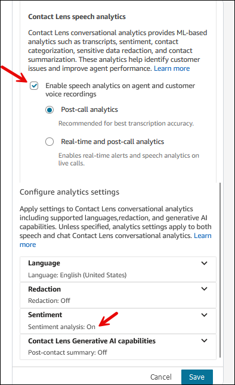

The following image shows a language that is not supported by sentiment
analysis. We recommend opening the **Sentiment** section to
verify whether it is enabled or disabled.

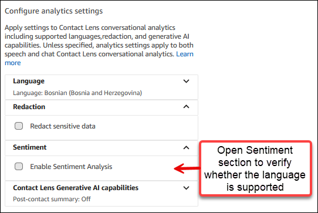

To disable sentiment analysis for all agents and customers, deselect the
**Enable Sentiment Analysis** option, as shown in the
following image.

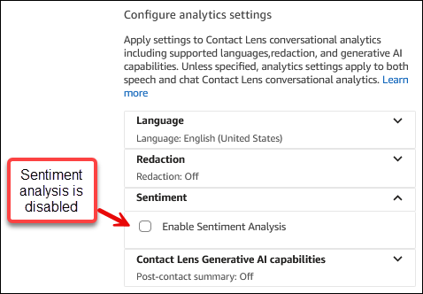

## Dynamically enable

redaction based on the customer's language

You can dynamically enable the redaction of the output files based on the
language of the customer. For example, for customers using en-US, you may want
only a redacted file whereas for those using en-GB, you may want both the
original and redacted output files.

- Redaction: choose one of the following (they are case
  sensitive)
  - None
  - RedactedOnly
  - RedactedAndOriginal

- Language: Choose from the [list of available
  languages](supported-languages.md#supported-languages-contact-lens "supported-languages.md#supported-languages-contact-lens").

You can set these attributes in the following ways:

- User defined: use a **Set contact attributes** block.
  For general instructions about using this block, see [How to reference contact
  attributes](how-to-reference-attributes.md "how-to-reference-attributes.md"). Define the
  **Destination key** and **Value**
  for redaction and language as needed.

The following image shows an example of how you can configure the
**Set contact attributes** block to use contact
attributes for redaction. Choose the **Use text**
option, set **Destination key** to
**redaction_option**, and set
**Value** to
**RedactedAndOriginal**.

###### Note

**Value** is case sensitive.

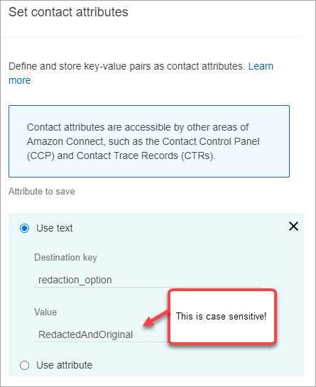

The following image show how to use contact attributes for language.
Choose the Use text option, set Destination
key to language, set
**Value** to **en-US**.

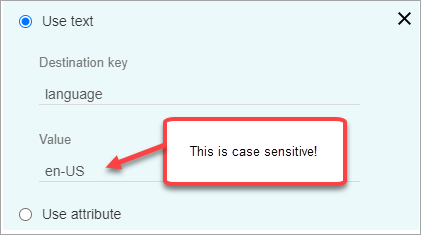

- [Use a Lambda function](attribs-with-lambda.md "attribs-with-lambda.md"). This
  is similar to how you set up user-defined contact attributes. An
  AWS Lambda function can return the result as a key-value pair, depending
  on the language of the Lambda response. The following example shows a
  Lambda response in JSON:

```
{
   'redaction_option': 'RedactedOnly',
   'language': 'en-US'
}

```

## Design a flow for key

highlights

Transcripts are visible to agents using the Contact Control Panel (CCP)
depending on whether conversational analytics is enabled in the [Set recording and analytics
behavior](set-recording-behavior.md "set-recording-behavior.md") in the inbound flow, and/or a
transfer flow.

This section provides three use cases for enabling conversational analytics in
the [Set recording and analytics
behavior](set-recording-behavior.md "set-recording-behavior.md") block, and describes how they
affect the agent's experience with key highlights.

### Use case 1:

Conversational analytics is enabled in an inbound flow only

- A contact enters the inbound flow, and there are no call
  transfers. Following is the agent experience:

The agent receives the full transcript during After Contact Work
(ACW). The transcript includes everything said by the agent and the
customer, from the moment the agent accepts the initial call, until
the call has ended, as shown in the following image.

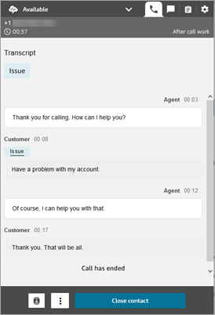

- A contact enters the inbound flow, and there is a call transfer.
  Following is the agent experience:
  - Agent 1 receives a call transcript after they leave the
    conference/warm transfer, during ACW.

  The transcript includes everything said by agent 1 and the
  customer, from the moment the agent accepts the initial
  call, until the agent 1 leaves the conference/warm transfer
  portion of the call. The transcript includes the flow
  (transfer/queue flow) prompt messages, as shown in the
  following image.

  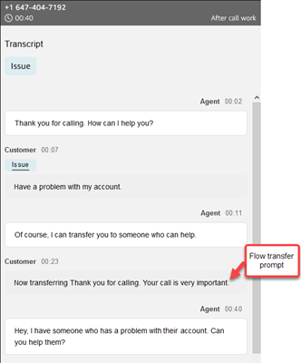
  - Agent 2 receives a call transcript at the time of
    accepting the conference/warm transfer call from agent
  1.

  The transcript includes everything said by agent 1 and the
  customer, from the moment agent 1 accepts the initial call
  until the agent 1 leaves the conference/warm transfer
  portion of the call. The transcript includes the flow
  (transfer/queue flow) prompt messages, and the warm transfer
  conversation, as shown in the following image.

  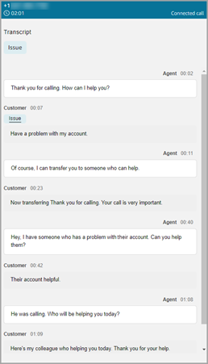

  Because conversational analytics is not enabled in the
  transfer flow, agent 2 doesn't see the remainder of the
  transcript when the call has ended and they enter ACW. The
  following image of ACW for agent 2 shows the transcript is
  empty.

  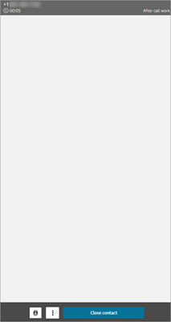

### Use case 2:

Conversational analytics is enabled in an inbound flow and a transfer
flow (quick connect)

- A contact enters the inbound flow, and there are no call
  transfers. Following is the agent experience:
  - Agent 1 receives a full call transcript (unredacted)
    during ACW.

  The transcript includes everything said by agent 1 and the
  customer from the moment the agent accepts the call, until
  the call has ended. This is shown in the following image of
  the CCP for agent 1.

  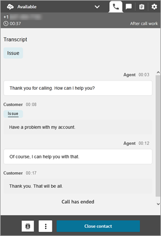

- A contact enters the inbound flow, and there is a call transfer.
  Following is the agent experience:
  - Agent 1 receives a call transcript after they leave the
    conference/warm transfer, during ACW.

  The transcript includes everything said by agent 1 and the
  customer from the moment agent 1 accepts the call, until
  agent 1 leaves the conference/warm transfer portion of the
  call. The transcript includes flow (transfer/queue flow)
  prompt messages.

  The full call transcript until warm transfer is shown in
  the following image.

  
  - Agent 2 receives a call transcript at the time of
    accepting the conference/warm transfer call from agent
  1.

  The transcript includes everything said by agent 1 and the
  customer, from the moment agent 1 accepts the call, until
  agent 1 leaves the conference/warm transfer portion of the
  call. The transcript includes the flow (transfer/queue flow)
  prompt messages.
  - Because conversational analytics is enabled in the
    transfer flow, agent 2 receives a call transcript after the
    call is completed, during ACW.

  The transcript includes only the remaining portion of the
  call between agent 2 and customer, after agent 1 has left
  the call. The transcript includes everything said by agent 2
  and the customer, from the moment they are conferenced/warm
  transferred in, until the call has ended. An example
  transcript is shown in the following image.

  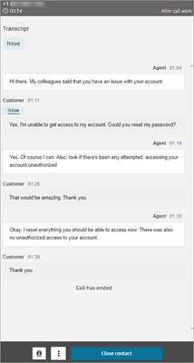

## What if the flow block

fails to enable conversational analytics?

It's possible that the [Set recording and analytics
behavior](set-recording-behavior.md "set-recording-behavior.md") block can fail to enable
conversational analytics on a contact. If conversational analytics isn't enabled
for a contact, [check the flow
logs](search-contact-flow-logs.md "search-contact-flow-logs.md") for the error.

## Multi-party calls and

conversational analytics

Contact Lens conversational analytics supports calls with up to 2
participants. For example, if there are more than two parties (agent and
customer) on a call, or a call is getting transferred to a third party, the
quality of the transcription and analytics, such as sentiment, redaction,
categories among others, can get degraded. We recommend you disable
conversational analytics for multi-party or third-party calls if there are more
than two parties (agent and customer). To do this, add another [Set recording and analytics
behavior](set-recording-behavior.md "set-recording-behavior.md") block to the flow and disable
conversational analytics. For more information about the behavior of the flow
block, see [Configuration tips](set-recording-behavior.md#set-recording-behavior-tips "set-recording-behavior.md#set-recording-behavior-tips").
