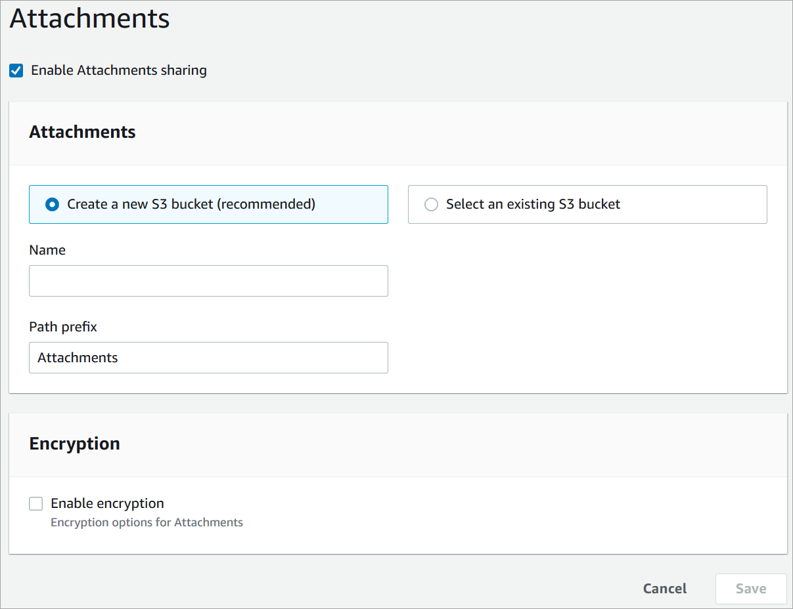

# Enable attachments in your CCP so customers and agents can share and upload files

You can allow customers and agents to share files using chat, email, and tasks, and allow
agents to upload files to cases. After you complete the steps in this topic, an
attachment icon automatically appears in your agent's Contact Control Panel so they can
share attachments on chats, emails, and tasks.

###### Important

You must complete steps 1 and 4 in this topic (create an Amazon S3 bucket and configure
a CORS policy) for email attachments. If you don't do this, yet have selected
**Enable Attachments sharing** for your instance, the email
channel will not work for your instance.

For a list of supported file types, see [Connect Customer feature specifications](feature-limits.md "feature-limits.md").

If you are not using the hosted communications widget, you need to update your customer-facing
chat interfaces to support attachment sharing.

**Using a custom chat application?** Check out the APIs
we've added to support attachment sharing: [StartAttachmentUpload](../../../connect-participant/latest/APIReference/API_StartAttachmentUpload.md "../../../connect-participant/latest/APIReference/API_StartAttachmentUpload.md"), [CompleteAttachmentUpload](../../../connect-participant/latest/APIReference/API_CompleteAttachmentUpload.md "../../../connect-participant/latest/APIReference/API_CompleteAttachmentUpload.md"), and [GetAttachment](../../../connect-participant/latest/APIReference/API_GetAttachment.md "../../../connect-participant/latest/APIReference/API_GetAttachment.md").

**Using a custom agent application?** Check out the
attached file APIs: [StartAttachedFileUpload](../APIReference/API_StartAttachedFileUpload.md "../APIReference/API_StartAttachedFileUpload.md"), [CompleteAttachedFileUpload](../APIReference/API_CompleteAttachedFileUpload.md "../APIReference/API_CompleteAttachedFileUpload.md"), and [GetAttachedFile](../APIReference/API_GetAttachedFile.md "../APIReference/API_GetAttachedFile.md"),
[BatchGetAttachedFileMetadata](../APIReference/API_BatchGetAttachedFileMetadata.md "../APIReference/API_BatchGetAttachedFileMetadata.md"), and [DeleteAttachedFile](../APIReference/API_DeleteAttachedFile.md "../APIReference/API_DeleteAttachedFile.md").

## Step 1: Enable attachments

1. Open the Connect Customer console at
   [https://console.aws.amazon.com/connect/](https://console.aws.amazon.com/connect/ "https://console.aws.amazon.com/connect/").
2. On the instances page, choose the instance alias. The instance alias is also
   your **instance name**, which appears in your Connect Customer
   URL. The following image shows the **Connect Customer virtual contact center instances** page, with a box
   around the instance alias.

 3. On the **Data storage** page, under the
**Attachments**, choose **Edit**,
select **Enable Attachments sharing**, and then choose
**Save**.

Storage options appear, similar to the following image.

 4. You can change the Amazon S3 bucket location where attachments are stored. By
default, your existing Connect Customer bucket is used, with a new prefix for
attachments.

###### Note

Currently, Connect Customer doesn’t support S3 buckets with [Object Lock](../../../AmazonS3/latest/userguide/object-lock.md "../../../AmazonS3/latest/userguide/object-lock.md")
enabled.

The attachments feature uses two Amazon S3 locations: a staging location
and a final location.

Note the following about the staging location:

    * The staging location is used as part of a business validation
     flow. Connect Customer uses it to validate the file size and type before it is
     available for download by using the `GetAttachedFile` or
     `GetAttachment` APIs.
    * The staging prefix is created by Connect Customer based on the bucket path
     you have selected. Specifically, it includes the S3 prefix for where
     you are saving files, with **staging** appended to
     it.
    * We recommend that you change the data retention policy for the
     staging prefix to one day. This way you won't be charged for storing
     the staging files. For instructions, see [How do I create a
     lifecycle rule for an S3 bucket?](../../../AmazonS3/latest/userguide/create-lifecycle.md "../../../AmazonS3/latest/userguide/create-lifecycle.md") in the *Amazon S3
     User Guide*.


    ###### Warning


    	+ Only change the lifecycle for the **file
    	 staging location**. If you accidentally
    	 change the lifecycle for the entire Amazon S3 bucket, all
    	 transcripts and attachments will be deleted.
    	+ S3 objects are **permanently
    	 deleted** if S3 bucket versioning is not
    	 enabled.

## Step 2: Enable file attachment configuration permissions

To allow administrators to view or modify file attachment settings, assign the
appropriate permissions in their security profile.

1. In the Connect Customer console, choose **Users**,
   **Security profiles**.
2. Select the security profile that you want to modify.
3. Expand the **Settings** section.
4. Under **File attachments**, choose the permissions to
   assign:
   - **View** — Allows users to view file
     attachment settings.
   - **Edit** — Allows users to view and modify
     file attachment settings, including attachment sizes and
     types.
   - **All** — Grants both View and Edit
     permissions for file attachment settings.

5. Choose **Save**.

Users assigned a security profile with file attachment permissions see a
**Settings** icon in the left navigation menu, below
**Channels**. From there, they can view or edit file
attachment settings based on their assigned permissions.

## Step 3: Configure attachment size limits and custom file extensions

After you enable attachments, you can configure the following options through the
Connect Customer admin website:

- **Attachment size limit** – The default
  maximum attachment size is 20 MB. You can increase this limit up to
  100 MB.
- **Custom file extensions** – In addition to
  the default supported file types, you can configure custom file extensions
  for attachments across chat, email, cases, and tasks.

###### Note

You can also configure these options by using the Connect Customer API.

## Step 4: Configure a CORS policy on your attachments bucket

To allow customers and agents to upload and download files, update your
cross-origin resource sharing (CORS) policy to allow `PUT` and
`GET` requests for the Amazon S3 bucket you are using for attachments.
This is more secure than enabling public read/write on your Amazon S3 bucket, which we
don't recommend.

###### To configure CORS on the attachments bucket

1. Find the name of the Amazon S3 bucket for storing attachments:
   1. Open the Connect Customer console at
      [https://console.aws.amazon.com/connect/](https://console.aws.amazon.com/connect/ "https://console.aws.amazon.com/connect/").
   2. In the Connect Customer console, choose **Data storage**,
      and locate the Amazon S3 bucket name.

2. Open the Amazon S3 console at
   [https://console.aws.amazon.com/s3/](https://console.aws.amazon.com/s3/ "https://console.aws.amazon.com/s3/").
3. In the Amazon S3 console, select your Amazon S3 bucket.
4. Choose the **Permissions** tab, and then scroll down to
   the **Cross-origin resource sharing (CORS)**
   section.
5. Add a CORS policy that has one of the following rules on your attachments
   bucket. For example CORS policies, see [Cross-origin resource
   sharing: Use-case scenarios](../../../AmazonS3/latest/userguide/cors.md#example-scenarios-cors "../../../AmazonS3/latest/userguide/cors.md#example-scenarios-cors") in the _Amazon S3 Developer
   Guide_.
   - Option 1: List the endpoints from where attachments will be sent
     and received, such as the name of your business web site. This rule
     allows cross-origin PUT and GET requests from your website (for
     example, http://www.example1.com).

   Your CORS policy may look similar to the following example:

   ```
   [
       {
           "AllowedMethods": [
               "PUT",
               "GET"
           ],
           "AllowedOrigins": [
               "http://www.example1.com",
               "http://www.example2.com"
               ],
          "AllowedHeaders": [
               "*"
               ]
       }
   ]
   ```

   - Option 2: Add the `*` wildcard to
     `AllowedOrigin`. This rule allows cross-origin PUT
     and GET requests from all origins, so you don't have to list your
     endpoints.

   Your CORS policy may look similar to the following example:

   ```
   [
       {
           "AllowedMethods": [
               "PUT",
               "GET"
           ],
           "AllowedOrigins": [
               "*"
               ],
          "AllowedHeaders": [
               "*"
               ]
       }
   ]
   ```

## Step 5 (Optional): Integrate with the APIs to enhance your custom UIs

If you are skipping the out-of-the-box Chat UI or Agent workspace, you can use the
Connect Customer Participant attachments APIs, or Connect Customer attached files APIs to build your own
UIs and provide attachments support for Cases and Chats. For the general steps in
working with both sets of APIs, see [Working with
attachments](../APIReference/working-with-acps-api.md "../APIReference/working-with-acps-api.md").

## Next step

We recommend enabling attachment scanning to meet compliance requirements or
security policies that your organization may have in place for file sharing. For
more information, see [Set up attachment scanning in Connect Customer](setup-attachment-scanning.md "setup-attachment-scanning.md").

## Attachments not appearing?

If your agents report problems receiving and sending attachments in chat messages,
see [Internal firewall or missing CORS policy prevents access to chat, email, task, or case attachments](ts-agent-attachments.md "ts-agent-attachments.md").
