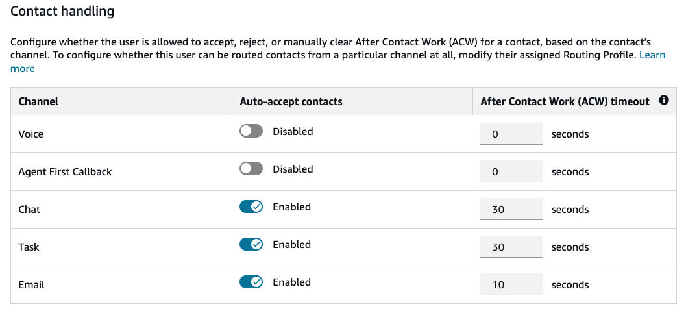

# Enable auto-accept for agents

When auto-accept is enabled for an available agent, the agent will be automatically connected to contacts
from that channel, and won’t need to manually click accept or reject.

Auto-accept can be enabled for calls, callbacks, chats, tasks, and emails. Auto-accept for customer-first
callbacks, inbound calls, and Outbound Campaigns calls are covered under the Voice auto-accept settings.
Auto-accept for agent-first callbacks are covered under the Agent-first callback setting.

## How long until the contact is connected to the

agent?

Less than one second. When a contact arrives to an available agent who has auto-accept enabled for
that channel, the Contact Control Panel (CCP) may briefly show the options **Accept**
or **Reject**. This is expected behavior. After less than a second, the contact is
automatically accepted and these options disappear. Additionally, if the contact is a chat, task,
or email, an audio notification will be played to notify the agent that the contact has been auto-accepted.
For voice calls, the auto-accept audio notification does not play, only the [agent whisper](set-whisper-flow.md "set-whisper-flow.md").

## Enable auto-accept for existing

agents

You can enable auto-accept using the Edit or Bulk Edit features in Amazon Connect. Please note that
you cannot configure per-channel auto-accept on user creation when creating users via importing a .csv
template; instead, first create the users then use Bulk Edit to modify their per-channel auto-accept settings.

To Edit or Bulk Edit:

1. Log in to the Amazon Connect admin website at https://`instance
name`.my.connect.aws/. Use an Admin account, or an account with
   **Users and Permissions** - **Users**

- **Create** or **Edit** permission in
  it's security profile.

2. On the left navigation menu, choose **Users**,
   **User management**.
3. In the list of users, select an agent, and then choose
   **Edit**.
4. On the **Edit users** page, find the **Contact handling**
   section under **Settings**, and enable auto-accept for the desired channel.
5. Choose **Save**.

###### Note

**Firefox users**: If you are using the Firefox
browser and using auto-accept for calls, you must keep the CCP or Agent
Workspace browser tab in focus when you accept and connect to a voice contact.
The CCP conforms to Firefox microphone usage guidance, and only has access to
connect to the user's microphone when CCP tab is in focus.

## Bulk upload new users

You cannot configure per-channel auto-accept on user creation when creating users via importing a
.csv template; instead, first create the users then use Bulk Edit to modify their per-channel auto-accept
settings.

You can't use the CSV template to edit information for existing users.
