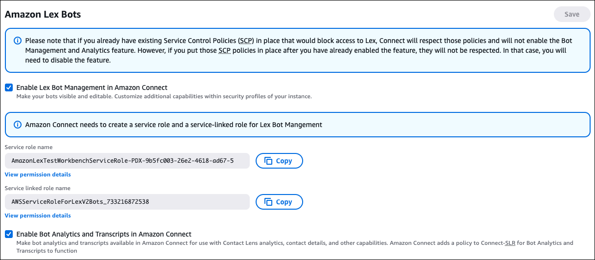

# Enable bot building and analytics in Amazon Connect

Complete the following steps to enable users to create Amazon Lex bots in the Amazon Connect admin website and
view metrics about bot performance.

Users can not edit LEX V1 bots or cross-regional bots from within Amazon Connect.

1. Open the [Amazon Connect
   console.](https://console.aws.amazon.com/connect/ "https://console.aws.amazon.com/connect/")
2. Select the Amazon Connect instance that you want to integrate with your Amazon Lex
   bot.

 3. On the navigation menu, choose **Flows**. 4. Choose **Enable Lex Bot Management in Amazon Connect** and
**Enable Bot Analytics and Transcripts in Amazon Connect**, and then
**Save**.

###### Note

If you already have existing Service Control Policies (SCP) in place that
block access to Lex, Amazon Connect respects those policies and does not enable the
Bot Management and Analytics feature. However, if you put those SCP policies
in place after you've already enabled this feature, they won't be respected.
In that case, you'll need to disable this feature.

Amazon Connect displays the service role and service linked role name it uses. uses
Amazon Lex resource-based policies to make calls to your Amazon Lex bot. When you
associate an Amazon Lex bot with your Amazon Connect instance, the resource-based policy on
the bot is updated to give Amazon Connect permission to invoke the bot.

For more information about Amazon Lex resource-based policies, see [Resource-based policies within Amazon Lex V2](../../../lexv2/latest/dg/security_iam_service-with-iam.md#security_iam_service-with-iam-resource-based-policies "../../../lexv2/latest/dg/security_iam_service-with-iam.md#security_iam_service-with-iam-resource-based-policies") in the _Amazon Lex V2
Developer Guide_. 5. Assign the following security profile permissions to users who need to create
and manage bots and bot analytics:

    * **Channels and Flows** - **Bots** -
     **View**, **Edit**,
     **Create** permissions
    * **Analytics and Optimization** - **Historical
     metrics** - **Access** permission
