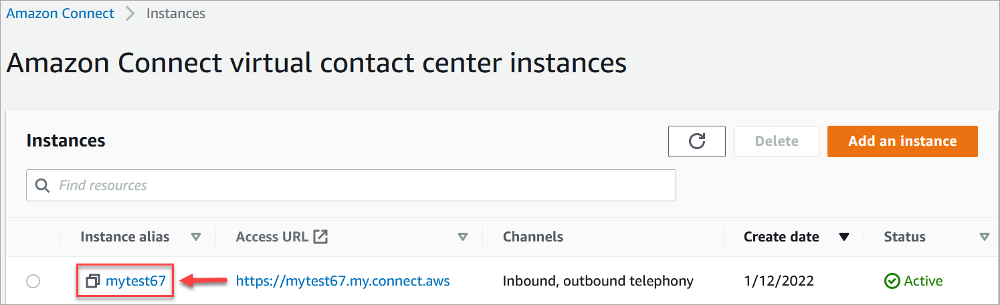

# Enable Cases using the Amazon Connect console

This topic explains how to enable Amazon Connect Cases using the Amazon Connect console. To use the
API, see [Amazon Connect Cases API Reference](../../../cases/latest/APIReference/Welcome.md "../../../cases/latest/APIReference/Welcome.md").

###### Tip

A case is always associated with a customer profile. You must have Customer Profiles enabled.
Check your instance settings in the Amazon Connect console, and if a Customer Profiles domain does not yet
exist, see [Enable Customer Profiles for your Amazon Connect instance](enable-customer-profiles.md "enable-customer-profiles.md").

## Requirements

If you're using custom IAM policies to manage access to the Amazon Connect Cases, your
users need the following IAM permissions to onboard to Cases using the Amazon Connect
console:

- `connect:ListInstances`
- `ds:DescribeDirectories`
- `connect:ListIntegrationAssociations`
- `cases:GetDomain`
- `cases:CreateDomain`
- `connect:CreateIntegrationAssociation`
- `connect:DescribeInstance`
- `iam:PutRolePolicy`

For more information, see [Required permissions for using custom
IAM policies to manage Amazon Connect Cases](required-permissions-iam-cases.md "required-permissions-iam-cases.md").

## How to enable Amazon Connect Cases

1. Open the Amazon Connect console at
   [https://console.aws.amazon.com/connect/](https://console.aws.amazon.com/connect/ "https://console.aws.amazon.com/connect/").
2. On the instances page, choose the instance alias. The instance alias is also
   your **instance name**, which appears in your Amazon Connect
   URL. The following image shows the **Amazon Connect virtual contact center instances** page, with a box
   around the instance alias.

 3. On the left navigation menu, choose **Cases** under the
**Applications** section. If you don't see this option,
it may not be available in your Region. For information about where Cases is
available, see [Cases availability by Region](regions.md#cases_region "regions.md#cases_region"). 4. Choose **Enable cases** to get started. 5. On the **Cases** page, choose **Add
domain**. 6. On the **Add domain** page, enter a unique, friendly name
that's meaningful to you, such as your organization name. 7. Choose **Add domain**. The domain is created.

If the domain is not created, choose **Try again**. If
that doesn't work, contact Support.

###### Tip

To delete a Cases domain, use the [DeleteDomain](../APIReference/API_connect-cases_DeleteDomain.md "../APIReference/API_connect-cases_DeleteDomain.md") API.

## Next steps

After your cases domain is created, do the following:

1. [Assign security profile
   permissions](assign-security-profile-cases.md "assign-security-profile-cases.md") to agents and call center managers.
2. [Create case fields](case-fields.md "case-fields.md"). Fields are the
   building blocks of your case templates.
3. [Create case templates](case-templates.md "case-templates.md"). Case
   templates are forms that agents complete and reference in the agent
   application. Templates ensure the right information is collected and
   referenced for different types of customer issues.
4. Optionally, [enable attachments](enable-attachments.md "enable-attachments.md")
   across your Amazon Connect instance. This step allows your agents to upload files to
   cases. For more information on the Files API, see the [StartAttachedFileUpload](../APIReference/API_StartAttachedFileUpload.md "../APIReference/API_StartAttachedFileUpload.md") API documentation.

###### Note

Ensure that you have the `cases:CreateRelatedItem`
permission for your IAM entity. For more information on Cases
permissions, see [Actions, resources, and condition keys for Amazon Connect
Cases](../../../service-authorization/latest/reference/list_amazonconnectcases.md "../../../service-authorization/latest/reference/list_amazonconnectcases.md"). 5. Optionally, add the [Cases](cases-block.md "cases-block.md") block to your flows. This block
enables you to get, update, or create cases automatically. 6. Optionally, set up [case event
streams](case-event-streams.md "case-event-streams.md") to get near real-time updates when cases are created or
modified.
