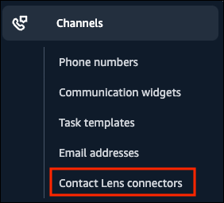

# Enable Amazon Connect Contact Lens

integration

After you create a Contact Lens connector, you need to enable the integration
by assigning users security profile permissions so they can access it on the
Amazon Connect admin website.

1. Log in to the Amazon Connect admin website at https://_instance
   name_.my.connect.aws/ using an Admin account.
2. On the navigation bar, choose **Security profiles**. On the
   **Manage security profiles** page, choose
   **Admin**, **Edit**.
3. On the **Edit security profile** page, choose
   **Channels and Flows** -
   **AnalyticsConnectors** - **View** and
   **Edit** permissions, and then choose
   **Save**.

###### Important

If you don't see the Contact Lens connectors permission under
**Channels and Flows**, request service quota increases
for the following quotas in your Amazon Connect account:

    * Contact Lens connectors per account
    * Maximum active recording sessions from external voice systems per
     instance

4. Assign this permission to the security profiles for users who you want to
   access the Contact Lens connectors.

###### Note

You can only delete the last Contact Lens connector in your Amazon Connect
instance when the access to the Contact Lens connector is removed
from the users of that instance.

If you attempt to delete the last Contact Lens connector without
first removing the Contact Lens connectors access from the users of
that instance, the following error message is displayed: **error -
Failed to delete connector {connector-name} with error: An analytics
connector permissions is being used in a security
profile**. 5. After you apply the permission, users who have it will be able to see the
**Contact Lens connectors** option in the Amazon Connect admin website
left navigation menu, as shown in the following image.

 6. You're done enabling the Contact Lens connector. Continue to the next
step: [associate a
Contact Lens connector with a flow](associate-contactlens-integration.md "associate-contactlens-integration.md").
