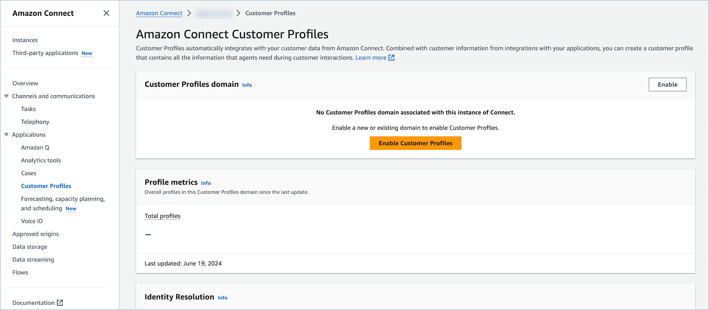
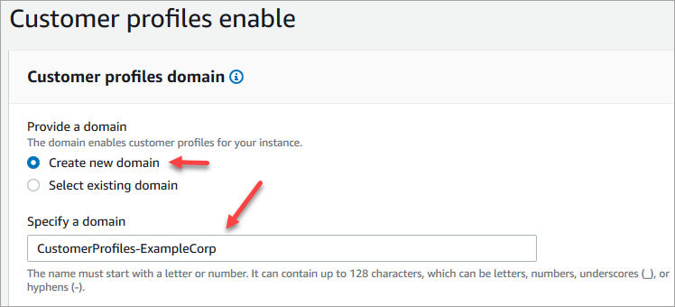
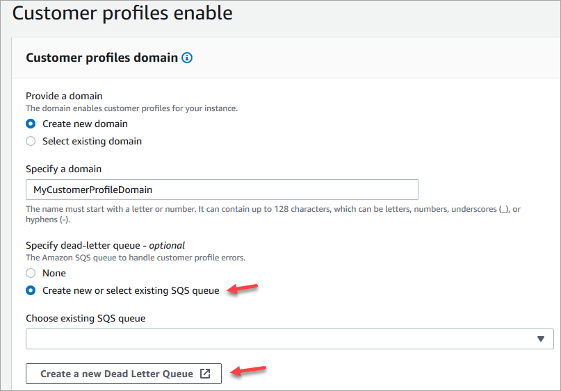
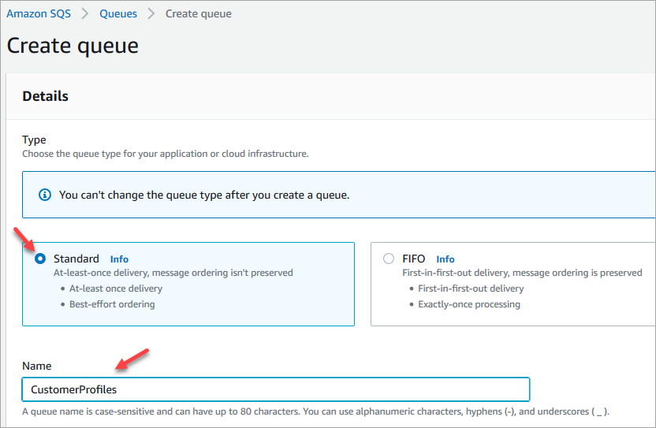
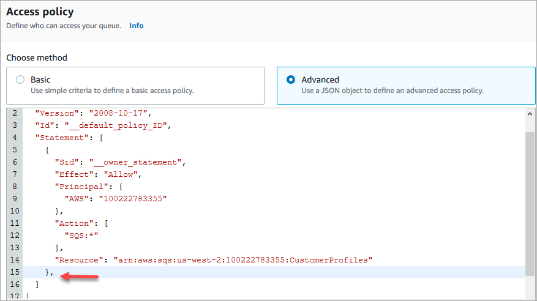
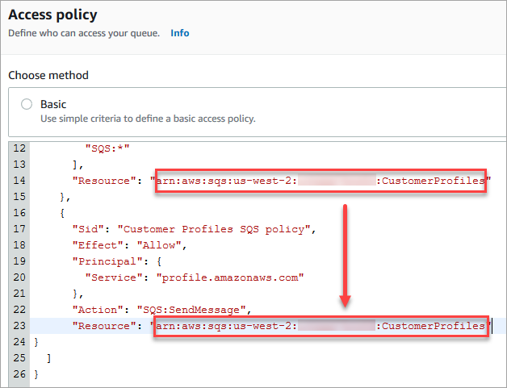
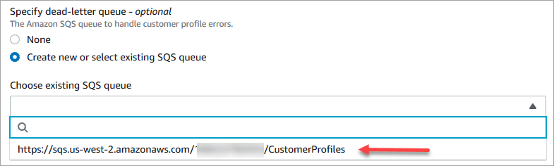
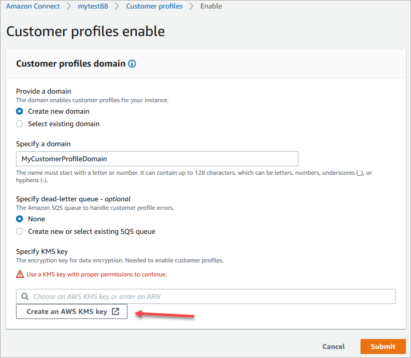
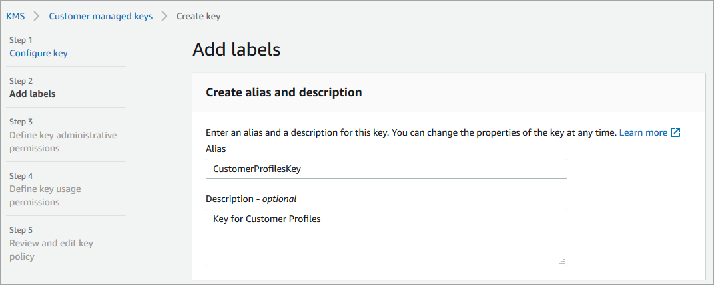
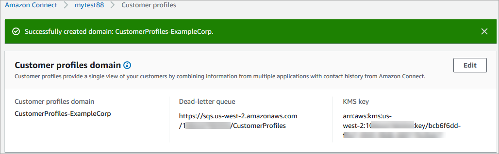

# Enable Customer Profiles for your Amazon Connect instance

Amazon Connect provides pre-built integrations so you can quickly combine customer information
from multiple external applications, with contact history from Amazon Connect. This allows you to
create a customer profile that has all the information agents need during customer
interactions in a single place.

## Before you begin

Following is an overview of key concepts and the information that you'll be
prompted for during the setup process.

### About the customer profiles

domain

When you enable Amazon Connect Customer Profiles, you create a customer profiles
domain: a container for all data, such as customer profiles, object types,
profile keys, and encryption keys. Following are guidelines for creating
Customer Profile domains:

- Each Amazon Connect instance can only be associated with one domain.
- You can create multiple domains, but they don't share external
  application integrations or customer data between each other.
- All the external application integrations you create are at a domain
  level. All of the Amazon Connect instances associated with a domain inherit the
  domain's integrations.
- You can change the association of your Amazon Connect instance from your
  current domain to a new domain at any time, by choosing a different
  domain. This isn't recommended, however, because the customer profiles
  from the earlier domain won't be moved to the new domain.

### How do you want to name your

customer profiles domain?

When you enable customer profiles, you are prompted to provide a friendly
domain name that's meaningful to you such as your organization name, for
example, _CustomerProfiles-ExampleCorp_. You can change the
friendly name using the API at any time.

### Do you want to use a

dead-letter queue?

A dead-letter queue is used for reporting errors associated with processing
data from external applications.

Amazon AppFlow handles connecting to the external application and moving data from it
to Amazon Connect Customer Profiles. Amazon Connect then processes the file.

- If an error occurs during the connection or while transporting the
  data to Amazon Connect, Amazon AppFlow surfaces the error but it doesn't write the error
  to the dead-letter queue.

For example, a processing error could be that the external data didn’t
match the specified schema or that the format of the external data
format isn't correct (currently only JSON is supported).

- If Amazon Connect encounters an error while processing the file, it writes the
  error to your dead-letter queue. You can look at the queue later and try
  to reprocess the error.
- You might find SQS messages in the dead-letter queue defined with your
  domain that includes the error message, along with the object.

| **Error Message**                                                                                                                                                                                                                                  | **Recommendation**                                                                                                                                                                                                                                      |
| -------------------------------------------------------------------------------------------------------------------------------------------------------------------------------------------------------------------------------------------------- | ------------------------------------------------------------------------------------------------------------------------------------------------------------------------------------------------------------------------------------------------------- |
| The UNIQUE key or PROFILE key does not exist in the profile<br>object                                                                                                                                                                              | Modify the data mapping or object, make sure keys marked as<br>UNIQUE and PROFILE in data mapping exist in object. See [data mapping page](customer-profiles-object-type-mapping.md "customer-profiles-object-type-mapping.md") on how<br>to set it up. |
| Too many objects ingested on profile per second                                                                                                                                                                                                    | Too many objects assigned to same profile within short time.<br>You can re-ingest the object or add wait time between calling<br>the PutProfileObject API.                                                                                              |
| Customer Profiles cannot ingest the object due to the EncryptionKey does<br>not exist in the region, the EncryptionKey does not have a grant<br>for Customer Profiles to use, or the EncryptionKey does not have the<br>GenerateDataKey permission | Check your KMS permission, make sure Customer Profiles has the required<br>access. Follow [Enable Customer Profiles, and<br>specify a dead-letter queue and KMS<br>key](#enable-customer-profiles-step1 "#enable-customer-profiles-step1") section.     |
| KMS key is invalid                                                                                                                                                                                                                                 | Check your KMS permission, make sure Customer Profiles has the required<br>access. Follow [Enable Customer Profiles, and specify a<br>dead-letter queue and KMS key](#enable-customer-profiles-step1 "#enable-customer-profiles-step1") section.        |
| Customer Profiles cannot ingest the object due to invalid KMS key                                                                                                                                                                                  | Check your KMS permission, make sure Customer Profiles has the required<br>access. Follow [Enable Customer Profiles, and specify a<br>dead-letter queue and KMS key](#enable-customer-profiles-step1 "#enable-customer-profiles-step1") section.        |
| Your data contains profile object larger than # bytes                                                                                                                                                                                              | Remove any unnecessary fields and reduce data size until it<br>falls below the specified limit mentioned in the error message.                                                                                                                          |
| All keys of this object are binding to more than one<br>profiles                                                                                                                                                                                   | Modify the data mapping or object, make sure at least 1<br>PROFILE key in the object binds to less than or equal to 1<br>existing profile.                                                                                                              |

When you enable Customer Profiles, you have the option of specifying an Amazon SQS
queue as your dead-letter queue. If you select this option, add the following
resource policy to Amazon SQS so Customer Profiles has permissions to send messages
to that queue:

```
{
      "Sid": "Customer Profiles SQS policy",
      "Effect": "Allow",
      "Principal": {
        "Service": "profile.amazonaws.com"
      },
      "Action": "SQS:SendMessage",
      "Resource": "arn:aws:sqs:`region`:`accountID`:`YourQueueName`"
}
```

To prevent a confused deputy security issue, see [Amazon Connect Customer Profiles cross-service
confused deputy prevention](cross-service-confused-deputy-prevention.md#customer-profiles-cross-service "cross-service-confused-deputy-prevention.md#customer-profiles-cross-service") for an example policy to
apply.

Step-by-step instructions for creating a dead-letter queue are provided later
in this topic, in [Enable Customer Profiles, and specify a
dead-letter queue and KMS key](#enable-customer-profiles-step1 "#enable-customer-profiles-step1").

### Create a KMS key to

be used by Customer Profiles to encrypt data (required)

###### Note

To maintain access to Customer Profiles APIs, entities using the Customer Profiles
`profile` APIs must have explicit `kms:Decrypt`
and `kms:GenerateDataKey` permissions in their IAM policies. This
enables them to use `kms:Decrypt` and
`kms:GenerateDataKey` for the KMS key associated with
resources retrieved from the API related to Customer Profiles.

When you enable Customer Profiles, you are prompted to create or provide a
AWS Key Management Service [KMS key](../../../kms/latest/developerguide/concepts.md#kms_keys "../../../kms/latest/developerguide/concepts.md#kms_keys").
Step-by-step instructions for creating a KMS key are provided later in this
topic, in [Enable Customer Profiles, and specify a
dead-letter queue and KMS key](#enable-customer-profiles-step1 "#enable-customer-profiles-step1").

All data at rest for Customer Profiles is encrypted under the KMS key you
choose. Your customer managed key is created, owned, and managed by you. You have full
control over the KMS key (AWS KMS charges apply).

If you choose to set up a KMS key where someone else is the administrator,
it must have a policy that allows `kms:GenerateDataKey`,
`kms:CreateGrant`, and `kms:Decrypt` permissions to
the Customer Profiles service principal. For information about how to change a
key policy, see [Changing a
key policy](../../../kms/latest/developerguide/key-policy-modifying.md "../../../kms/latest/developerguide/key-policy-modifying.md") in the AWS Key Management Service Developer Guide. In addition, to prevent
cross-service impersonation, see [Cross-service confused deputy
prevention in AWS](cross-service-confused-deputy-prevention.md "cross-service-confused-deputy-prevention.md") for sample
policies that you should apply.

## Enable Customer Profiles, and specify a

dead-letter queue and KMS key

1. Open the Amazon Connect console at
   [https://console.aws.amazon.com/connect/](https://console.aws.amazon.com/connect/ "https://console.aws.amazon.com/connect/").
2. On the instances page, choose the instance alias. The instance alias is also
   your **instance name**, which appears in your Amazon Connect
   URL. The following image shows the **Amazon Connect virtual contact center instances** page, with a box
   around the instance alias.

 3. In the navigation pane, choose **Customer
profiles**.

The **Customer profiles domain** page lists the
applications that are available for integration. In the following image, the
page shows no customer profile domains have been enabled.

 4. Choose **Enable customer profiles** to get
started. 5. At the **Customer profiles enable** page, choose
**Create new domain**. Under **Specify a
domain**, enter a friendly name that's meaningful to you, such
as your organization name, for example,
_CustomerProfiles-ExampleCorp_.

 6. Under **Specify dead-letter queue**, choose whether to
send failed events to a dead-letter queue. This is helpful if you want to
get visibility into data that failed to be ingested. It also gives you the
option to retry these failed data ingestions in the future.

Following are the steps to create a dead-letter queue:

    * On the **Customer profiles enable** page, choose
     **Create new or select existing SQS queue** and
     then choose **Create a new Dead Letter
     Queue**.


    
    * A new tab in your browser opens for the Amazon SQS console. Choose
     **Create queue**.
    * On the **Create queue** page, choose
     **Standard**, then assign a name to your
     queue.


    
    * In the **Access policy** section, choose
     **Advanced**.


    The Version name, policy ID, and Statement appear. If needed,
     update this section to give access to only the appropriate
     roles.
    * At the end of the Statement section (line 15 in the following
     image) add a comma after }, and press `Enter`.


    
    * Then copy and paste the following code:


    ```
    {
          "Sid": "Customer Profiles SQS policy",
          "Effect": "Allow",
          "Principal": {
            "Service": "profile.amazonaws.com"
          },
          "Action": "SQS:SendMessage",
          "Resource": "arn:aws:sqs:`region`:`accountID`:`YourQueueName`"
    }
    ```
    * To replace `region`,
     `accountID`, and
     `YourQueueName` with your information,
     copy and paste the `Resource` information from line
     14.


    
    * Choose **Create queue**.
    * Return to the tab in your browser for the Amazon Connect console,
     **Customer profiles enable** page. Click or tap
     in the **Choose existing SQS queue** box to select
     the queue you just created from the dropdown list.


    

[Show moreShow less](# "#") 7. Under **Specify KMS key**, create or enter your own
AWS KMS key for encryption. Following are the steps to create your
AWS KMS key:

    * On the **Customer profiles enable** page, choose
     **Create an AWS KMS key**.


    
    * A new tab in your browser opens for the Key Management Service
     (KMS) console. On the **Configure key** page,
     choose **Symmetric**, and then choose
     **Next**.


    
    * On the **Add labels** page, add a name and
     description for the key, and then choose
     **Next**.


    
    * On the **Define key administrative permissions**
     page, choose **Next**.
    * On the **Define key usage permissions** page,
     choose **Next**.
    * On the **Review and edit key policy** page,
     choose **Finish**.


    In the following example, the name of the key starts with
     **bcb6fdd**:


    
    * Return to the tab in your browser for the Amazon Connect console,
     **Customer profiles enable** page. Click or tap
     in the **Specify KMS key box** for the key you
     created to appear in a dropdown list. Choose the key you
     created.


    

[Show moreShow less](# "#") 8. Choose **Submit**. The completed page looks similar to
the following image. It shows the name of the customer profiles domain, the
dead-letter queue, and the KMS key.



You're done! Amazon Connect Customer Profiles is enabled. Now with every new contact that
comes in, Amazon Connect creates a customer profile record. It then tracks the contact
history for that phone number (voice) or email address (chat).

Your agents can [create new customer profiles](ag-cp-create.md "ag-cp-create.md")
and view contact records for your customers.

## Next steps

1. [Make Customer Profiles available through the
   agent application](customer-profile-access.md "customer-profile-access.md").
2. [Assign agents
   permissions to access Customer Profiles in the agent application](assign-security-profile-customer-profile.md "assign-security-profile-customer-profile.md").
3. [Integrate with
   external applications that profile customer profile data
   (optional)](integrate-external-apps-customer-profiles.md "integrate-external-apps-customer-profiles.md").
4. [Enable Identity Resolution to identify two or
   more similar profiles, and consolidate them](use-identity-resolution.md "use-identity-resolution.md").
