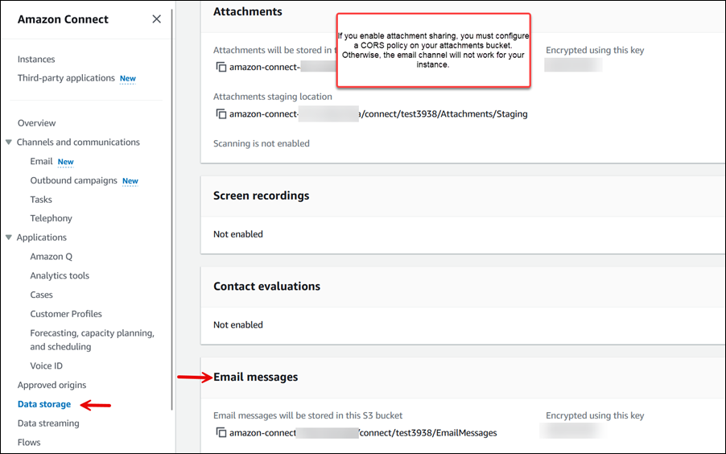
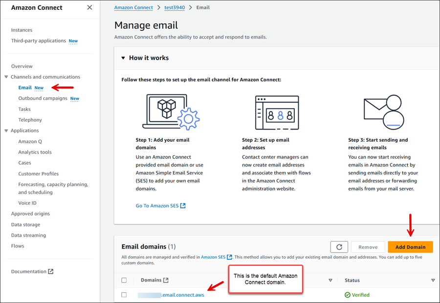
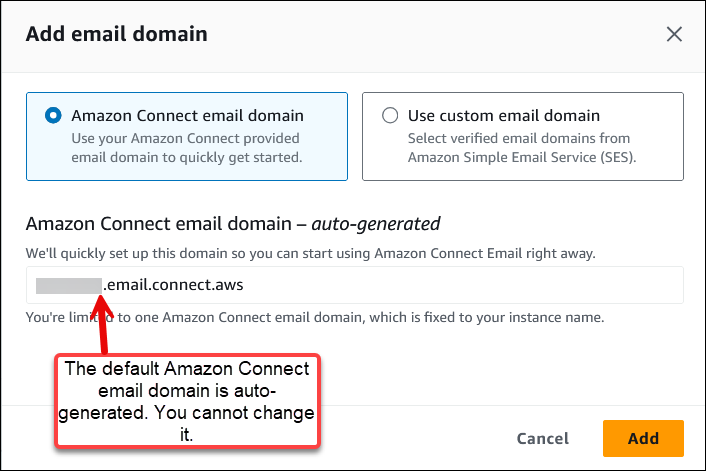
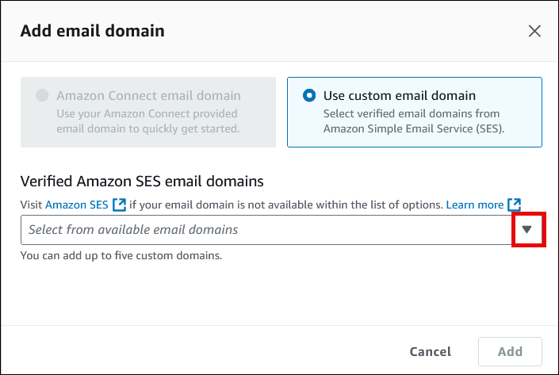

# Enable email campaigns for your Amazon Connect instance

This topic is for administrators who have access to the Amazon Connect console. It explains how to
enable email campaigns for your instance using the console. For the APIs used to enable email
campaigns programmatically, see [APIs to enable email for campaigns](#apis-email-setup1 "#apis-email-setup1").

When you enable email, you get an autogenerated email domain. Optionally, you can also use
custom domains.

- **Amazon Connect email domain**. The email domain is
  _`instance-alias`.email.connect.aws_.
- **Custom domains**. You can specify up to 5 custom domains
  that have been [onboarded to
  Amazon SES](../../../ses/latest/dg/creating-identities.md#just-verify-domain-proc "../../../ses/latest/dg/creating-identities.md#just-verify-domain-proc").

## Step 1: Move Amazon SES into production mode

Amazon Connect uses Amazon SES for sending emails. If you have a new Amazon SES instance, you need to take it
out of sandbox mode. For instructions, see [Request production access (Moving out of the
Amazon SES sandbox)](../../../ses/latest/dg/request-production-access.md "../../../ses/latest/dg/request-production-access.md") in the _Amazon SES Developer Guide_.

After you move Amazon SES into production mode, if you already enabled email when you created
your Amazon Connect instance, skip to these topics:

- [(Optional) Step 4: Use your own custom email domains](#use-custom-email1 "#use-custom-email1")
- [Step 5: Configure a CORS policy on your
  attachments bucket](#config-email-attachments-cors "#config-email-attachments-cors")

Otherwise, proceed to Step 2.

## Step 2: Enable email and create an Amazon S3 bucket for

storing email and attachments

These steps apply only if you already created an Amazon Connect instance but didn't enable
email.

You need to update your **Data storage** settings to enable sending email
campaigns and specify the Amazon S3 bucket where email messages and attachments are to be stored.
Email requires two Amazon S3 bucket pointers. They can be to the same Amazon S3 bucket or two different
buckets.

###### Important

If you choose **Enable Attachments sharing** for your instance, you must
create an Amazon S3 bucket and [configure a CORS policy
on your attachments bucket](#config-email-attachments-cors "#config-email-attachments-cors"), as described in this topic. If you don't do this, **email will not work for your instance**.

1. Open the Amazon Connect console at
   [https://console.aws.amazon.com/connect/](https://console.aws.amazon.com/connect/ "https://console.aws.amazon.com/connect/").
2. On the instances page, choose the instance alias. The instance alias is also
   your **instance name**, which appears in your Amazon Connect
   URL. The following image shows the **Amazon Connect virtual contact center instances** page, with a box
   around the instance alias.

 3. On the left navigation menu, choose **Data storage**, and then choose
**Enable email**. If you want to allow email attachments, choose
**Attachments** as well.

The following image of the **Data storage** page shows the Amazon S3 bucket for
email messages and attachments.



## Step 3: Get an Amazon Connect email domain

These steps apply only if you already created an Amazon Connect instance but didn't enable email.
Complete these steps to get an email domain from Amazon Connect.

1. In the Amazon Connect console, on the left navigation menu, choose **Email**, and
   then choose **Add Domain** as shown in the following image.

 2. In the **Add email domain** box, choose **Amazon Connect email
domain**, as shown in the following image. When you choose this option, the name of
the domain is autogenerated:
_`instance-alias`.email.connect.aws_. You cannot
change this email address.



## (Optional) Step 4: Use your own custom email domains

You can import up to five custom domains that have been [onboarded to
Amazon SES](../../../ses/latest/dg/creating-identities.md#just-verify-domain-proc "../../../ses/latest/dg/creating-identities.md#just-verify-domain-proc").

1. In the Amazon Connect console, on the left navigation menu, choose **Email**, and
   then choose **Add Domain** as shown in the following image.

 2. Choose **Use custom email domain**. Use the dropdown box to choose
custom domains that have been [verified by
Amazon SES](../../../ses/latest/dg/creating-identities.md#just-verify-domain-proc "../../../ses/latest/dg/creating-identities.md#just-verify-domain-proc").



## Step 5: Configure a CORS policy on your

attachments bucket

To allow customers and agents to upload and download files, update your cross-origin
resource sharing (CORS) policy to allow `PUT` and `GET` requests for the
Amazon S3 bucket you are using for attachments. This is more secure than enabling public read/write
on your Amazon S3 bucket, which we don't recommend.

###### To configure CORS on the attachments bucket

1. Find the name of the Amazon S3 bucket for storing attachments:
   1. Open the Amazon Connect console at
      [https://console.aws.amazon.com/connect/](https://console.aws.amazon.com/connect/ "https://console.aws.amazon.com/connect/").
   2. In the Amazon Connect console, choose **Data storage**, and locate the Amazon S3
      bucket name.

2. Open the Amazon S3 console at
   [https://console.aws.amazon.com/s3/](https://console.aws.amazon.com/s3/ "https://console.aws.amazon.com/s3/").
3. In the Amazon S3 console, select your Amazon S3 bucket.
4. Choose the **Permissions** tab, and then scroll down to the
   **Cross-origin resource sharing (CORS)** section.
5. Add a CORS policy that has one of the following rules on your attachments bucket. For
   example CORS policies, see [Cross-origin resource sharing: Use-case scenarios](../../../AmazonS3/latest/userguide/cors.md#example-scenarios-cors "../../../AmazonS3/latest/userguide/cors.md#example-scenarios-cors") in the _Amazon S3 Developer
   Guide_.
   - Option 1: List the endpoints from where attachments will be sent and received, such as
     the name of your business web site. This rule allows cross-origin PUT and GET requests from
     your website (for example, http://www.example1.com).

   Your CORS policy may look similar to the following example:

   ```
   [
       {
           "AllowedHeaders": [
               "*"
           ],
           "AllowedMethods": [
               "PUT",
               "GET"
           ],
           "AllowedOrigins": [
               "*.my.connect.aws",
               "*.awsapps.com"
           ],
           "ExposeHeaders": []
       }
   ]
   ```

   - Option 2: Add the `*` wildcard to `AllowedOrigin`. This rule
     allows cross-origin PUT and GET requests from all origins, so you don't have to list your
     endpoints.

   Your CORS policy may look similar to the following example:

   ```
   [
       {
           "AllowedMethods": [
               "PUT",
               "GET"
           ],
           "AllowedOrigins": [
               "*"
               ],
          "AllowedHeaders": [
               "*"
               ]
       }
   ]
   ```

## APIs to enable email for campaigns

Use the following APIs to enable email programmatically:

- [CreateInstance](../APIReference/API_CreateInstance.md "../APIReference/API_CreateInstance.md")
- [CreateIntegrationAssociation](../APIReference/API_CreateIntegrationAssociation.md "../APIReference/API_CreateIntegrationAssociation.md")
- [AssociateInstanceStorageConfig](../APIReference/API_AssociateInstanceStorageConfig.md "../APIReference/API_AssociateInstanceStorageConfig.md")
- [DisassociateInstanceStorageConfig](../APIReference/API_DisassociateInstanceStorageConfig.md "../APIReference/API_DisassociateInstanceStorageConfig.md")
- [DescribeInstanceStorageConfig](../APIReference/API_DescribeInstanceStorageConfig.md "../APIReference/API_DescribeInstanceStorageConfig.md")
