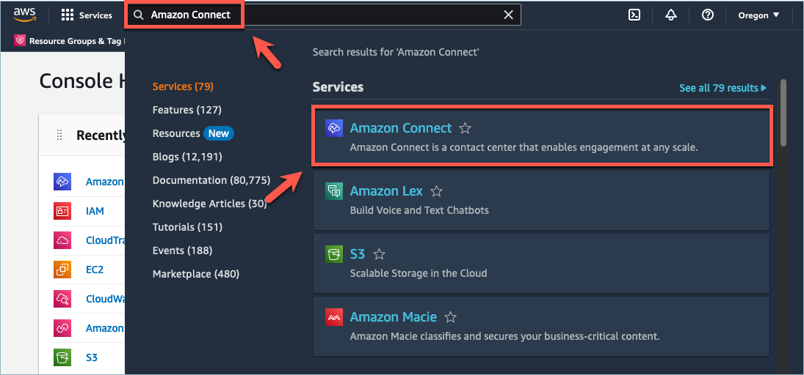
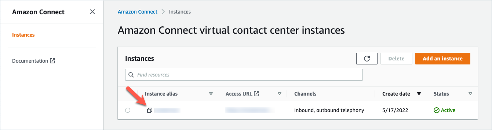
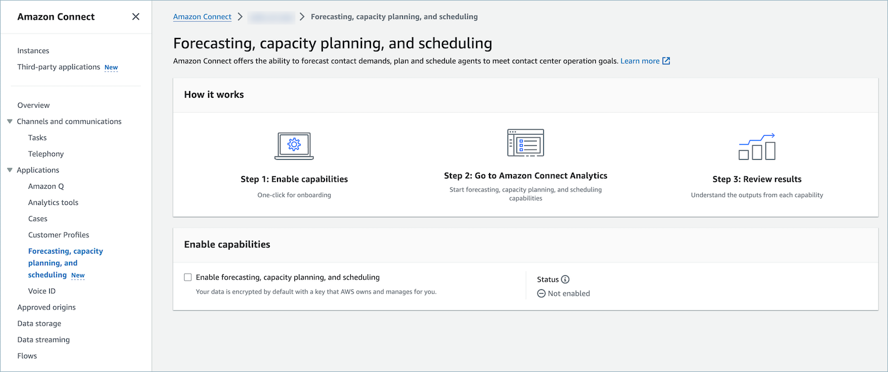
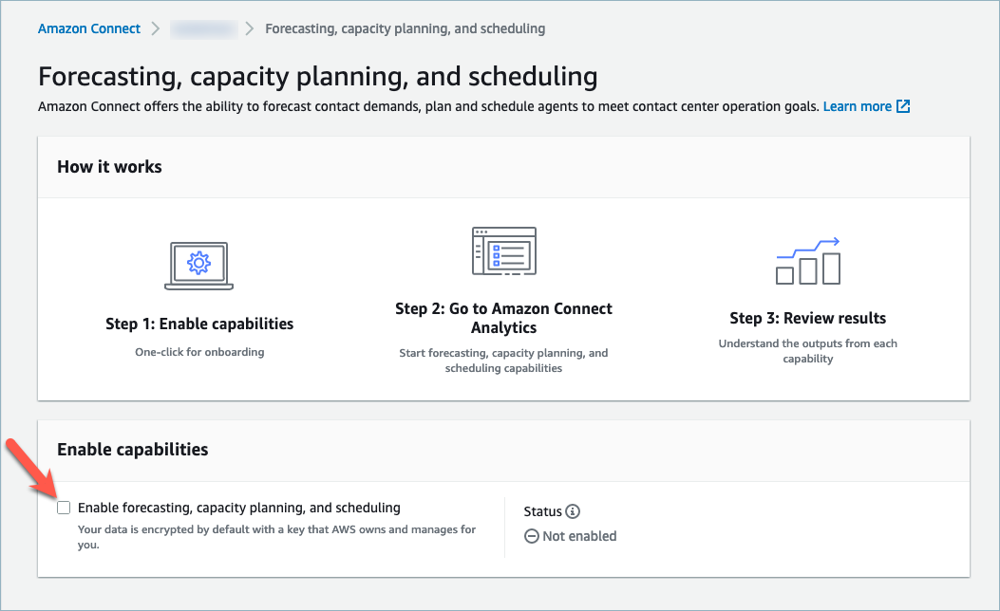
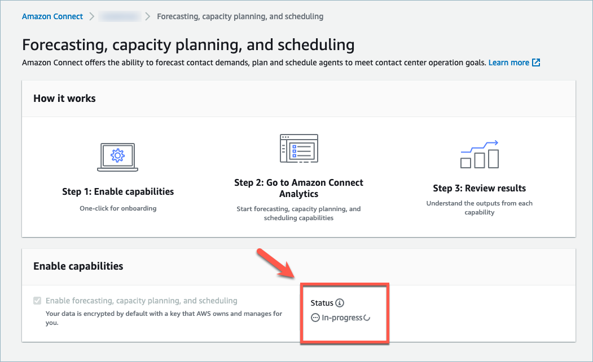
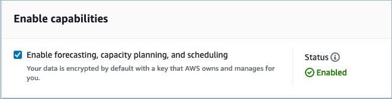

# Enable forecasting & agent scheduling in Connect Customer

You must enable forecasting & agent scheduling at the Connect Customer instance level. After you enable forecasting & agent scheduling,
it might take up to 24 hours for the feature to be available for use in your AWS
account.

1. Log in to the [AWS Management
   Console](https://console.aws.amazon.com/console/ "https://console.aws.amazon.com/console/") using your AWS account.
2. In the AWS Management Console, at the top of the page in the search bar,
   type _Connect Customer_ and then choose
   **Connect Customer**.This is shown in the following image.

 3. On the **Connect Customer virtual contact center instances** page,
choose the **Instance alias** where you want to enable
forecasting & agent scheduling.

 4. In the navigation pane, choose **Forecasting & agent scheduling**.

 5. On the **Forecasting & agent scheduling** page, select the check box to enable
forecasting & agent scheduling.

 6. The status changes to _In progress_, as shown in the
following image.

 7. Within 24 hours the status will change to _Enabled_ and
forecasting & agent scheduling will be ready to use.

