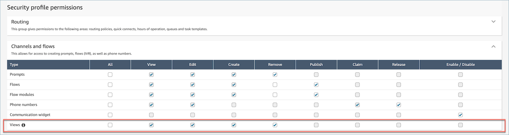
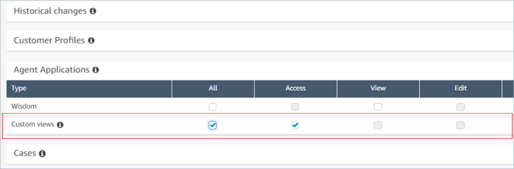

# Enable step-by-step guides in

Amazon Connect

The following steps allow you to provide your users with the ability to create guided
experiences, and allow agents to interact with the experiences.

1. **Enable admins to create visual flow**

Assign managers and business analysts to the **Channels and flows -
Views** security profile permission, as shown in the following
image. This permission grants them the ability to configure step-by-step guides
in flows.

Since guides are created using flows, also assign the **Flows - Edit,
Create** permissions so that they can create any type of
flow.

 2. **Enable agents to view guides**

Assign the **Agent Applications - Custom views** permission
to agents. This enables them to see step-by-step guides in their agent
workspace.

 3. **Increase your service quota for concurrent active chats
per instance**

The workflows that agents interact with run as chat contacts in Amazon Connect. We
recommend that you increase your **concurrent active chats per
instance** quota by the number of concurrent contacts you expect to
have this feature enabled for.

For more information about quotas, see [Amazon Connect quotas](amazon-connect-service-limits.md#connect-quotas "amazon-connect-service-limits.md#connect-quotas").

###### Note

Disconnect flow workflows count as their own contacts, so if you are
setting both a `DefaultFlowID` and `DisconnectFlowID`,
they will be counted as two active contacts.
