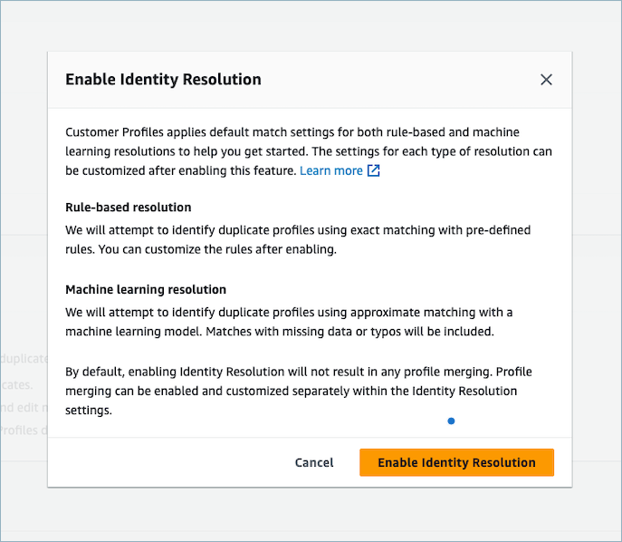

# Enable Identity Resolution for your Amazon Connect Customer Profiles

domain

###### Important

Amazon Connect Cases is not fully compatible with Amazon Connect Customer Profiles Identity Resolution when using
the Agent Workspace. Here's what happens to existing cases when profiles are
merged:

- Cases remain tied to their original profile ID after a merge.
- Cases do not automatically consolidate across merged profiles.
  There is no supported method to re-associate an existing case to another
  profile. Use
  [CreateCase](../APIReference/API_connect-cases_CreateCase.md "../APIReference/API_connect-cases_CreateCase.md")
  and
  [CreateRelatedItem](../APIReference/API_connect-cases_CreateRelatedItem.md "../APIReference/API_connect-cases_CreateRelatedItem.md")
  as a workaround if you need to
  consolidate cases manually.

When you enable Identity Resolution you specify the following information:

- When the Identity Resolution Job should run on a weekly basis. By default, it runs Saturdays
  at 12AM UTC.
- The Amazon S3 bucket where the Identity Resolution Job should write the results of the automatic
  profile matching process. If you don't have an S3 bucket, you'll have the
  option to create one during the enablement process.

You can query the Amazon S3 bucket or use the [GetMatches](../../../customerprofiles/latest/APIReference/API_GetMatches.md "../../../customerprofiles/latest/APIReference/API_GetMatches.md") API to filter results based on [confidence scores](how-identity-resolution-works.md#confidence-score "how-identity-resolution-works.md#confidence-score").
After you enable Identity Resolution you'll see the option to [create consolidation criteria](create-consolidation-criteria.md "create-consolidation-criteria.md") for
the optional auto-merging process.

###### To enable Identity Resolution

1. You must have a Customer Profiles domain enabled for your instance. For instructions,
   see [Enable Customer Profiles for your Amazon Connect instance](enable-customer-profiles.md "enable-customer-profiles.md").
2. In the navigation pane, choose **Customer
   profiles**.
3. In the **Identity Resolution** section, choose **Enable
   Identity Resolution**.

 4. In the **Identity Resolution** pop-up box, choose **Enable
Identity Resolution**.

 5. On the **Enable Identity Resolution** page, specify the date and time
when you want the Identity Resolution Job to run. 6. If you want to review the matched profile IDs from an Amazon S3 bucket, select
**Write profile ID matches to Amazon S3**. Otherwise, you
can use the [GetMatches](../../../customerprofiles/latest/APIReference/API_GetMatches.md "../../../customerprofiles/latest/APIReference/API_GetMatches.md") API to review matching profiles.

###### Note

If you auto-enable merges, you will not receive matched profile
IDs.

    1. Specify the Amazon S3 bucket where the Identity Resolution Job should write the profile
     matches.

    We recommend applying a policy to prevent a confused deputy
     security issue. For more information and a sample policy, see [Amazon Connect Customer Profiles cross-service
     confused deputy prevention](cross-service-confused-deputy-prevention.md#customer-profiles-cross-service "cross-service-confused-deputy-prevention.md#customer-profiles-cross-service").

7. When done, choose **Enable Identity Resolution**. Both rule-based matching and
   ML-based matching are enabled after you enable Identity Resolution. You can disable one of
   them or both from the Identity Resolution page. For more information, see [Disable Identity Resolution in Amazon Connect Customer Profiles](disable-identity-resolution.md "disable-identity-resolution.md").
8. Rule-based matching for Identity Resolution:
   1. After you enable the rule-based matching with a new domain the matching
      will start immediately if you set up an integration and the
      integration is running.
   2. After you enable the rule-based matching with an existing domain, the
      matching process will start within one hour.

9. ML-based matching for Identity Resolution:
   1. After you enable Identity Resolution the Identity Resolution Job runs for the first time within 24
      hours.

   ###### Note

   Before running an Identity Resolution Job for the first time on a new Customer Profiles
   domain, we recommend checking your profile metrics to make sure
   that profiles have been created. Otherwise, there won't be any
   matching results. 2. You may want to set up consolidation criteria for auto-merging
   matching profiles. If so, see [Set up consolidation criteria for
   Identity Resolution in Amazon Connect](create-consolidation-criteria.md "create-consolidation-criteria.md").
