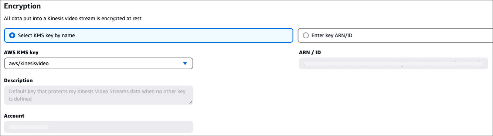

# Enable live media streaming in your Amazon Connect

instance

Live media streaming (customer audio streams) is not enabled by default. You can
enable customer audio streams from the settings page for your instance.

###### To enable live media streaming

1. Open the Amazon Connect console at
   [https://console.aws.amazon.com/connect/](https://console.aws.amazon.com/connect/ "https://console.aws.amazon.com/connect/").
2. On the instances page, choose the instance alias. The instance alias is also
   your **instance name**, which appears in your Amazon Connect
   URL. The following image shows the **Amazon Connect virtual contact center instances** page, with a box
   around the instance alias.
3. In the navigation pane, choose **Data storage**.
4. Under **Live media streaming**, choose
   **Edit**. Choose **Enable live media
   streaming**.
5. Enter a prefix for the Kinesis Video Streams created for your customer audio. This prefix
   makes it easier for you to identify the stream with the data.
6. Data is encrypted before it's written to the Kinesis Video Streams stream
   storage layer, and it's decrypted after it's retrieved from storage. As a
   result, your data is always encrypted at rest within the Kinesis Video Streams
   service. Choose the KMS key used to encrypt the data within Kinesis Video Streams as shown in the following image.



When you choose to enter your own key, make note of the following restrictions:

    1. The KMS key must be in the same Region as the instance.
    2. The KMS key should be either:


    	* A customer managed key
    OR


    	* The AWS managed key for Kinesis Video Streams (aws/kinesisvideo).
    It should not be any of the AWS managed keys automatically created for other services (for example, aws/connect, aws/lambda, aws/kinesis).
    3. The grant provisioned for the key by Amazon Connect shouldn't be revoked. These grants would have `GranteePrincipal` of the format:


    ```
    arn:aws:iam::`customer-account-id`:role/aws-service-role/connect.amazonaws.com/AWSServiceRoleForAmazonConnect_`hash_suffix`
    ```

7. Specify a number and unit for the **Data retention
   period**.

###### Important

If you select **No data retention**, data is not retained
and is available to be consumed for only 5 minutes. This is the default
minimum time that Kinesis retains data.

Because Amazon Connect uses Kinesis for streaming, [Kinesis Video Streams quotas](../../../kinesisvideostreams/latest/dg/limits.md "../../../kinesisvideostreams/latest/dg/limits.md")
apply. 8. Choose **Save** under **Live media
streaming**, and then choose **Save** at the
bottom of the page.
After you enable live media streaming, add **Start media streaming**
and **Stop media streaming** blocks to your flow. Configure those
blocks to specify what audio you want to capture. For instructions and an example, see
[Example flow for testing live media streaming
in Amazon Connect](use-media-streams-blocks.md "use-media-streams-blocks.md").
