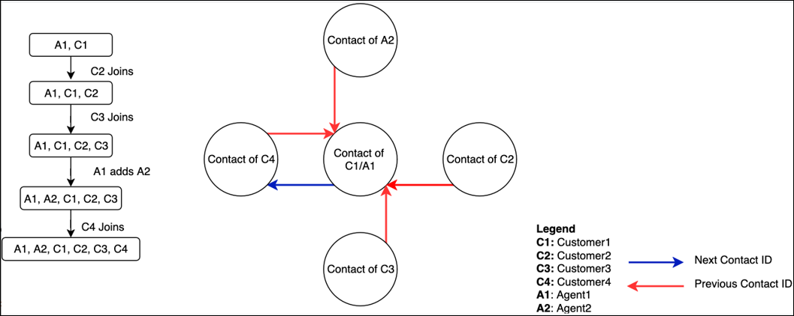
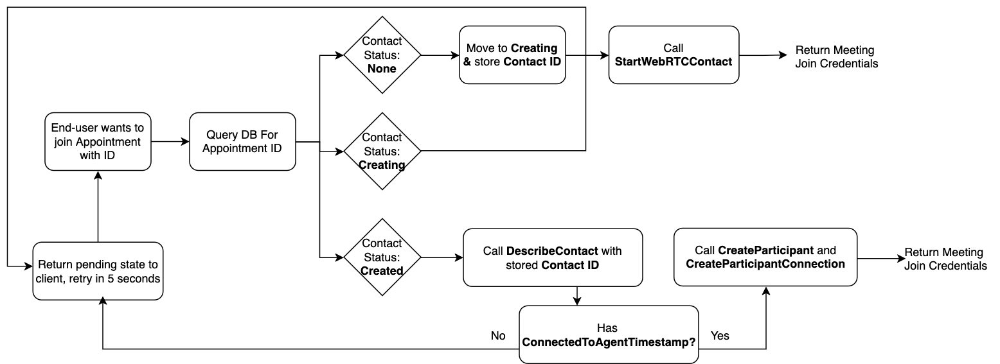

# Enable multi-user in-app, web, and video

calling

Amazon Connect supports adding additional users to join the in-app, web, and video
call in an existing call. You can add up to four additional users to an ongoing or
scheduled in-app, web or video call, for a total of six participants: the agent, the
first user, and four other participants (users or agents).

## How to add participants to a multi-user

call

1. To enable multi user calling, you need to enable [enhanced multi-party contact
   monitoring](monitor-conversations.md "monitor-conversations.md") from the Amazon Connect console.
2. After this is complete, you can leverage the existing Amazon Connect
   [StartWebRTCContact](../APIReference/API_StartWebRTCContact.md "../APIReference/API_StartWebRTCContact.md") API to create a contact, and route this
   contact to an agent.
3. To add an additional participant, first create a participant passing in
   `ContactId` from the [StartWebRTCContact](../APIReference/API_StartWebRTCContact.md "../APIReference/API_StartWebRTCContact.md") API response to the [CreateParticipant](../APIReference/API_CreateParticipant.md "../APIReference/API_CreateParticipant.md") API. [CreateParticipant](../APIReference/API_CreateParticipant.md "../APIReference/API_CreateParticipant.md") will not succeed until the original caller
   has connected to the agent. The video and screenshare capabilities for the
   participant can be set in the
   `ParticipantDetails.ParticipantCapabilities` field.
4. When [CreateParticipant](../APIReference/API_CreateParticipant.md "../APIReference/API_CreateParticipant.md") completes successfully, it returns a [participant token](../APIReference/API_CreateParticipant.md#connect-CreateParticipant-response-ParticipantCredentials "../APIReference/API_CreateParticipant.md#connect-CreateParticipant-response-ParticipantCredentials"). This token can be used in a request to
   [CreateParticipantConnection](../APIReference/API_connect-participant_CreateParticipantConnection.md "../APIReference/API_connect-participant_CreateParticipantConnection.md") with `Type` set to
   `WEBRTC_CONNECTION`. The response includes [ConnectionData](../APIReference/API_ConnectionData.md#connect-Type-ConnectionData-Meeting "../APIReference/API_ConnectionData.md#connect-Type-ConnectionData-Meeting") which can be used to join the meeting using the
   [Amazon Chime SDK Client Libraries](../../../chime-sdk/latest/dg/mtgs-sdk-client-lib.md "../../../chime-sdk/latest/dg/mtgs-sdk-client-lib.md") for the additional participant
   created. Follow the [integration
   instructions](config-com-widget2.md "config-com-widget2.md") to allow your application end-user to join the
   meeting.

###### Note

[CreateParticipant](../APIReference/API_CreateParticipant.md "../APIReference/API_CreateParticipant.md") returns a Bad Request error if the agent
is not yet connected to the contact. For business applications where
users may attempt to join before the agent is connected, see [Handling concurrent user joins](#handling-concurrent-joins "#handling-concurrent-joins"). 5. The additional customers can connect at any time after [CreateParticipantConnection](../APIReference/API_connect-participant_CreateParticipantConnection.md "../APIReference/API_connect-participant_CreateParticipantConnection.md") returns. After participants join,
[all additional voice and recording
behavior is similar to the multi party capability](multi-party-calls.md "multi-party-calls.md"). The new
participants can enable their video and screen-share, if their capabilities
have been enabled in the [CreateParticipant](../APIReference/API_CreateParticipant.md "../APIReference/API_CreateParticipant.md") request.

###### Note

A total of only 6 participants (customers and agents) can join an
active call at any time. The Amazon Chime SDK Client Libraries returns a status
code indicating the call is at capacity when an action is taken to add
extra participants beyond the limit occurs during meeting join. 6. After the participants are connected to the call, and then are
disconnected gracefully, or non-gracefully for a preconfigured time, their
participant credentials are no longer be valid. If the client library
`onAudioVideoDidStop` observer receives a status code
indicating the attendee no longer is valid, applications can trigger a new
call to [CreateParticipant](../APIReference/API_CreateParticipant.md "../APIReference/API_CreateParticipant.md") and [CreateParticipantConnection](../APIReference/API_connect-participant_CreateParticipantConnection.md "../APIReference/API_connect-participant_CreateParticipantConnection.md") from your business backend to
rejoin the call. 7. For every additional user connection, Amazon Connect creates a new
contact and [contact record](ctr-data-model.md "ctr-data-model.md"). All
additional contacts have PreviousContactId set to the InitialContactId (that
is, the one that was created by the [StartWebRTCContact](../APIReference/API_StartWebRTCContact.md "../APIReference/API_StartWebRTCContact.md") API) in order to trace it to original
contact. Each contact record:

    * Has an **"InitiationMethod":
     "WEBRTC\_API"**
    * Has the following segment attributes:


    ```
       "SegmentAttributes": {
          "connect:Subtype": {
            "ValueString": "connect:WebRTC"
          }
        },
    ```

Additionally, each contact record has the display name provided in
`CreateParticipant`. Agent information is not populated for
any additional user contact. This is to avoid the duplication of agent
information.

The following diagram illustrates how previous and next contact IDs are
mapped in a scenario where multiple participants and agents are added in a
web, in-app or video call.



## Handling concurrent user joins

Businesses may want to create applications where users can join in any order, at
any time. For example, your application may email a link with an external
appointment ID to multiple users that should be used to join a call at a scheduled
time. To achieve this behavior, business backends must ensure that:

- The first user that joins triggers a StartWebRTCContact request.
- All additional users use CreateParticipant and CreateParticipantConnection
  but **only after the first user has connected to an
  agent**.

This section describes a possible implementation, assuming that your business
backend contains a store (like DynamoDB) that can hold metadata about scheduled
appointments. Note that scheduled appointments is not a feature of Amazon Connect, but of the example implementation.

When the user navigates to the page, they should send a request to the backend.
The backend checks:

- Whether the user is able to start the appointment, and whether it is the
  correct time.
- Whether the Amazon Connect contact already been created by calling
  [StartWebRTCContact](../APIReference/API_StartWebRTCContact.md "../APIReference/API_StartWebRTCContact.md").

**If the contact has not already been created**, the
customer should call [StartWebRTCContact](../APIReference/API_StartWebRTCContact.md "../APIReference/API_StartWebRTCContact.md") API with a custom [flow](connect-contact-flows.md "connect-contact-flows.md"), and an [Attribute](../APIReference/API_StartWebRTCContact.md#connect-StartWebRTCContact-request-Attributes "../APIReference/API_StartWebRTCContact.md#connect-StartWebRTCContact-request-Attributes") indicating the agent queue of the corresponding agent who was
expected to join the call. The flow should include a [Set working queue](set-working-queue.md "set-working-queue.md") block that is configured to
use the agent queue provided in attributes. The flow should then terminate with a
[Transfer to queue](transfer-to-queue.md "transfer-to-queue.md") block. Before the API
is called, the backend should atomically update the store to move the call from
'None' to 'Creating' state, and handle any concurrent modification
exceptions.

The credentials from [StartWebRTCContact](../APIReference/API_StartWebRTCContact.md "../APIReference/API_StartWebRTCContact.md") should be returned to the customer and they should
immediately join the call. The contact should be marked as 'Created' in the business
store, along with the Contact ID. **This business API needs to
be synchronized between all possible attendees that join**. This can be
done by using the atomic operations provided by a DB.

**If the contact is in creating state** the
additional user should be returned this state, display relevant information, and
retry after a short wait.

**If the contact is created**: They should retrieve
the contact ID, and call the [DescribeContact](../APIReference/API_DescribeContact.md "../APIReference/API_DescribeContact.md") API. The business backend should look for the **`Contact.AgentInfo.ConnectedToAgentTimestamp`**
field. If it does not exist, the first user has not connected to the agent, and the
additional user should display relevant information, and retry after a short
wait.

If the field exists, the backend should call [CreateParticipant](../APIReference/API_CreateParticipant.md "../APIReference/API_CreateParticipant.md"), and then [CreateParticipantConnection](../APIReference/API_connect-participant_CreateParticipantConnection.md "../APIReference/API_connect-participant_CreateParticipantConnection.md"), to get [ConnectionData](../APIReference/API_ConnectionData.md#connect-Type-ConnectionData-Meeting "../APIReference/API_ConnectionData.md#connect-Type-ConnectionData-Meeting"), as described in previous sections.

The backend flow should look like the following.



You can refer to the [Amazon Connect in-app calling examples](https://github.com/amazon-connect/amazon-connect-in-app-calling-examples/tree/main/Web "https://github.com/amazon-connect/amazon-connect-in-app-calling-examples/tree/main/Web") on GitHub for implementation.

**The agent will not join using the same website**.
The agent should set their status in the [Contact Control
Panel](launch-ccp.md "launch-ccp.md") to **Available**. When the first customer joins,
the agent is called automatically.

## Billing

Billing for additional participants is equivalent to existing billing for the
initial customer and any agents on the call. Audio, video, and screen-share all
incur their own, participant specific charges.

## Hold behavior

During a video call or screen sharing session, agents are able to see the
participant's video or screen share even when the participant is on hold. It is the
participant's responsibility to handle PII accordingly. If using the native CCP
application, agent video is disabled if any non-agent participant is on hold. If you
want to change this behavior, you can build a custom CCP and communication widget.

For more information, see [Integrate in-app, web, video calling, and screen
sharing natively into your application](config-com-widget2.md "config-com-widget2.md").

## Limitation

The following limitation exists when creating additional in-app, web, video
calling, and screen sharing participants:

- The additional participants cannot have video capabilities set to
  **Send**, if the original contact was
  created with customer video capabilities set to **None**.
