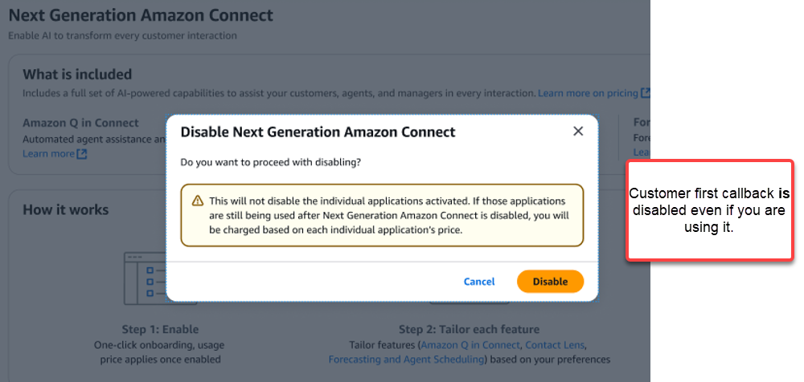
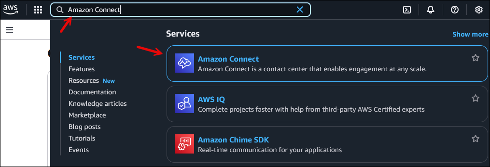
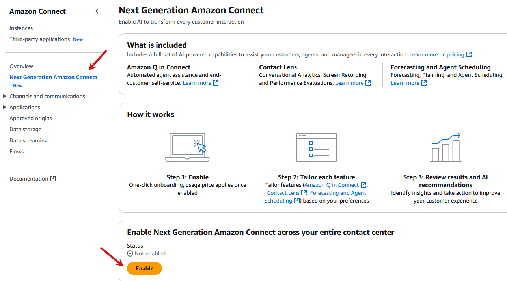

# Enable Next Generation Amazon Connect

By default when you create an Amazon Connect instance, Next Generation Amazon Connect is enabled. Next
Generation Amazon Connect is an AI-powered contact center solution that turns every customer
touchpoint into a deeper relationship and better outcome.

Amazon Connect provides unlimited use of Amazon Connect AI capabilities that power customer self-service,
agent assistance, and supervisor experiences. It allows you to optimize every step of your
customer journey without cost-driven compromises. For more information, see [Amazon Connect Pricing](https://aws.amazon.com/connect/pricing/ "https://aws.amazon.com/connect/pricing/").

###### Contents

- [How Amazon Connect billing works](#how-ac-billing-works "#how-ac-billing-works")
- [Best practices for Amazon Connect billing](#bestpractices-ac-billing "#bestpractices-ac-billing")
- [How to disable Next Generation Amazon Connect](#how-to-disable-ac "#how-to-disable-ac")
- [How to enable Next Generation Amazon Connect or verify it's
  enabled](#how-to-enable-ac "#how-to-enable-ac")

## How Amazon Connect billing works

When Amazon Connect with unlimited AI is enabled:

- Any activated free trials of relevant Amazon Connect services end. For example, free
  trials of Contact Lens conversational analytics, Contact Lens
  performance evaluation, and agent scheduling.

For global resiliency pricing, contact your AWS Technical Account Manager or
Solutions Architect.

## Best practices for Amazon Connect billing

You have the following two pricing options:

- You can pay separately for channels and any optimization features you choose
  to use. To switch to paying separately, after initially creating your Amazon Connect instance you
  need to disable the default option of Next Generation Amazon Connect .

* OR -

- Accept the default option which enables Amazon Connect with unlimited AI. It enables
  you to use an all-inclusive channel pricing model that covers all optimization
  features for usage on that platform.

The all-inclusive pricing includes unlimited use of:

    + Contact Lens capabilities: conversational analytics,
     performance evaluation, and screen recording
    + Agent scheduling tools
    + AI-powered voice and chat through Amazon Lex and Amazon Q in Connect
    + AI-powered generative voice for text-to-speech (TTS) in Amazon Connect

We recommend reviewing [Service Improvement and how to opt out from using your data for service improvement](data-opt-out.md "data-opt-out.md") to learn which Amazon Connect services use your
customer's data to train machine learning models, and how you can opt
out.

Both pricing models are available, giving you the flexibility to choose the option
that best suits your needs.

## How to disable Next Generation Amazon Connect

After creating your Amazon Connect instance initially, complete the following steps to disable
your subscription to Next Generation Amazon Connect and instead use the per feature pricing model
for those individual applications you've already activated or will activate in the
future.

1. On the **Amazon Connect virtual contact center instances** page,
   choose the instance alias where you want to disable Next Generation
   Amazon Connect.
2. In the navigation pane, choose **Next Generation Amazon Connect**, and
   then choose **Disable**.
3. A dialog box appears as shown in the following image, prompting you to confirm
   that you want to disable your subscription to Next Generation Amazon Connect and instead
   use the per feature pricing model for those individual applications you've
   already activated. Choose **Disable**.

###### Warning

Even if you are already using the [customer
first callback](setup-queued-cb.md "setup-queued-cb.md") feature, it is disabled when you choose to disable
**Next Generation Amazon Connect**.

## How to enable Next Generation Amazon Connect or verify it's

enabled

If you disable Next Generation Amazon Connect but want to enable it at a later time, or you
created your Amazon Connect before this option was released, here's how you can enable it now.
Also use these steps if you want to verify it's enabled.

1. Log in to the AWS Management Console using your AWS account.
2. In the AWS Management Console, in the search box, type
   **Amazon Connect**. Choose **Amazon Connect**, as shown in
   the following image.

 3. On the **Amazon Connect virtual contact center instances** page,
choose the instance alias where you want to enable Next Generation Amazon Connect. 4. In the navigation pane, choose **Next Generation Amazon Connect**, and
then choose **Enable**.

