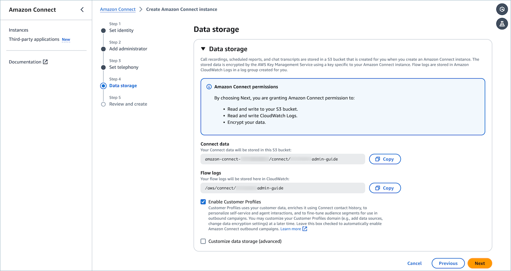
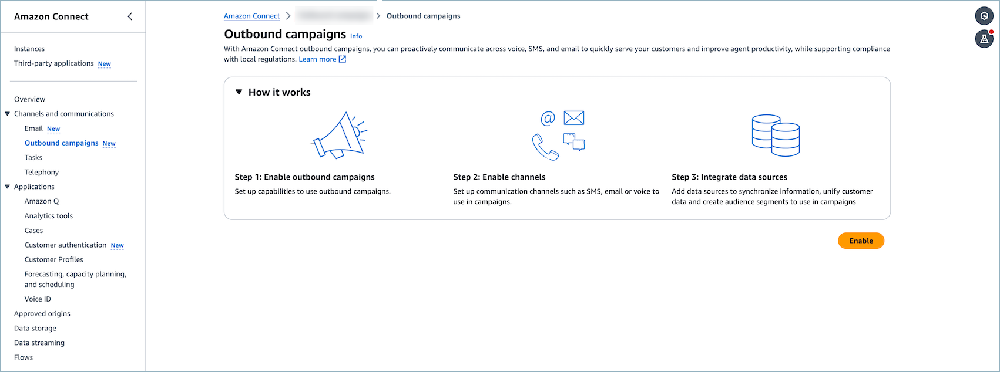
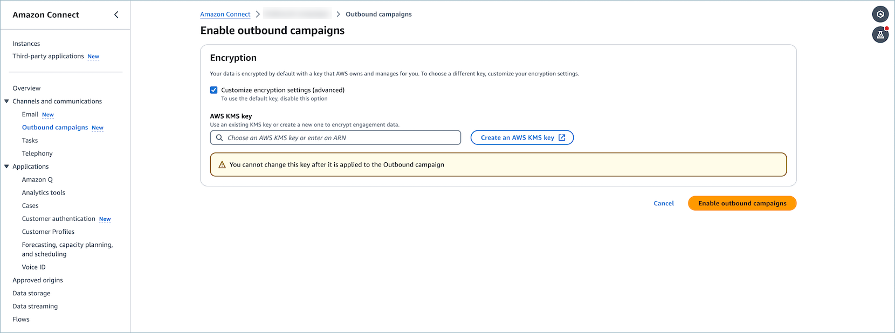
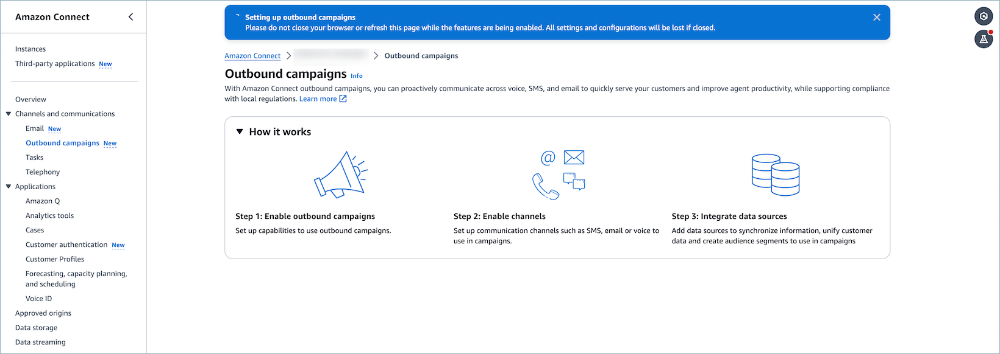
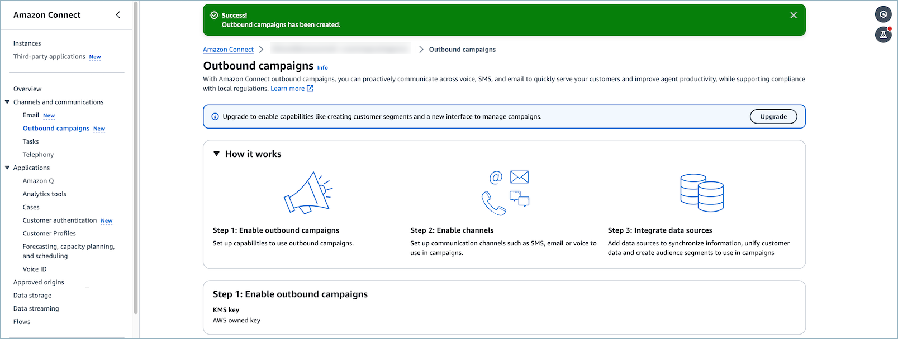
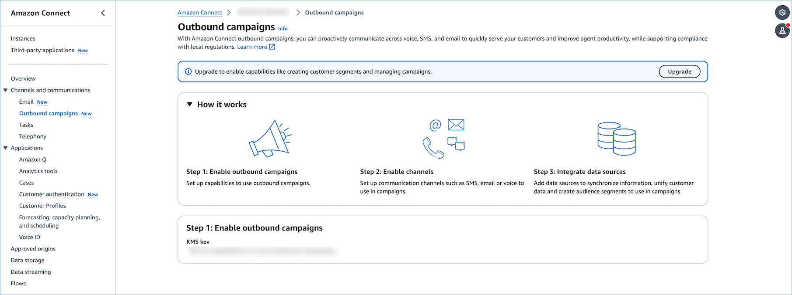
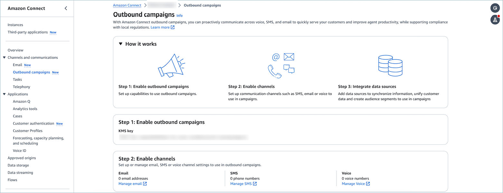
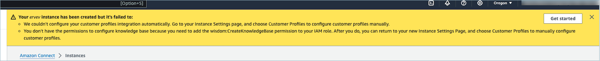
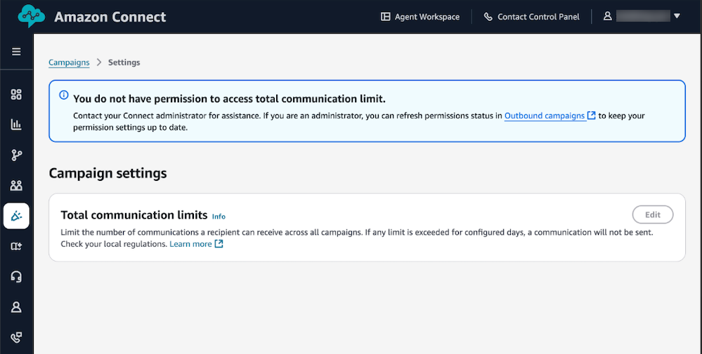
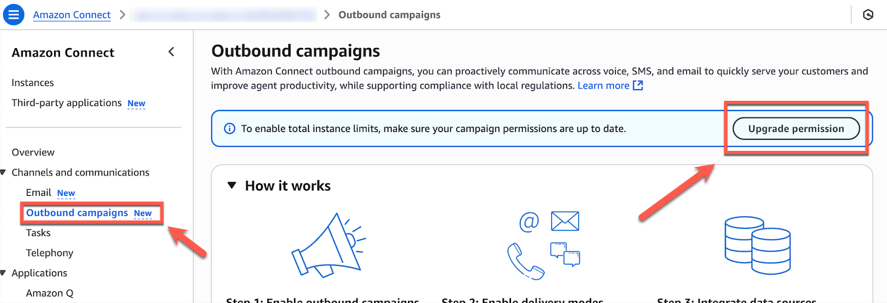

# Enable outbound campaigns and Customer Profiles

**To enable Amazon Connect Customer Profiles and Amazon Connect outbound campaigns**

1. When creating an Amazon Connect instance, when you get to **Step 4 - Data
   storage**, keep **Enable Customer Profiles** selected, as shown in
   the following image. This option enables  Amazon Connect Customer Profiles and outbound
   campaigns.

1. Select **Customize data storage (advanced)** to select a customer
   managed key for Customer Profiles and outbound campaigns from a dropdown list. An AWS owned
   key is used if you don't provide a custom key.
2. When a Amazon Connect instance is created successfully, outbound campaigns and Customer Profiles
   is enabled by default.

## Existing customers enable

outbound campaigns

###### To enable Amazon Connect Outbound campaigns

1. Select the Amazon Connect instance you wish to enable outbound campaigns for.
2. Choose **Outbound campaigns** in the left navigation pane.
3. If you are setting up outbound campaigns for the first time, you will see an
   **Enable** button.

 4. Choose **Enable** to go to the KMS configuration page for outbound
campaigns. 

###### Note

The KMS configuration will only be used for the outbound campaigns configuration and the
KMS key cannot be updated once it is created. 5. Choose **Enable outbound campaigns**. Upon enabling outbound campaigns, a Customer Profiles
domain, and an Amazon Q in Connect knowledge base with KnowledgeType `MESSAGE_TEMPLATES` will
be created if none existed previously. 6. You will be redirected to the home page and see a notification bar indicating that
resources are being created.

 7. A success banner will be display upon successfully enabling outbound campaigns.

 8. After successfully enabling an outbound campaign, and configuring a KMS key, the KMS
(AWS Key Management Service) key that was previously selected for the campaign will be displayed. 9. Choose **Manage email** to be redirected to the AWS
Connect Email console. In the AWS Connect Email console, you can set up and
configure your email domain, including verifying the domain, creating email addresses, and
managing email sending and receiving settings. 10. Choose **Manage SMS** to be directed to the AWS End User Messaging SMS console. In the
AWS End User Messaging SMS, you can configure and set up SMS phone numbers for your application, including
purchasing numbers, managing sender IDs, and configuring SMS messaging settings. 11. Choose **Manage voice** to be redirected to the Amazon Connect admin
website. In the Amazon Connect admin website, you can claim and manage voice phone numbers
for your contact center, set up call routing, and configure various voice-related
features.

**To upgrade outbound campaigns if you have a Amazon Connect instance with outbound
campaigns enabled**

1. Select the Amazon Connect instance you wish to upgrade outbound campaigns for.
2. Choose **Outbound campaigns**.
3. If outbound campaigns was previously enabled, the **Upgrade** button
   will be displayed.

###### Note

    * Upgrading outbound campaigns will allow you to use segmentation and orchestration
     capabilities in the Amazon Connect admin website
    * Upgrading outbound campaigns will update the current outbound campaigns page to new
     experience.

1. Choose **Upgrade**.

1. After successfully upgrading an outbound campaign, the KMS (AWS Key Management Service) key that was
   previously selected for the campaign will be displayed.
2. Choose **Manage email** to be redirected to the Amazon Connect Email console. In
   the Amazon Connect Email console, you can set up and configure your email domain, including verifying
   the domain, creating email addresses, and managing email sending and receiving settings.
3. Choose **Manage SMS** to be directed to the Amazon End User Messaging
   console. In the End User Messaging console, you can configure and set up SMS phone numbers for
   your application, including purchasing numbers, managing sender IDs, and configuring SMS
   messaging settings.
4. Choose **Manage voice** to be redirected to the Amazon Connect admin website. In the Amazon Connect admin website, you
   can claim and manage voice phone numbers for your contact center, set up call routing, and
   configure various voice-related features.

## How to delete Outbound

campaigns configuration

You can delete the Outbound campaigns configuration by using the Outbound campaigns
`DeleteConnectInstanceConfig` API. The option to toggle the Outbound campaigns
configuration on/off has been removed. The only way to turn off the Outbound campaigns feature in the
UI is to delete your Amazon Connect instance.

### Error state and troubleshooting

When creating instance if you see a warning banner, you are either missing some
permissions to enable these features or some failed to be created. You can configure those
permissions at a different time. 

If you navigate to the Outbound campaigns **Settings** page and see the
following banner, you do not have the required permissions to access total communications
limits.

In order to enable total limits permissions, you can navigate to the Amazon Connect admin website and under
**Outbound campaigns**, choose **Upgrade
permission**.

| **Error message**                                                                                                                  | **Cause**                                                                                                                                             | **Resolution**                                                                                                                                                                                                                                                                                                                                                                                                                                                                                                                       | **Screenshot**                                                                                      |
| ---------------------------------------------------------------------------------------------------------------------------------- | ----------------------------------------------------------------------------------------------------------------------------------------------------- | ------------------------------------------------------------------------------------------------------------------------------------------------------------------------------------------------------------------------------------------------------------------------------------------------------------------------------------------------------------------------------------------------------------------------------------------------------------------------------------------------------------------------------------ | --------------------------------------------------------------------------------------------------- |
| Already associated with another customer profiles domain, cannot be associated with multiple domains.                           | An Outbound campaign can only be associated to one customer profile or one knowledge base at a time.                                               | You can either use the associated Customer Profiles domain, go back to the Customer Profiles domain page, and re-associate the domain, or you can find out which domain is associated by using the `connect-campaign:ListConnectInstanceIntegrations` API to find the Customer Profiles domain Arn. If needed, you can delete the integration between Outbound campaigns and Customer Profiles and re-associate it by deleting the integration by using the `connect-campaigns:DeleteConnectInstanceIntegration` API. | Error message indicating a campaign is already associated with another customer profiles domain.    |
| Outbound campaigns has been created. However, some features may not work as expected. Please check your settings and try again. | A resource failed to configure correctly. However, some resources succeeded. The error message will help indicate to the customer what went wrong. | Follow the instructions on the warn/error banner.                                                                                                                                                                                                                                                                                                                                                                                                                                                                                    | Warning message showing partial success with outbound campaigns creation but with potential issues. |
