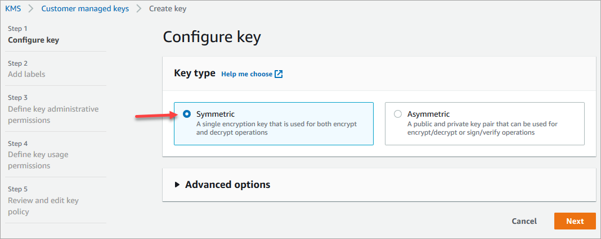
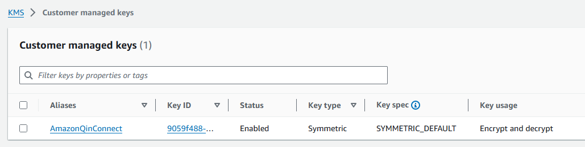

# Set up Amazon Connect outbound campaigns

This topic explains how to set up Amazon Connect outbound campaigns, a feature of Amazon Connect and formerly known as
high-volume outbound communications.

## Important things to know

- The phone numbers that outbound campaigns can call are based on the AWS Region where
  your Amazon Connect instance is created. For a list of AWS Regions and countries, see [Outbound campaigns](regions.md#campaigns_region "regions.md#campaigns_region") in the _Availability of
  Amazon Connect services by Region_ topic.
- You must obtain pre-authorization by creating an AWS Support ticket to use Amazon Connect outbound campaigns for event-driven mass notifications, such as severe weather warnings,
  evacuation notices, disaster response communications, or utility disruptions that impact
  several thousand of customers.

This review process helps ensure the reliable delivery of these critical messages while
maintaining service quality for all customers. While we may support these use-cases, they
require additional technical validation due to their unique nature and implications, such as
the impact on carrier networks for voice or SMS communications.

Follow the instructions in [Requesting a quota
increase](../../../servicequotas/latest/userguide/request-quota-increase.md "../../../servicequotas/latest/userguide/request-quota-increase.md") in the _Service Quotas User Guide_ to open a ticket that contains a
detailed description of your requirements. Additional charges may apply based on your location
and anticipated notification volumes.

## Before you begin

You need a few things in order to use outbound campaigns:

- Make sure your Amazon Connect instance is [enabled for
  outbound calling](enable-outbound-calls.md "enable-outbound-calls.md").
- Create a dedicated outbound campaigns queue to handle any contacts that will be routed to
  agents as a result of the campaign.
- Assign the queue to the agent's routing profile.
- Create and publish a flow that includes a [Check call progress](check-call-progress.md "check-call-progress.md") block. This block enables you to branch based on
  whether a person or a machine answered a call, for example.

## Create an AWS KMS key

When you enable outbound campaigns, you can provide your own [AWS KMS key](../../../kms/latest/developerguide/concepts.md#kms_keys "../../../kms/latest/developerguide/concepts.md#kms_keys"). You create and
manage these keys, and AWS KMS charges apply. You can also use an AWS owned key.

When using an API to enable or disable outbound campaigns, make sure the API user is either the
administrator or has the following permissions: `kms:DescribeKey`,
`kms:CreateGrant`, and `kms:RetireGrant` for the key.

###### Note

To switch the KMS key that is associated with outbound campaigns, first you need to disable
outbound campaigns, and then re-enable it using a different AWS KMS key.

## Configure outbound campaigns

1. Open the Amazon Connect console at
   [https://console.aws.amazon.com/connect/](https://console.aws.amazon.com/connect/ "https://console.aws.amazon.com/connect/").
2. On the instances page, choose the instance alias. The instance alias is also
   your **instance name**, which appears in your Amazon Connect
   URL. The following image shows the **Amazon Connect virtual contact center instances** page, with a box
   around the instance alias.

 3. In the navigation pane, choose **Channels and communications**,
**Outbound campaigns**. 4. On the **Outbound campaigns** page, choose **Enable**.
If you don't see this option, then check whether [outbound campaigns is
available in your AWS Region](regions.md#campaigns_region "regions.md#campaigns_region"). 5. Under **Encryption**, enter your own AWS KMS key or choose
**Create an AWS KMS key**.

If you choose **Create an AWS KMS key**:

    * A new tab in your browser opens for the Key Management Service (KMS) console. On the
     **Configure key** page, choose **Symmetric**, and then
     choose **Next**, as shown in the following image.

    
    * On the **Add labels** page, add a name and description for the key, and
     then choose **Next**.
    * On the **Define key administrative permissions** page, choose
     **Next**.
    * On the **Define key usage permissions** page, choose
     **Next**.
    * On the **Review and edit key policy** page, choose
     **Finish**.

    In the following example, the name of the key starts with
     **bcb6fdd**:

    
    * Return to the tab in your browser for the Amazon Connect console, **Enable outbound
     campaigns** page. Click or tap in the **AWS KMS key** for the
     key you created to appear in a dropdown list. Choose the key you created.

[Show moreShow less](# "#") 6. Choose **Enable outbound campaigns**. 7. It takes a few minutes for outbound campaigns to be enabled. When it's successfully enabled, you
can create outbound campaigns in Amazon Connect for voice calls. If it does not enable, verify you have
the required [IAM permissions](security-iam-amazon-connect-permissions.md "security-iam-amazon-connect-permissions.md").

## Best practices for ring duration and caller ID

The following best practices can help you comply with regulations.

**Meet the minimum ring duration requirements**

Regulations may require unanswered calls to ring for a minimum amount of time, such as 15
seconds, so the customer has time to pick up the call. Amazon Connect outbound campaigns let unanswered
calls ring until they go to voicemail or automatically terminate.

**Maintain Calling Line Identification**

Many locations require you to display the phone number associated with a caller ID. Amazon Connect
enforces the use of Calling Line Identification that corresponds to a number in an Amazon Connect
instance. The phone number you specify as caller ID for an outbound campaign must be one you
have claimed or ported in to your number inventory.
