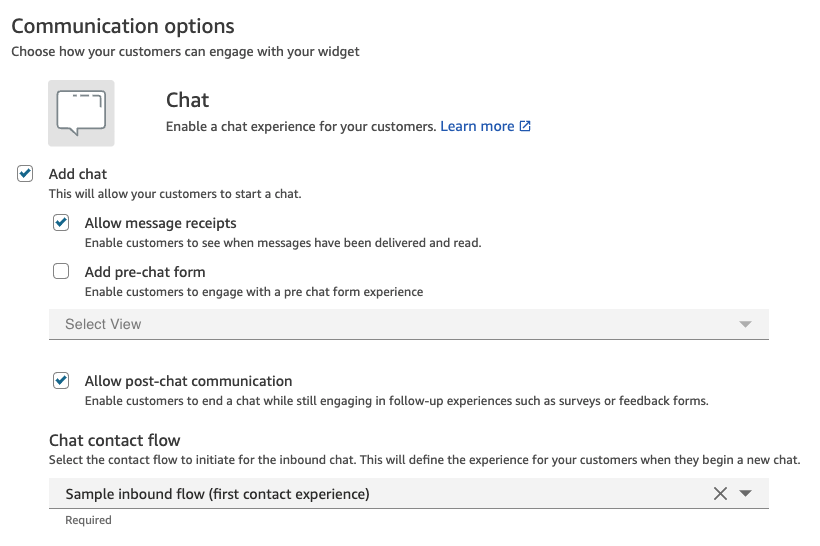
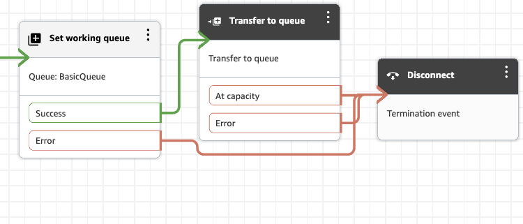
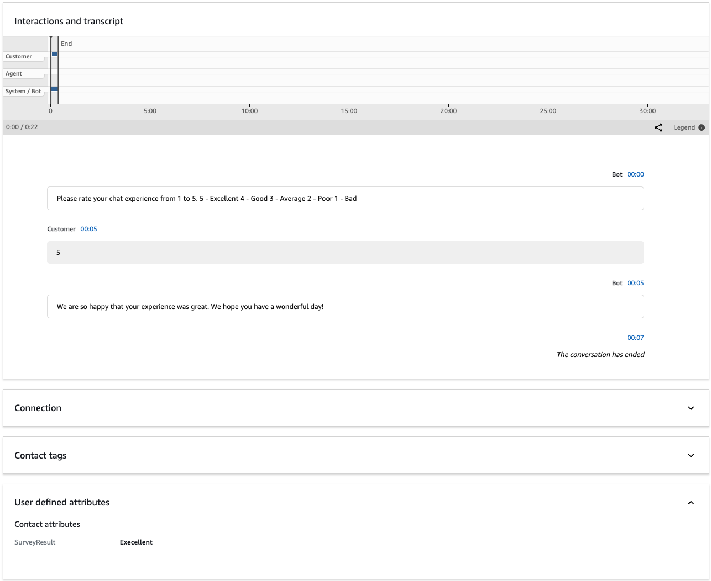

# Enable post-chat survey

Post-chat survey enables you to collect end customer feedback immediately after a chat conversation ends. With the **`DisconnectOnCustomerExit`** parameter in the [StartChatContact](../APIReference/API_StartChatContact.md "../APIReference/API_StartChatContact.md") API, you can configure automatic agent disconnection when end customer disconnects, ensuring that disconnect flow is triggered consistently regardless of which participant disconnects first.

## Implementation options

There are two ways to enable post-chat survey:

### For Custom Chat Widget

If you're using a custom chat implementation:

1. Upgrade to the latest version of [amazon-connect-chatjs](https://github.com/amazon-connect/amazon-connect-chatjs "https://github.com/amazon-connect/amazon-connect-chatjs").
2. Add the `DisconnectOnCustomerExit` parameter to your [StartChatContact](../APIReference/API_StartChatContact.md "../APIReference/API_StartChatContact.md") API request:

```
{
    "DisconnectOnCustomerExit": ["AGENT"],
    // ... other StartChatContact parameters
}
```

### For Amazon Connect Communication Widget

If you're using the Amazon Connect Communication Widget:

1. Open the Amazon Connect console and navigate to **Communication widgets**.
2. Enable the post-chat survey setting through the Communication Widgets page.



## Update contact flow to add post-chat survey as a disconnect flow

To enable post-chat survey, you'll need to update the disconnect flow that's connected to your chat solution. Once configured, the survey will automatically trigger when customers end their chat sessions.

For information about creating a disconnect flow, see [Example chat scenario](web-and-mobile-chat.md#example-chat-scenario "web-and-mobile-chat.md#example-chat-scenario").

There are two ways to implement a survey in your disconnect flow:

- **Option #1: Using ShowView block** - Use the [Flow block in Amazon Connect: Show view](show-view-block.md "show-view-block.md") to display a custom survey interface.
- **Option #2: Using Lex** - Integrate with Amazon Lex for text-based survey collection. For more information, see [Add an Amazon Lex bot to Amazon Connect](amazon-lex.md "amazon-lex.md").

###### Note

For supervisor barge-in scenarios, ensure you add a [Flow block in Amazon Connect: Set working queue](set-working-queue.md "set-working-queue.md") block before **Transfer to Queue**. Omitting it will cause chat contacts to terminate rather than transfer for this feature.



###### Contact Trace Records

When a customer ends a chat session, Amazon Connect sets `disconnectReason` to `CUSTOMER_DISCONNECT` in the [ContactTraceRecord](ctr-data-model.md#ctr-ContactTraceRecord "ctr-data-model.md#ctr-ContactTraceRecord"). When `DisconnectOnCustomerExit` is configured, the system generates a new contact ID (`nextContactId`) and initiates the configured disconnect flow.

Example:

```
{
    "contactId": "104c05e3-abscdfre",
    "nextContactId": "4cbae06d-ca5b-1234567",
    "channel": "CHAT",
    "initiationMethod": "DISCONNECT",
    "disconnectReason": "CUSTOMER_DISCONNECT"
}
```

[How contact attributes work in Amazon Connect](what-is-a-contact-attribute.md "what-is-a-contact-attribute.md") will update in Contact Search and Contact Details.



## Additional resources

- [StartChatContact API](../APIReference/API_StartChatContact.md "../APIReference/API_StartChatContact.md")
- [Sample inbound flow in Amazon Connect for the first contact
  experience](sample-inbound-flow.md "sample-inbound-flow.md")
- [Example chat scenario](web-and-mobile-chat.md#example-chat-scenario "web-and-mobile-chat.md#example-chat-scenario")
- [Flow block in Amazon Connect: Set working queue](set-working-queue.md "set-working-queue.md")
- [Flow block in Amazon Connect: Transfer to queue](transfer-to-queue.md "transfer-to-queue.md")
- [Amazon Connect ShowView](show-view-block.md "show-view-block.md")
- [Amazon Connect with Lex](amazon-lex.md "amazon-lex.md")
- [How contact attributes work in Amazon Connect](what-is-a-contact-attribute.md "what-is-a-contact-attribute.md")
