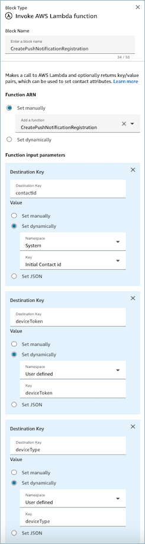

# Enable push notifications for

mobile chat

Push notifications for mobile chat are configured through [AWS End User Messaging](../../../sms-voice/latest/userguide/what-is-service.md "../../../sms-voice/latest/userguide/what-is-service.md").
You can enable push notifications for mobile chat on iOS or Android devices, allowing you to
alert customers about new messages even when they aren't actively using your mobile
application. You can enable this feature in your existing app integrated with the [Amazon Connect mobile SDKs](integrate-chat-with-mobile.md "integrate-chat-with-mobile.md"), a [webview solution](https://github.com/amazon-connect/amazon-connect-chat-ui-examples/tree/master/mobileChatExamples "https://github.com/amazon-connect/amazon-connect-chat-ui-examples/tree/master/mobileChatExamples"), or a custom native solution.

The following steps and resources will help you get started with integrating Amazon Connect push notifications into your native mobile applications:

## Step 1: Obtain

credentials from Apple's APNs and Google's FCM console

In order to set up Amazon Connect so that it can send push notifications to your
apps, you first have to obtain credentials from Apple's APNs and Google's FCM console
that will enable [AWS End User
Messaging](../../../sms-voice/latest/userguide/what-is-service.md "../../../sms-voice/latest/userguide/what-is-service.md") to send notifications to your mobile applications. The credentials
that you provide, depend on which push notification system you use:

- For Apple Push Notification service (APNs) credentials, see [Obtain an encryption key and key ID from Apple](https://developer.apple.com/documentation/usernotifications/establishing-a-token-based-connection-to-apns#Obtain-an-encryption-key-and-key-ID-from-Apple "https://developer.apple.com/documentation/usernotifications/establishing-a-token-based-connection-to-apns#Obtain-an-encryption-key-and-key-ID-from-Apple") and [Obtain a provider certificate from Apple](https://developer.apple.com/documentation/usernotifications/establishing-a-certificate-based-connection-to-apns#Obtain-a-provider-certificate-from-Apple "https://developer.apple.com/documentation/usernotifications/establishing-a-certificate-based-connection-to-apns#Obtain-a-provider-certificate-from-Apple") in the Apple Developer
  documentation.
- For Google's Firebase Cloud Messaging (FCM) credentials they can be obtained
  through the Firebase console, see [Firebase Cloud
  Messaging](https://firebase.google.com/docs/cloud-messaging "https://firebase.google.com/docs/cloud-messaging").

## Step 2: Create

an AWS End User Messaging service application using the AWS console and enable
the push notification channel for FCM or APNs

Before you can enable Amazon Connect to send push notifications, you first have to
[create an AWS
End User Messaging application and enable the push notifications](../../../push-notifications/latest/userguide/procedure-enable-push.md "../../../push-notifications/latest/userguide/procedure-enable-push.md") channel in
the [AWS
console](https://console.aws.amazon.com/push-notifications/ "https://console.aws.amazon.com/push-notifications/").

Follow these directions to create an application and enable any of the push channels.
To complete this procedure you are only required to enter an application name. You can
enable or disable any of the push channels at a later time:

1. Open the AWS End User Messaging Push console at [https://console.aws.amazon.com/push-notifications/](https://console.aws.amazon.com/push-notifications/ "https://console.aws.amazon.com/push-notifications/")
2. Choose **Create application**.
3. For **Application name** enter the name for your
   application.
4. (Optional) Follow this optional step to enable the **Apple Push Notification service (APNs)**.
   1. For **Apple Push Notification service
      (APNs)** select **Enable**.
   2. For **Default authentication type**
      choose either:
      1. If you choose **Key
         credentials**, provide the following information
         from your Apple developer account. AWS End User Messaging Push
         requires this information to construct authentication tokens.
         1. **Key ID** – The ID that's
            assigned to your signing key.
         2. **Bundle identifier** – The
            ID that's assigned to your iOS app.
         3. **Team identifier** – The
            ID that's assigned to your Apple developer account team.
         4. **Authentication key** –
            The .p8 file that you download from your Apple developer
            account when you create an authentication key.

      2. If you choose **Certificate
         credentials**, provide the following information:
         1. **SSL certificate** – The
            .p12 file for your TLS certificate.
         2. **Certificate password** –
            If you assigned a password to your certificate, enter it
            here.
         3. **Certificate type** –
            Select the type of certificate to use.

5. (Optional) Follow this optional step to enable the **Firebase Cloud Messaging (FCM)**.
   1. For **Firebase Cloud Messaging (FCM)**
      select **Enable**.
   2. Choose **Token credentials**
      for**Default authentication
      type,**then choose your service JSON file.

6. Choose **Create application**.

## Step 3: Associate the

AWS End User Messaging application with an Amazon Connect instance

To enable push notifications on an [Amazon Connect
instance](find-instance-arn.md "find-instance-arn.md"), you will need to associate an AWS End User Messaging application
with an [Amazon Connect
instance](find-instance-arn.md "find-instance-arn.md") by calling the [CreateIntegrationAssociation](../APIReference/API_CreateIntegrationAssociation.md "../APIReference/API_CreateIntegrationAssociation.md") API with the `PINPOINT_APP`
[IntegrationType](../APIReference/API_CreateIntegrationAssociation.md#API_CreateIntegrationAssociation_RequestSyntax "../APIReference/API_CreateIntegrationAssociation.md#API_CreateIntegrationAssociation_RequestSyntax"). You can call this API with [AWS CLI](../../../cli/latest/reference/connect/create-integration-association.md "../../../cli/latest/reference/connect/create-integration-association.md")
or the [Amazon Connect SDK](https://aws.amazon.com/developer/tools/ "https://aws.amazon.com/developer/tools/") for any
supported languages. This is a one-time onboarding step required for each integration
between an AWS End User Messaging application and an Amazon Connect instance.

## Step 4: Get device

token with FCM or APNs SDK, and register it with Amazon Connect

You will need to fetch the device token and use it to register an end-user mobile
device with an Amazon Connect chat contact to send push notifications for new
messages in the chat. Read the below FCM/APNs developer documentation for how the device
token is generated and obtained from the mobile application.

- For Apple Push Notification service (APN), see [Registering your app with APNs](https://developer.apple.com/documentation/usernotifications/registering-your-app-with-apns "https://developer.apple.com/documentation/usernotifications/registering-your-app-with-apns") in the Apple Developer
  documentation.
- For Firebase Cloud Messaging (FCM), see [Best
  practices for FCM registration token management](https://firebase.google.com/docs/cloud-messaging/manage-tokens "https://firebase.google.com/docs/cloud-messaging/manage-tokens").

To register the device with a chat contact, we recommend that you do the following:

1. When the mobile application calls the [StartChatContact](../APIReference/API_StartChatContact.md "../APIReference/API_StartChatContact.md") API, pass the `deviceToken` and
   `deviceType` as [contact attributes](../APIReference/API_StartChatContact.md#connect-StartChatContact-request-Attributes "../APIReference/API_StartChatContact.md#connect-StartChatContact-request-Attributes"). For webview and hosted communication widget
   users, see [How to pass contact attributes into the communications widget](pass-contact-attributes-chat.md#how-to-contact-attributes-chatwidget "pass-contact-attributes-chat.md#how-to-contact-attributes-chatwidget") for
   more details.
2. Embed a call to the [CreatePushNotificationRegistration](../APIReference/API_CreateIntegrationAssociation.md "../APIReference/API_CreateIntegrationAssociation.md") action in a Lambda function in a
   contact flow. The flow block should read `deviceToken` and
   `deviceType` from the user-defined contact attributes, and the
   `initialContactId` from the system attributes, then pass these
   values to the Lambda function.
   1. Depending on your use case, place the Lambda function either
      immediately after starting the chat (at the beginning of the flow) if
      you want the end user to receive push notifications immediately, or
      right before routing the contact to a queue so that they will receive
      the contact only an when agent is about to join. Once the API call is
      made, the device will start receiving push notifications when a new
      message comes from the agent or system. By default, push notifications
      will be sent for all the system and agent messages.

   

3. (optional)  Embed a call to the [DeletePushNotificationRegistration](../APIReference/API_CreateIntegrationAssociation.md "../APIReference/API_CreateIntegrationAssociation.md") action in a Lambda function in a
   flow. Once the API call is made, the device will stop receiving push
   notifications when a new message comes from the agent or system.

## Step 5: Receive push

notification on your mobile applications

Check out our [Amazon Connect Chat UI Examples](https://github.com/amazon-connect/amazon-connect-chat-ui-examples "https://github.com/amazon-connect/amazon-connect-chat-ui-examples") project and refer to our sample [iOS](https://github.com/amazon-connect/amazon-connect-chat-ui-examples/tree/master/mobileChatExamples/iOS-WKWebView-sample "https://github.com/amazon-connect/amazon-connect-chat-ui-examples/tree/master/mobileChatExamples/iOS-WKWebView-sample") and [Android](https://github.com/amazon-connect/amazon-connect-chat-ui-examples/tree/master/mobileChatExamples/android-webview-sample "https://github.com/amazon-connect/amazon-connect-chat-ui-examples/tree/master/mobileChatExamples/android-webview-sample") chat webview examples that showcase how to integrate Amazon Connect APIs to onboard and receive push notifications.

## Monitor your usage for push

notifications

To ensure the reliability, availability, and performance of your push notifications,
it's crucial to monitor their usage. You can track this information through several
channels:

1. AWS provides comprehensive monitoring tools for push
   notifications. For more information, see [Monitoring AWS End User Messaging Push](../../../push-notifications/latest/userguide/monitoring-overview.md "../../../push-notifications/latest/userguide/monitoring-overview.md").
2. Depending on the push notification service you're using, you can access
   additional usage data through their respective consoles.
   1. Firebase Cloud Messaging (FCM) : Consult the FCM documentation
      on [Understanding message delivery](https://firebase.google.com/docs/cloud-messaging/understand-delivery?platform=android "https://firebase.google.com/docs/cloud-messaging/understand-delivery?platform=android") for insights into your FCM
      usage.
   2. Apple Push Notification service (APNs) : Review the APNs
      documentation section on [Viewing the status of push notifications using Metrics and
      APNs](https://developer.apple.com/documentation/usernotifications/viewing-the-status-of-push-notifications-using-metrics-and-apns "https://developer.apple.com/documentation/usernotifications/viewing-the-status-of-push-notifications-using-metrics-and-apns") to monitor your notification status.
