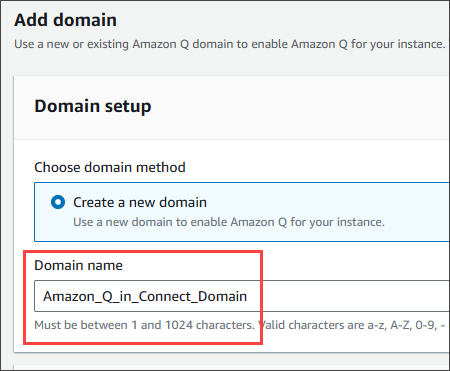
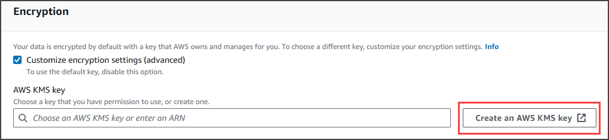
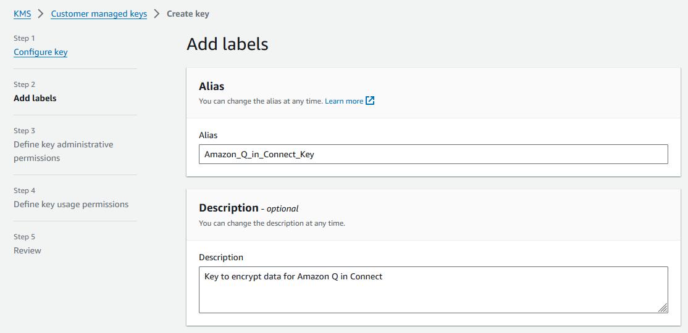
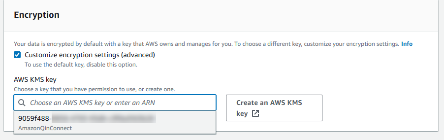
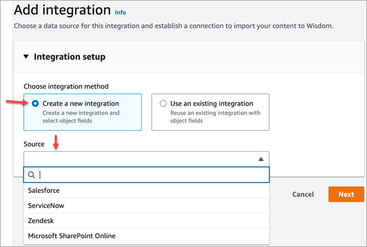
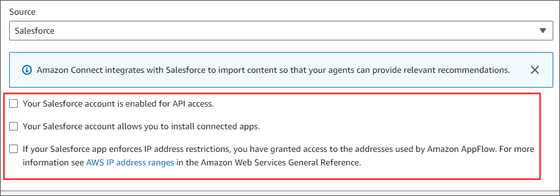
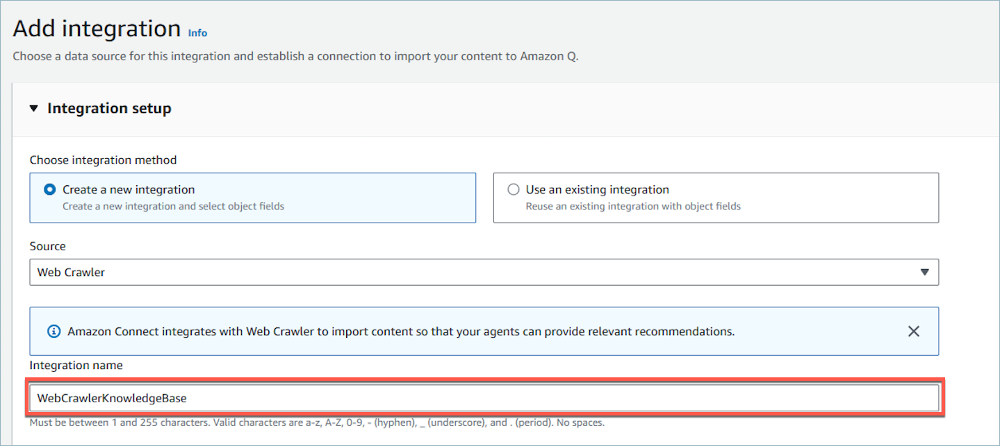
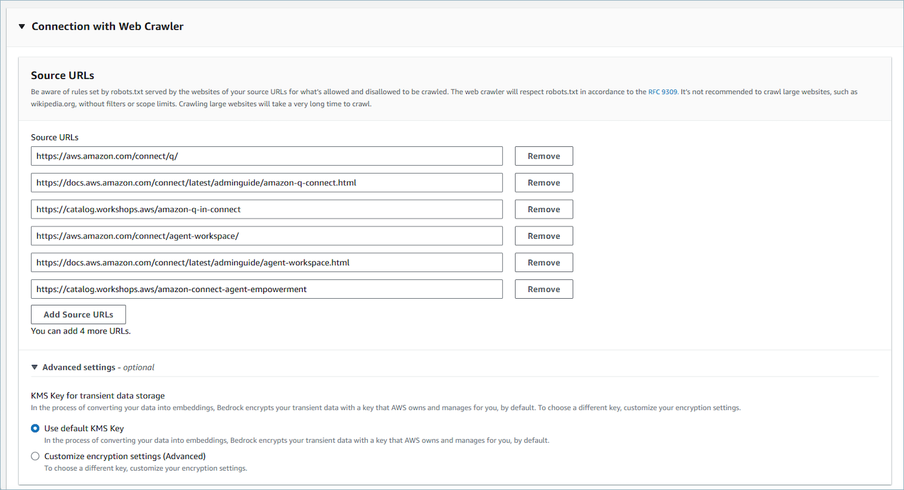
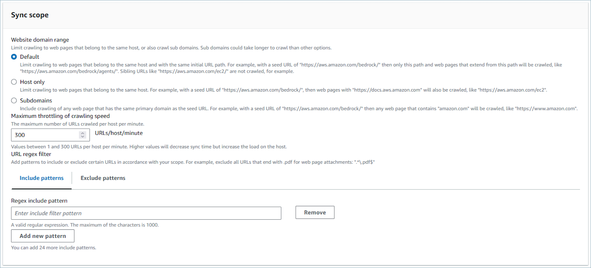
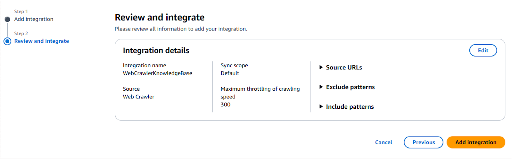

# Enable Amazon Q in Connect for your instance

There are two ways you can enable Amazon Q in Connect:

- Use the Amazon Connect console. There are instructions on this page.
- Use the [Amazon Q in Connect
  API](../APIReference/API_Operations_Amazon_Q_Connect.md "../APIReference/API_Operations_Amazon_Q_Connect.md") to ingest content.
  The following sections explain how to use the Amazon Connect console to enable Amazon Q in Connect. Follow
  them in the order listed. If you want to use the Amazon Q in Connect API, we assume you have the
  necessary programming skills.

###### Contents

- [Supported content types](#q-content-types "#q-content-types")
- [Integration overview](#q-overview "#q-overview")
- [Before you begin](#enable-q-requirements "#enable-q-requirements")
- [Step 1: Create an Amazon Q in Connect domain](#enable-q-step1 "#enable-q-step1")
- [Step 2: Encrypt the domain](#enable-q-step-2 "#enable-q-step-2")
- [Step 3: Create an integration (knowledge
  base)](#enable-q-step-3 "#enable-q-step-3")
- [Step 4: Configure your flow for Amazon Q in Connect](#enable-q-step4 "#enable-q-step4")
- [When was your knowledge base last updated?](#enable-q-tips "#enable-q-tips")
- [Cross-region inference
  service](#enable-q-cross-region-inference-service "#enable-q-cross-region-inference-service")

## Supported content types

Amazon Q in Connect supports the ingestion of HTML, Word, PDF, and text files up to 1 MB. Note
the following:

- Plain text files must be in UTF-8.
- Word documents must be in DOCX format.
- Word documents are automatically converted to simplified HTML and will not
  retain the source document’s font family, size, color, highlighting,
  alignment, or other formatting such as background colors, headers or
  footers.
- PDF files cannot be encrypted or password protected.
- Actions and scripts embedded into PDF files are not supported.

For a list of adjustable quotas, such as the number of quick responses per
knowledge base, see [Amazon Q in Connect service quotas](amazon-connect-service-limits.md#q-in-connect-quotas "amazon-connect-service-limits.md#q-in-connect-quotas").

## Integration overview

You follow these broad steps to enable Amazon Q in Connect:

1. Create an Amazon Q in Connect domain (assistant). A domain consists of a single
   knowledge base, such as SalesForce or Zendesk.
2. Create an encryption key to encrypt the excerpts that are provided in the
   recommendations to the agent.
3. Create a knowledge base using external data:
   - Add data integrations from Amazon S3, Microsoft SharePoint Online,
     [Salesforce](https://developer.salesforce.com/docs/atlas.en-us.knowledge_dev.meta/knowledge_dev/sforce_api_objects_knowledge__kav.htm "https://developer.salesforce.com/docs/atlas.en-us.knowledge_dev.meta/knowledge_dev/sforce_api_objects_knowledge__kav.htm"), [ServiceNow](https://developer.servicenow.com/dev.do#!/reference/api/rome/rest/knowledge-management-api "https://developer.servicenow.com/dev.do#!/reference/api/rome/rest/knowledge-management-api"), and ZenDesk using prebuilt connectors in
     the Amazon Connect console.
   - Encrypt the content importing from these applications using a
     KMS key.
   - For certain integrations, specify the sync frequency.
   - Review the integration.

4. Configure your flow.
5. Assign permissions.

## Before you begin

Following is an overview of key concepts and the information that you'll be
prompted for during the setup process.

### About the Amazon Q in Connect domain

When you enable Amazon Q in Connect, you create an Amazon Q in Connect _domain_: an assistant that consists of one knowledge base. Follow
these guidelines when creating domains:

- You can create multiple domains, but they don't share external
  application integrations or customer data between each other.
- You can associate each domain with one or more Amazon Connect instances, but
  you can only associate an Amazon Connect instance with one domain.

###### Note

If you want to use multiple data sources, we recommend collecting
the data in Amazon Simple Storage Service and using that as your domain.

- All the external application integrations you create are at a domain
  level. All of the Amazon Connect instances associated with a domain inherit the
  domain's integrations.
- You can associate your Amazon Connect instance with a different domain at any
  time by choosing a different domain.

### How to name your Amazon Q in Connect domain

When you enable Amazon Q in Connect, you are prompted to provide a friendly domain name
that's meaningful to you, such as your organization name.

### (Optional) Create AWS KMS keys to

encrypt the domain and the content

When you enable Amazon Q in Connect, by default the domain and connection are encrypted with
an AWS owned key. However, if you want to manage the keys, you can create or
provide two [AWS KMS keys](../../../kms/latest/developerguide/concepts.md#kms_keys "../../../kms/latest/developerguide/concepts.md#kms_keys"):

- Use one key for the Amazon Q in Connect domain, used to encrypt the excerpt provided
  in the recommendations.
- Use the second key to encrypt the content imported from Amazon S3,
  Microsoft SharePoint Online, Salesforce, ServiceNow, or ZenDesk. Note
  that Amazon Q in Connect search indices are always encrypted at rest using an
  AWS owned key.

To create KMS keys, follow the steps in [Step 1: Create an Amazon Q in Connect domain](#enable-q-step1 "#enable-q-step1"), later in this section.

Your customer managed key is created, owned, and managed by you. You have full control
over the KMS key, and AWS KMS charges apply.

If you choose to set up a KMS key where someone else is the administrator,
the key must have a policy that allows `kms:CreateGrant`,
`kms:DescribeKey`, and `kms:Decrypt` and
`kms:GenerateDataKey*` permissions to the IAM identity using
the key to invoke Amazon Q in Connect. To use Amazon Q in Connect with chat and emails, the key policy for
your Amazon Q in Connect domain must allow `kms:Decrypt`,
`kms:GenerateDataKey*`, and `kms:DescribeKey`
permissions to the `connect.amazonaws.com` service principal.

###### Note

To use Amazon Q in Connect with chat and emails, the key policy for your Amazon Q in Connect domain
must grant the `connect.amazonaws.com` service principal the
following permissions:

- `kms:GenerateDataKey*`
- `kms:DescribeKey`
- `kms:Decrypt`
  For information about how to change a key policy, see [Changing a key
  policy](../../../kms/latest/developerguide/key-policy-modifying.md "../../../kms/latest/developerguide/key-policy-modifying.md") in the _AWS Key Management Service Developer
  Guide_.

## Step 1: Create an Amazon Q in Connect domain

The following steps explain how to add a domain to an Amazon Connect instance, and how to
add an integration to the domain. To complete these steps, you must have an instance
without a domain.

1. Open the Amazon Connect console at
   [https://console.aws.amazon.com/connect/](https://console.aws.amazon.com/connect/ "https://console.aws.amazon.com/connect/").
2. On the **Amazon Connect virtual contact center instances** page,
   under **Instance alias**, choose the name of the instance.
   The following image shows a typical instance name.

 3. In the navigation pane, choose **Amazon Q**, and then
choose **Add domain**. 4. On the **Add domain** page, choose **Create a
domain**. 5. In the **Domain name** box, enter a friendly name, such
as your organization name.

 6. Keep the page open and go to the next step.

## Step 2: Encrypt the domain

You can use the Amazon Connect default key to encrypt your domain. You can also use an
existing key, or you can create keys that you own. The following sets of steps
explain how to use each type of key. Expand each section as needed.

### Use the default key

1. Under **Encryption**, clear the **Customize
   encryption settings** checkbox.
2. Choose **Add domain**.

### Use an existing key

1. Under **Encryption**, open the **AWS KMS
   key** list and select the desired key.
2. Choose **Add domain**.

###### Note

To use an existing key with Amazon Connect chats and emails, you must grant the
`connect.amazonaws.com` service principal the
`kms:Decrypt`, `kms:GenerateDataKey*`, and
`kms:DescribeKey` permissions.

The following example shows a typical policy.

JSON

```
`{
 "Id": "`key-consolepolicy-3`",
 "Version":"2012-10-17",
 "Statement": [
 {
 "Effect": "Allow",
 "Principal": {
 "AWS": "arn:aws:iam::`111122223333`:root"
 },
 "Action": "kms:*",
 "Resource": "*"
 },
 {
 "Effect": "Allow",
 "Principal": {
 "Service": "connect.amazonaws.com"
 },
 "Action": [
 "kms:Decrypt",
 "kms:GenerateDataKey*",
 "kms:DescribeKey"
 ],
 "Resource": "*"
 }
 ]
}`

```

### Create an AWS KMS key

1. On the **Add domain** page, under
   **Encryption**, choose **Create an
   AWS KMS key**.



That takes you to the Key Management Service (KMS) console. Follow
these steps:

    1. In the KMS console, on the **Configure key**
     page, choose **Symmetric**, and then choose
     **Next**.


    
    2. On the **Add labels** page, enter an alias
     and description for the KMS key, and then choose
     **Next**.


    
    3. On the **Define key administrative
     permissions** page, choose
     **Next**, and on the **Define key
     usage permissions** page, choose
     **Next** again.
    4. On the **Review and edit key policy** page,
     scroll down to **Key policy**.


    ###### Note

    To use Amazon Q in Connect with chats and emails, modify the key policy
     to allow the `kms:Decrypt`, `kms:GenerateDataKey*`, and
     `kms:DescribeKey` permissions to the `connect.amazonaws.com` service principal. The
     following code shows a sample policy.


    JSON


    ```
    `{
     "Id": "key-consolepolicy-3",
     "Version":"2012-10-17",
     "Statement": [
     {
     "Effect": "Allow",
     "Principal": {
     "AWS": "arn:aws:iam::`111122223333`:root"
     },
     "Action": "kms:*",
     "Resource": "*"
     },
     {
     "Effect": "Allow",
     "Principal": {
     "Service": "connect.amazonaws.com"
     },
     "Action": [
     "kms:Decrypt",
     "kms:GenerateDataKey*",
     "kms:DescribeKey"
     ],
     "Resource": "*"
     }
     ]
    }`

    ```
    5. Choose **Finish**.


    In the following example, the name of the KMS key starts
     with **9059f488**.


    

2. Return to the **Amazon Q in Connect** browser tab, open the
   **AWS KMS key** list, and select the key that
   you created in the previous steps.

 3. Choose **Add domain**.

## Step 3: Create an integration (knowledge

base)

1. On the **Amazon Q** page, choose **Add
   integration**.
2. On the **Add integration** page, choose **Create
   a new integration**, and then select a source.



The steps for creating an integration vary, depending on the source that
you choose. Expand the following sections as needed to finish creating an
integration.

You follow a multi-step process to create a Salesforce integration. The
following sections explain how to complete each step.

#### Step 1: Add the integration

1. Select all the checkboxes that appear. This acknowledges that
   you set up your Salesforce account properly:

 2. In the **Integration name** box, enter a name
for the integration.

###### Tip

If you create multiple integrations from the same source,
we recommend you develop a naming convention to make the
names easy to distinguish. 3. Select **Use an existing connection**, open
the **Select an existing connection** list and
choose a connection, then choose
**Next**.

—OR—

Select **Create a new connection** and follow
these steps:

    1. Choose **Production** or
     **Sandbox**.
    2. In the **Connection name** box, enter
     the name of your connection. The name is your Salesforce
     URL without the **https://**.
    3. Choose **Connect**, sign in to
     Salesforce, and when prompted, choose
     **Allow**.

4. Under **Encryption**, open the **AWS
   KMS Key** list and choose a key.

—OR—

Choose **Create an AWS KMS Key** and follow
the steps listed in [Create an AWS KMS key](#q-create-key "#q-create-key"), earlier in this
section. 5. (Optional) Under **Sync frequency**, open the
**Sync frequency** list and select and
select a synchronization interval. The system defaults to an
hour. 6. (Optional) Under **Ingestion start date**,
choose **Ingest records created after**, then
select a start date. The system defaults to ingesting all
records. 7. Choose **Next** and follow the steps in the
next section of this topic.

#### Step 2: Select objects and

fields

###### Tip

If you create multiple integrations from the same source, we
recommend you develop a naming convention to make the names easy to
distinguish.

1. On the **Select objects and fields** page,
   open the **Available objects** list and select
   an object. Only knowledge objects appear in the list.
2. Under **Select fields for**
   _object name_, select the fields that you
   want to use.

###### Note

By default, the system automatically selects all required
fields. 3. Choose **Next**.

#### Step 3: Review and add the

integration

- Review the settings for the integration. When finished, choose
  **Add integration**.

1. Under **Integration setup**, select the checkbox
   next to **Read and acknowledge that your ServiceNow account
   meets the integration requirements.**.
2. In the **Integration name** box, enter a name for
   the integration.

###### Tip

If you create multiple integrations from the same source, we
recommend you develop a naming convention to make the names easy
to distinguish. 3. Select **Use an existing connection**, open the
**Select an existing connection** list and
choose a connection, then choose **Next**.

—OR—

Select **Create a new connection** and follow
these steps:

    1. In the **User name** box, enter your
     ServiceNow user name. You must have administrator
     permissions.
    2. In the **Password** box, enter your
     password.
    3. In the **Instance URL** box, enter your
     ServiceNow URL.
    4. In the **Connection name** box, enter a
     name for the connection.
    5. Choose **Connect**.
    6. Under **Encryption**, open the
     **AWS KMS Key** list and choose a
     key.


    —OR—


    Choose **Create an AWS KMS Key** and
     follow the steps listed in [Create an AWS KMS key](#q-create-key "#q-create-key"), earlier in this
     section.
    7. (Optional) Under **Sync frequency**, open
     the **Sync frequency** list and select and
     select a synchronization interval. The system defaults to an
     hour.
    8. (Optional) Under **Ingestion start
     date**, choose **Ingest records created
     after**, then select a start date. The system
     defaults to ingesting all records.
    9. Choose **Next**.

4. Select the fields for the knowledge base. The following fields are
   required:
   - short_description
   - number
   - workflow_state
   - sys_mod_count
   - active
   - text
   - sys_updated_on
   - wiki
   - sys_id

5. Choose **Next**.
6. Review your settings, change them as needed, then choose
   **Add integration**.

###### Prerequisites

You must have the following items to connect to Zendesk:

- A client ID and a client secret. You obtain the ID and secret by
  registering your application with Zendesk and enabling an OAuth
  authorization flow. For more information, see [Using OAuth authentication with your application](https://support.zendesk.com/hc/en-us/articles/4408845965210-Using-OAuth-authentication-with-your-application "https://support.zendesk.com/hc/en-us/articles/4408845965210-Using-OAuth-authentication-with-your-application") on
  the Zendesk support site.
- In Zendesk, a Redirect URL configured with `https://[AWS
 REGION].console.aws.amazon.com/connect/v2/oauth`. For
  example,
  `https://ap-southeast-2.console.aws.amazon.com/connect/v2/oauth`.
  After you have those items, follow these steps:

1. Under **Integration setup**, select the
   checkboxes and enter a name for the integration.

###### Tip

If you create multiple integrations from the same source, we
recommend you develop a naming convention to make the names easy
to distinguish. 2. Select **Use an existing connection**, open the
**Select an existing connection** list and
choose a connection, then choose **Next**.

—OR—

Select **Create a new connection** and follow
these steps:

    1. Enter a valid client ID, client secret, account name, and
     connection name in their respective boxes, then choose
     **Connect**.
    2. Enter your email address and password, then choose
     **Sign in**.
    3. On the pop-up that appears, select
     **Allow**.
    4. Under **Encryption**, open the
     **AWS KMS Key** list and choose a
     key.


    —OR—


    Choose **Create an AWS KMS Key** and
     follow the steps listed in [Create an AWS KMS key](#q-create-key "#q-create-key"), earlier in this
     section.

3. (Optional) Under **Sync frequency**, open the
   **Sync frequency** list and select and select a
   synchronization interval. The system defaults to an hour.
4. (Optional) Under **Ingestion start date**, choose
   **Ingest records created after**, then select a
   start date. The system defaults to ingesting all records.
5. Choose **Next**.
6. Select the fields for the knowledge base, then choose
   **Next**.
7. Review your settings, change them as needed, then choose
   **Add integration**.
   After you create the integration, you can only edit its URL.

###### Prerequisites

You must have the following item to connect to SharePoint:

- In SharePoint, a Redirect URL configured with `https://[AWS
 REGION].console.aws.amazon.com/connect/v2/oauth`. For
  example,
  `https://ap-southeast-2.console.aws.amazon.com/connect/v2/oauth`.
  After you have this item, follow these steps:

1. Under **Integration setup**, select the checkbox
   and enter a name for the integration.

###### Tip

If you create multiple integrations from the same source, we
recommend you develop a naming convention to make the names easy
to distinguish. 2. Under **Connection with S3**, open the
**Select an existing connection** list and
choose a connection, then choose **Next**.

—OR—

Select **Create a new connection** and follow
these steps:

    1. Enter your tenant ID in both boxes, enter a connection
     name, then choose **Connect**.
    2. Enter your email address and password to sign in to
     SharePoint.
    3. Under **Encryption**, open the
     **AWS KMS Key** list and choose a
     key.


    —OR—


    Choose **Create an AWS KMS Key** and
     follow the steps listed in [Create an AWS KMS key](#q-create-key "#q-create-key"), earlier in this
     section.
    4. Under **Sync frequency**, accept the
     default or open the **Sync frequency** list
     and select and select a synchronization interval.
    5. Choose **Next**.

3. Under **Select Microsoft SharePoint Online
   site**, open the list and select a site.
4. Under **Select folders from**
   _site name_, select the folders that you want to
   include in your domain, then choose
   **Next**.
5. Review your settings, change them as needed, then choose
   **Add integration**.
6. In the **Integration name** box, enter a name for
   your integration.

###### Tip

If you create multiple integrations from the same source, we
recommend you develop a naming convention to make the names easy
to distinguish. 2. Under **Connections with Microsoft SharePoint
Online**, open the **Select an existing
connection** list and choose a connection, then choose
**Next**.

—OR—

Under **Connection with S3**, enter the URI of
your Amazon S3 bucket, then choose **Next**.

—OR—

Choose **Browse S3**, use the search box to find
your bucket, select the button next to it, then select
**Choose**. 3. Under **Encryption**, open the **AWS KMS
Key** list and choose a key.

—OR—

Choose **Create an AWS KMS Key** and follow the
steps listed in [Create an AWS KMS key](#q-create-key "#q-create-key"), earlier in this section. 4. Choose **Next**. 5. Review your settings, change them as needed, then choose
**Add integration**.
The Web Crawler connects to and crawls HTML pages starting from the seed
URL, traversing all child links under the same top primary domain and path.
If any of the HTML pages reference supported documents, the Web Crawler will
fetch these documents, regardless if they are within the same top primary
domain.

###### Supported features

- Select multiple URLs to crawl.
- Respect standard robots.txt directives like 'Allow' and
  'Disallow'.
- Limit the scope of the URLs to crawl and optionally exclude URLs
  that match a filter pattern.
- Limit the rate of crawling URLs.
- View the status of URLs visited while crawling in Amazon
  CloudWatch.

#### Prerequisites

- Check that you are authorized to crawl your source URLs.
- Check the path to robots.txt corresponding to your source
  URLs doesn't block the URLs from being crawled. The Web Crawler
  adheres to the standards of robots.txt: disallow by default if
  robots.txt is not found for the website. The Web Crawler
  respects robots.txt in accordance with the [RFC
  9309](https://www.rfc-editor.org/rfc/rfc9309.html "https://www.rfc-editor.org/rfc/rfc9309.html")
- Check if your source URL pages are JavaScript dynamically
  generated, as crawling dynamically generated content is
  currently not supported. You can check this by entering the
  following in your browser:
  `view-source:https://examplesite.com/site/`. If
  the body element contains only a `div` element and
  few or no `a href` elements, then the page is likely
  dynamically generated . You can disable JavaScript in your
  browser, reload the web page, and observe whether content is
  rendered properly and contains links to your web pages of
  interest.
- [Enable CloudWatch Logs delivery](../../../bedrock/latest/userguide/knowledge-bases-logging.md "../../../bedrock/latest/userguide/knowledge-bases-logging.md") to view the status
  of your data ingestion job for ingesting web content, and if
  certain URLs cannot be retrieved.

###### Note

When selecting websites to crawl, you must adhere to the [Amazon Acceptable Use
Policy](https://aws.amazon.com/aup/ "https://aws.amazon.com/aup/") and all other Amazon terms. Remember that you
must only use the Web Crawler to index your own web pages, or web
pages that you have authorization to crawl.

#### Connection configuration

To reuse an existing integration with object fields, chose **Use an existing connection**, open the
**Select an existing connection**
list and choose a connection, then choose **Next**.

To create a new integration, use the following steps:

1. Choose **Create a new
   connection**.
2. In the **Integration name**
   box, assign a friendly name to the integration.

 3. In the **Connection with Web Crawler >
Source URLs** section, provide the **Source URLs** of the URLs you want to
crawl. You can add up to 9 additional URLs by selecting
**Add Source URLs**. By
providing a source URL, you are confirming that you are
authorized to crawl its domain. 

 4. Under Advanced settings, you can optionally configure to use
the default KMS key or a Customer Managed Key (CMK). 5. Under **Sync scope**

    1. Select an option for the **scope** of crawling your source URLs. You
     can limit the scope of the URLs to crawl based on each
     page URL's specific relationship to the seed URLs. For
     faster crawls, you can limit URLs to those with the same
     host and initial URL path of the seed URL. For broader
     crawls, you can choose to crawl URLs with the same host
     or within any subdomain of the seed URL. 


    ###### Note

    Make sure you are not crawling potentially
     excessive web pages. It's not recommended to crawl
     large websites, such as wikipedia.org, without
     filters or scope limits. Crawling large websites
     will take a very long time to crawl.

    [Supported file types](../../../bedrock/latest/userguide/knowledge-base-ds.md "../../../bedrock/latest/userguide/knowledge-base-ds.md") are crawled
     regardless of scope and if there's no exclusion
     pattern for the file type.
    2. Enter **Maximum throttling of
     crawling speed**. Ingest URLs between 1 and
     300 URLs per host per minute. A higher crawling speed
     increases the load but takes less time.
    3. For **URL Regex**
     patterns (optional) you can add **Include patterns** or **Exclude patterns** by
     entering the regular expression pattern in the box. You
     can add up to 25 include and 25 exclude filter patterns
     by selecting **Add new
     pattern**. The include and exclude patterns
     are crawled in accordance with your scope. If there's a
     conflict, the exclude pattern takes precedence.


    	1. You can include or exclude certain URLs in
    	 accordance with your scope. [Supported file types](../../../bedrock/latest/userguide/knowledge-base-ds.md "../../../bedrock/latest/userguide/knowledge-base-ds.md") are crawled
    	 regardless of scope and if there's no exclusion
    	 pattern for the file type. If you specify an
    	 inclusion and exclusion filter and both match a
    	 URL, the exclusion filter takes precedence and the
    	 web content isn’t crawled.


    	###### Important

    	Problematic regular expression pattern
    	 filters that lead to [catastrophic backtracking](../../../codeguru/detector-library/python/catastrophic-backtracking-regex.md "../../../codeguru/detector-library/python/catastrophic-backtracking-regex.md") and look ahead,
    	 are rejected.
    	2. The following is an example of a regular
    	 expression filter pattern to exclude URLs that end
    	 with ".pdf" or PDF web page attachments:
    	 `.*\.pdf$`


    	

6. Choose **Next**.
7. Review all the integration details.

 8. Select **Add integration.** 9. The integration is added to your list.

#### Incremental

syncing

Each time the Web Crawler runs, it retrieves content for all URLs
that are reachable from the source URLs that match the scope and
filters. For incremental syncs after the first sync of all content,
Amazon Q in Connect will update your knowledge base with new and
modified content, and will remove old content that is no longer present.
Occasionally, the crawler may not be able to distinguish if content was
removed from the website; and in this case it will preserve old content
in your knowledge base.

###### Note

- If you delete objects from SaaS applications, such as SalesForce and
  ServiceNow, Amazon Q in Connect does not process those deletions. You must archive
  objects in SalesForce and retire articles in ServiceNow to remove them
  from those knowledge bases.
- For Zendesk, Amazon Q in Connect does not process hard deletes or archives of
  articles. You must unpublish articles in Zendesk to remove them from
  your knowledge base.
- For Microsoft SharePoint Online, you can select a maximum of 10
  folders.
- Amazon Q automatically adds an `AmazonConnectEnabled:True`
  tag to the Amazon Q resources associated with your Amazon Connect instance, such
  as a knowledge base and an Assistant. It does this to authorize the
  access from Amazon Connect to Amazon Q resources. This action is a result of the
  tag-based access control in the managed policy of the Amazon Connect service
  linked role. For more information, see [Service-linked role permissions for
  Amazon Connect](connect-slr.md#slr-permissions "connect-slr.md#slr-permissions").

## Step 4: Configure your flow for Amazon Q in Connect

1. Add a [Amazon Q in Connect](q-block.md "q-block.md") block to
   your flow. The block associates an Amazon Q in Connect domain to the current contact. This
   enables you to display information from a specific domain, based on criteria
   about the contact.

If you choose to [customize](customize-q.md "customize-q.md") the Amazon Q in Connect
experience, you will instead create a Lambda and then use an [AWS Lambda
function](invoke-lambda-function-block.md "invoke-lambda-function-block.md") block to add it to
your flows. 2. To use Amazon Q in Connect with calls, you must enable Contact Lens
conversational analytics in the flow by adding a [Set recording and analytics
behavior](set-recording-behavior.md "set-recording-behavior.md") block that is configured
for Contact Lens conversational analytics real-time. It doesn't
matter where in the flow you add the [Set recording and analytics
behavior](set-recording-behavior.md "set-recording-behavior.md") block.

###### Note

To use Amazon Q in Connect with calls, you must enable Contact Lens
conversational analytics. Contact Lens conversational
analytics real-time analytics is used recommend content that is related to
customer issues detected during the current call.

Contact Lens
conversational analytics is not required to use Amazon Q in Connect with chats or emails, or to
use Amazon Q in Connect self-service.

## When was your knowledge base last updated?

To confirm the last date and time that your knowledge base was updated (meaning a
change in the content available), use the [GetKnowledgeBase](../../../amazon-q-connect/latest/APIReference/API_GetKnowledgeBase.md "../../../amazon-q-connect/latest/APIReference/API_GetKnowledgeBase.md") API to reference
`lastContentModificationTime`.

## Cross-region inference

service

Amazon Q in Connect uses [cross-region
inference](../../../bedrock/latest/userguide/cross-region-inference.md "../../../bedrock/latest/userguide/cross-region-inference.md") to automatically select the optimal AWS Region
for processing your data, improving the customer experience by maximizing available
resources and model availability. If you do not want your data processed in a
different region from what you selected, you can contact AWS
Support.

###### Note

While existing Custom prompts will continue using in-region inference, we
recommend upgrading to the latest supported models to benefit from cross-region
inference capabilities. You can contact AWS Support for migration assistance of
your existing prompts.
