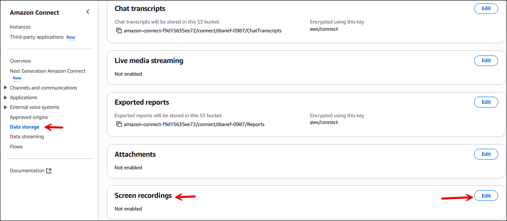
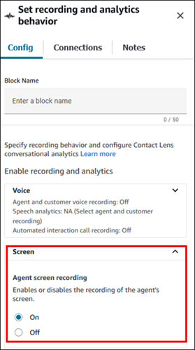

# Enable screen recording for your Amazon Connect instance

This topic provides steps to enable screen recording for your Amazon Connect instance, download
and install the Amazon Connect Client Application, and perform key configuration steps.

###### Contents

- [Step 1: Enable screen recording for
  your instance](#install-sr-step1 "#install-sr-step1")
- [Step 2: Download and install the
  Amazon Connect Client Application](#install-sr-step2 "#install-sr-step2")
- [Step 3: Configure the Set recording and analytics behavior block](#configure-recording-block "#configure-recording-block")
- [Configuration tips](#tips-sr "#tips-sr")

## Step 1: Enable screen recording for your

instance

###### Important

If your Amazon Connect instance was created before October, 2018, and you don't have
service-linked roles set up, follow the steps in [Use
service-linked roles](connect-slr.md#migrate-slr "connect-slr.md#migrate-slr") to migrate to the Amazon Connect service-linked
role.

The steps in this section explain how to update your instance settings to enable
screen recording, and how to encrypt recording artifacts.

1. Open the Amazon Connect console at
   [https://console.aws.amazon.com/connect/](https://console.aws.amazon.com/connect/ "https://console.aws.amazon.com/connect/").
2. Choose your instance alias.
3. In the navigation pane, choose **Data storage**, scroll
   down to **Screen recordings** and choose
   **Edit**, as shown in the following image.

 4. Choose **Enable screen recording**, and then choose
**Create a new S3 bucket (recommended)** or
**Select an existing S3 bucket**. 5. If you chose **Create a new Amazon S3 bucket (recommended)**,
enter a name in the **Name** box. If you chose to use an
existing bucket, select it from the **Name** list. 6. (Optional) To encrypt the recording artifacts in your Amazon S3 bucket, select
**Enable encryption**, then choose a KMS key.

###### Note

When you enable encryption, Amazon Connect uses the KMS key to encrypt any
intermediate recording data while the service processes it. 7. When finished, choose **Save**.

For more information about instance settings, see [Update settings for your Amazon Connect
instance](update-instance-settings.md "update-instance-settings.md").

## Step 2: Download and install the Amazon Connect Client Application

Follow the instructions in [Amazon Connect Client Application](amazon-connect-client-app.md "amazon-connect-client-app.md") to download and install the
Amazon Connect Client Application for your operating system.

## Step 3: Configure the Set recording and analytics behavior block

- Add a [Set recording and analytics
  behavior](set-recording-behavior.md "set-recording-behavior.md") block immediately after
  the point of entry to the flow. Add the block to every flow that you want to
  enable for screen recording.
- The following image shows the properties page of the [Set recording and analytics
  behavior](set-recording-behavior.md "set-recording-behavior.md") block. In the
  **Screen Recording** section, choose
  **On**.

## Configuration tips

- To enable supervisors to search for contacts that have screen recordings,
  add a [Set contact
  attributes](set-contact-attributes.md "set-contact-attributes.md") block before
  **Set recording and analytics behavior**. Add a custom
  attribute called something like **screen recording =
  true**. Supervisors can [search on this custom attribute](search-custom-attributes.md "search-custom-attributes.md") to find those that have screen
  recordings.
- You may want to add a [Distribute by
  percentage](distribute-by-percentage.md "distribute-by-percentage.md") block before
  **Set recording and analytics behavior**. This enables
  you to use screen recording for some but not all contacts.
- You may want to leverage the [SuspendContactRecording](../APIReference/API_SuspendContactRecording.md "../APIReference/API_SuspendContactRecording.md") and [ResumeContactRecording](../APIReference/API_ResumeContactRecording.md "../APIReference/API_ResumeContactRecording.md") APIs to prevent sensitive information
  from being captured in the screen recording.
