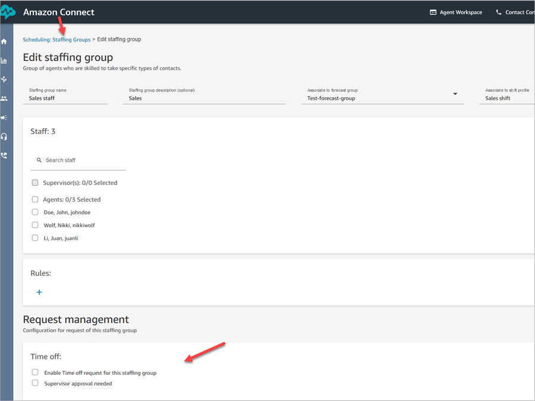
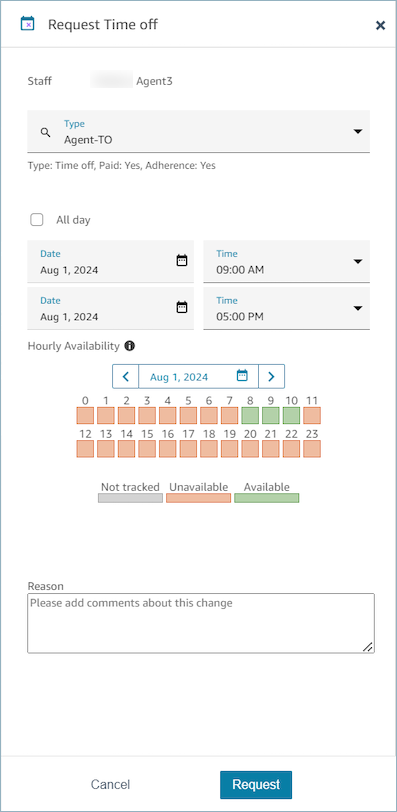
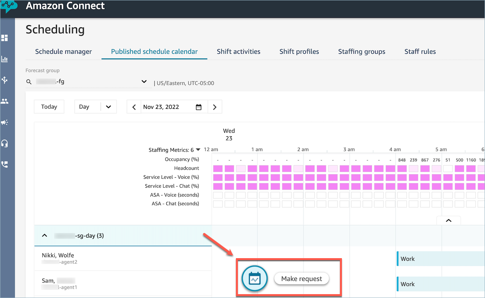
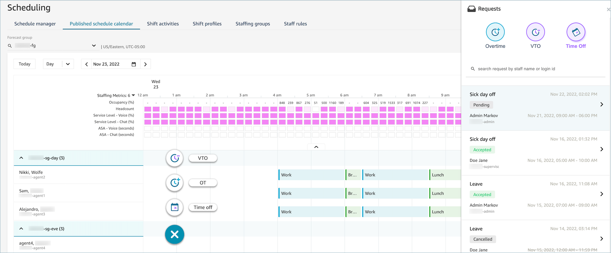

# Enable time off for Amazon Connect contact center

agents

You enable time off management for each staffing group. The following image shows
the **Request management** section of the **Edit staffing
group** page where you configure time off settings.

Choose from the following options:

- **Enable Time off request for this staffing
  group**: This option enables the time off management feature
  for this group of agents and supervisors. Time offs are automatically
  approved or rejected based on the availability of [time off allowance](config-group-allowance-to.md "config-group-allowance-to.md").

After you choose this option:

    + Agents can see the **Time off** widget on the
     agent application. (Agents also require the **Agent
     application schedule calendar - Edit** security profile
     permission to see the widget.)

    The following image shows an example of the **Time off** widget on the agent application.

    
    + Supervisors can see the **Make request** button
     on the **Published schedule calendar** page.
     Pending and completed requests are visible in the [request
     drawer](manager-agent-view-request-drawer-to.md "manager-agent-view-request-drawer-to.md").

    The following image shows the location of the **Make
     request** button on the **Published schedule
     calendar** page.

    

- **Supervisor approval needed**: Choose this
  option if supervisors need to review every timeoff request, regardless of
  available balances. Supervisors will need to manually approve or decline all
  agent time off requests before they are added to the schedule.

If this option is **not** selected for the
staffing group, then a request that meets **both** of the following criteria is auto-approved:

    + The request is within the agent's available time off
     balance.
    + The request is within the [group allowance](config-group-allowance-to.md "config-group-allowance-to.md") set
     by the business for the specified time period.

Requests that are not auto-approved are displayed as follows:

    + Supervisor drawer: Requests are listed for manual approval. The
     supervisor has the option to choose **Override time off
     rules** to override any allowances configured for the
     agent or group allowance. The following image shows a list of time
     off requests in the supervisor drawer.

    
    + Agent application: Requests are displayed as **Awaiting
     Approval**.

## Assign security profile permissions to

agents so they can request time off

The agent's security profile needs to include the following permissions so
they can access the **Time off** widget on their schedule:

- **Agent Applications** - **Agent application
  schedule calendar** - **Edit**

If the agent has only **View** permissions, the
**Time off** widget does not appear in the agent
schedule.

For more information about the agent's experience, see [Agent initiated time off request](create-time-off-to.md#to-agent "create-time-off-to.md#to-agent").
