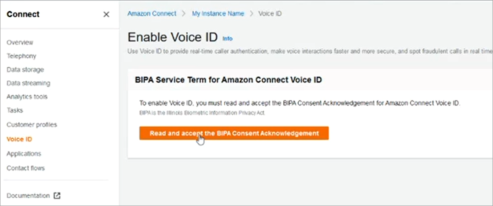
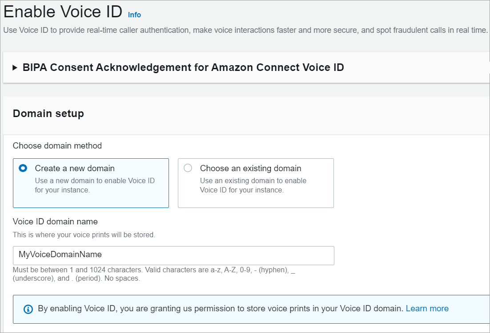
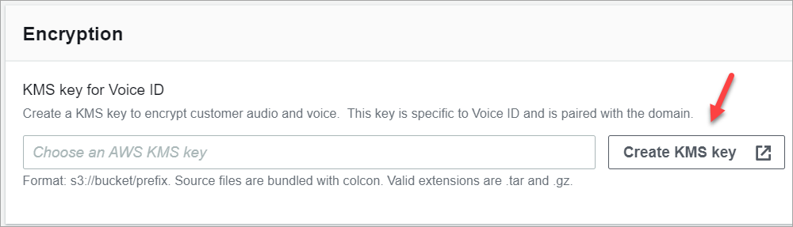

# Get started enabling Voice ID in Amazon Connect

###### Note

End of support notice: On May 20, 2026, AWS will end support for Amazon Connect
Voice ID. After May 20, 2026, you will no longer be able to access Voice ID on the
Amazon Connect console, access Voice ID features on the Amazon Connect admin website or Contact Control Panel, or access Voice ID
resources. For more information, visit [Amazon Connect
Voice ID end of support](amazonconnect-voiceid-end-of-support.md "amazonconnect-voiceid-end-of-support.md").

## Before you begin

Before you get started, complete the following tasks.

###### Tasks

- [Grant the required
  permissions](#enable-voiceid-permissions "#enable-voiceid-permissions")
- [Decide how to name your Voice ID
  domain](#enable-voiceid-domains "#enable-voiceid-domains")
- [Create an AWS KMS key to
  encrypt data stored in the domain](#enable-voiceid-awsmanagedkey "#enable-voiceid-awsmanagedkey")

### Grant the required

permissions

You must grant the required permissions to users, groups, or roles. For more
information, see [AmazonConnectVoiceIDFullAccess](security_iam_awsmanpol.md#amazonconnectvoiceidfullaccesspolicy "security_iam_awsmanpol.md#amazonconnectvoiceidfullaccesspolicy").

Access to Voice ID APIs using the Contact Control Panel (CCP) is disabled by
default.

### Decide how to name your Voice ID

domain

When you enable Voice ID, you are prompted to provide a friendly domain name
that's meaningful to you such as your organization name, for example,
_Voice ID-ExampleCorp_.

### Create an AWS KMS key to

encrypt data stored in the domain

When you enable Voice ID, you are prompted to create or provide an [AWS KMS key](../../../kms/latest/developerguide/concepts.md#kms_keys "../../../kms/latest/developerguide/concepts.md#kms_keys"). It
encrypts the customer data stored by Voice ID such as audio files, voiceprints,
and the speaker identifiers.

Step-by-step instructions for creating these KMS keys are provided in [Step 2: Create a new Voice ID domain and
encryption key](#enable-voiceid-step2 "#enable-voiceid-step2").

Data at rest—specifically, freeform fields that you provide plus audio
files/voiceprints—are encrypted under the KMS key you choose. Your
customer managed key is created, owned, and managed by you. You have full control over the
KMS key (AWS KMS charges apply).

When making calls to Voice ID for anything other than
`CreateDomain` or `UpdateDomain`, the user making the
call requires `kms:Decrypt` permissions for the key associated with
the domain. When making calls to `CreateDomain` or
`UpdateDomain`, the user also requires
`kms:DescribeKey` and `kms:CreateGrant` permissions
for the key. When you create (or update) a Voice ID domain, it creates a grant
on the KMS key so that it can be used by Voice ID asynchronous processes
(such as speaker enrollment) and by the Amazon Connect service-linked role during your
flows. This grant includes an encryption context specifying the domain with
which the key is associated. For more on grants, see [Using grants](../../../kms/latest/developerguide/grants.md "../../../kms/latest/developerguide/grants.md") in the
AWS Key Management Service Developer Guide.

If you create a domain and associate it with one key, store some data, and
then change the KMS key to a different key, an asynchronous process will be
triggered to re-encrypt the old data with the new KMS key. After this process
completes, all of your domain's data will be encrypted under the new KMS key,
and you may safely retire the old key. For more information, see [UpdateDomain](../../../voiceid/latest/APIReference/API_UpdateDomain.md "../../../voiceid/latest/APIReference/API_UpdateDomain.md").

###### Tip

You can create KMS keys or provide an existing KMS key
programmatically. For more information, see [Amazon Connect Voice ID APIs](../../../voiceid/latest/APIReference.md "../../../voiceid/latest/APIReference.md").

## Step 1: Read the BIPA Consent

Acknowledgement

Reading the Biometric Privacy Act (BIPA) Consent Acknowledgement is a requirement
to enable Voice ID. You need to do this once per account, across all Regions. You
cannot do this step by using APIs. For more information about BIPA, see this
Wikipedia article: [Biometric
Information Privacy Act](https://en.wikipedia.org/wiki/Biometric_Information_Privacy_Act "https://en.wikipedia.org/wiki/Biometric_Information_Privacy_Act").

1. Open the Amazon Connect console at
   [https://console.aws.amazon.com/connect/](https://console.aws.amazon.com/connect/ "https://console.aws.amazon.com/connect/").
2. On the instances page, choose the instance alias. The instance alias is also
   your **instance name**, which appears in your Amazon Connect
   URL. The following image shows the **Amazon Connect virtual contact center instances** page, with a box
   around the instance alias.

 3. In the navigation pane, choose **Voice ID**. Read the
BIPA Consent Acknowledgement, and accept if you agree.

## Step 2: Create a new Voice ID domain and

encryption key

You can perform this step using the Amazon Connect console or by using Amazon Connect and Voice ID
APIs.

Amazon Connect console instructions

1. In the **Domain setup** section, choose
   **Create a new domain**.

 2. In the **Domain name** box, enter a friendly
name that's meaningful to you, such as your organization name,
for example, _VoiceID-ExampleCorp_. 3. Under **Encryption**, create or enter your
own AWS KMS key for encrypting your Voice ID domain.
Following are the steps to create your KMS key key:

    1. Choose **Create KMS key**.

    
    2. A new tab in your browser opens for the Key Management
     Service (KMS) console. On the **Configure
     key** page, choose
     **Symmetric**, and then choose
     **Next**.

    
    3. On the **Add labels** page, add a
     name and description for the KMS key, and then choose
     **Next**.
    4. On the **Define key administrative
     permissions** page, choose
     **Next**.
    5. On the **Define key usage
     permissions** page, choose
     **Next**.
    6. On the **Review and edit key policy**
     page, choose **Finish**.
    7. Return to the tab in your browser for the Amazon Connect
     console, **Voice ID** page. Click or
     tap in the **AWS KMS key** for the
     key you created to appear in a dropdown list. Choose the
     key you created.

4. Choose **Enable Voice ID**.

API instructions

1. Call the [CreateDomain](../../../voiceid/latest/APIReference/API_CreateDomain.md "../../../voiceid/latest/APIReference/API_CreateDomain.md") API to create a new Voice ID
   domain.
2. Call the [CreateIntegrationAssociation](../APIReference/API_CreateIntegrationAssociation.md "../APIReference/API_CreateIntegrationAssociation.md") API to associate the
   Voice ID domain with the Amazon Connect instance.
   1. Pass the ARN of the Voice ID domain just created into
      the `IntegrationArn` parameter. For
      `IntegrationType` use
      `VOICE_ID`.

You've enabled Voice ID for your instance. The following has been created:

- Your Voice ID domain and a default fraudster watchlist that will hold
  your fraudsters.
- A managed Amazon EventBridge rule in your account. This rule is used to ingest
  Voice ID events for creating contact records related to Voice ID.
  Additionally, Amazon Connect adds [Voice ID
  permissions](connect-slr.md "connect-slr.md") to the service-linked role for Amazon Connect.

Next, in Step 3 you configure how you want Voice ID to work in your flow.

## Step 3: Configure Voice ID in your contact

flow

In this step you add the required blocks to your flow and configure how you want
Voice ID to work.

- [Play prompt](play.md "play.md"): Add this block before
  the [Set Voice ID](set-voice-id.md "set-voice-id.md") block
  to stream audio properly. You can edit it to include a simple message such
  as "Welcome."
- [Set Voice ID](set-voice-id.md "set-voice-id.md"): After
  the [Play prompt](play.md "play.md") block, add the [Set Voice ID](set-voice-id.md "set-voice-id.md") block. It
  should be at the start of a call. Use this block to start streaming audio to
  Amazon Connect Voice ID to verify the caller's identity, as soon as the call is
  connected to a flow.

In **Set Voice ID** block you configure the
authentication threshold, response time, fraud threshold, and fraudster
watchlist to be used for known fraudster detection.

- [Set contact
  attributes](set-contact-attributes.md "set-contact-attributes.md"): Use to pass the
  `CustomerId` attribute to Voice ID. The
  `CustomerId` may be a customer number from your CRM, for
  example. You can create a Lambda function to pull the unique customer ID of
  the caller from your CRM system. Voice ID uses this attribute as the
  `CustomerSpeakerId` for the caller.

###### Note

`CustomerId` can be an alphanumeric value. It supports only
\_ and - (underscore and hyphen) special characters. It does not need to
be UUID. Since Voice ID stores biometric information for each speaker,
we strongly recommend that you use an identifier that does not contain
PII in the CustomerSpeakerId field. For more information, see
`CustomerSpeakerId` in the [Speaker](../../../voiceid/latest/APIReference/API_Speaker.md "../../../voiceid/latest/APIReference/API_Speaker.md")
data type.

- [Check Voice ID](check-voice-id.md "check-voice-id.md"): Use
  to check the response from Voice ID for enrollment status, voice
  authentication, and fraud detection, and then branch based on one of the
  returned statuses.

### Example Voice ID flow

**Caller not enrolled**

1. When a customer calls for the first time, their
   `CustomerId` is passed to Voice ID using the [Set contact
   attributes](set-contact-attributes.md "set-contact-attributes.md") block.
2. Voice ID looks for `CustomerId` in its database. Since
   it's not there, it sends a **Not enrolled** result
   message. The [Check Voice ID](check-voice-id.md "check-voice-id.md") block branches based on this
   result, and you can decide what the next step should be. For example,
   you might want agents to enroll the customer in voice
   authentication.
3. Voice ID starts listening to the customer's speech after the contact
   has encountered the [Set Voice ID](set-voice-id.md "set-voice-id.md") block, where Voice ID is
   enabled. It listens until it accummulates 30 seconds of net speech or
   the call ends, whichever happens first.

**Caller enrolled**

1. The next time the customer calls, Voice ID finds their
   `CustomerId` in the database.
2. Voice ID starts listening to the audio to create a voiceprint. The
   voiceprint that is created this time is used for authentication purposes
   so Voice ID can compare if the caller had been enrolled
   previously.
3. It compares the caller's current voiceprint with the stored
   voiceprint associated with the claimed identity. It returns a result
   based on the **Authentication threshold** property you
   configured in the [Set Voice ID](set-voice-id.md "set-voice-id.md") block.
4. After it evaluates the speech, it returns the message
   **Authenticated** if the voiceprints are similar.
   Or it returns one of the other statuses.
5. The contact is then routed down the appropriate branch by the [Check Voice ID](check-voice-id.md "check-voice-id.md")
   block.
