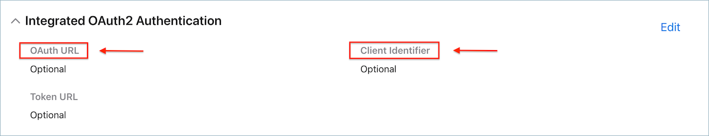
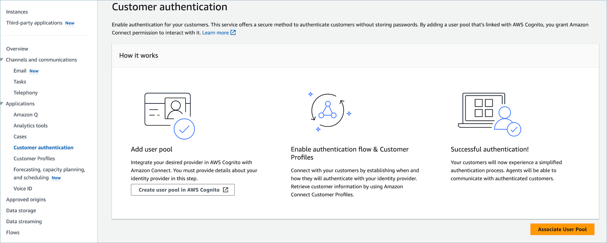
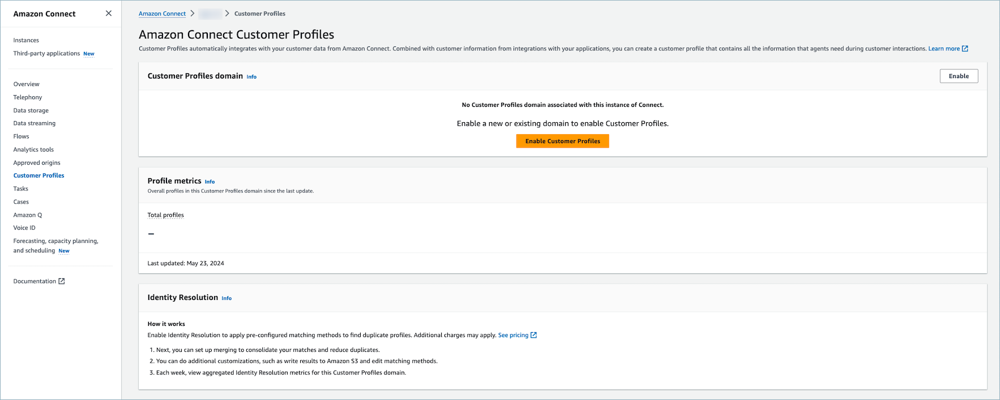

# Enable

authentication for Apple Messages for Business

To begin the setup process, first navigate to your Identity Provider.

## Identity Provider Configuration

The following Amazon Connect domain must be registered as an allowed Redirect URI for the
Identity Provider(s) used for authentication:

```
https://participant.connect.`region`.amazonaws.com/participant/authentication/update

```

## Integration with Amazon Cognito

You can [add your Identity Provider(s)](../../../cognito/latest/developerguide/cognito-user-pools-identity-provider.md "../../../cognito/latest/developerguide/cognito-user-pools-identity-provider.md") to an existing Amazon Cognito user pool or create
a new [Amazon Cognito user
pools](../../../cognito/latest/developerguide/cognito-user-identity-pools.md "../../../cognito/latest/developerguide/cognito-user-identity-pools.md").

Within this user pool you can create an [app
client](../../../cognito/latest/developerguide/user-pool-settings-client-apps.md "../../../cognito/latest/developerguide/user-pool-settings-client-apps.md") and select some or all of your Identity Providers. Take note of
the app client's client ID. For this app client, the following Amazon Connect domain must be
added as an Allowed callback URL:

```
https://participant.connect.`region`.amazonaws.com/participant/authentication/update

```

###### Note

You must select **Don't generate a client secret**  when
configuring the Amazon Cognito app client. Only Amazon Cognito app clients without client secrets
are supported.

## Configure your Amazon Cognito app client with the Apple Messages for Business

Portal

On **Integrated OAuth2 Authentication**, configure your Amazon Cognito
app client client ID as the **Client Identifier** and your Amazon Cognito
user pool domain's [authorization
endpoint](../../../cognito/latest/developerguide/authorization-endpoint.md "../../../cognito/latest/developerguide/authorization-endpoint.md") as the **OAuth URL**.



## Configure your user pools

with Amazon Connect

On the **Customer authentication** page on the Amazon Connect console
associate the user pool that will be used for the authentication.



## Enable Amazon Connect Customer Profiles

**Enable Customer Profiles**

On the **Customer Profiles** page in Amazon Connect console, ensure that
Customer Profiles is enabled for your instance. If **No Customer Profiles domain associated with this
instance of Amazon Connect.** is displayed, then see [Enable Customer Profiles for your Amazon Connect instance](enable-customer-profiles.md "enable-customer-profiles.md").



### Grant Customer Profile permission(s) to security profiles

(optional)

To grant users (agent, admin) permissions to view/edit/publish Customer
Profiles in Agent Workspace, see [Update Customer Profiles permissions
for agents](security-profile-customer-profile-agent.md "security-profile-customer-profile-agent.md"). After
permission(s) are granted to security profile(s), users should be able to access
the features in the Agent Workspace.

For a detailed list of permissions, see [Customer Profiles security profile
permissions](security-profile-list.md#customerprofiles-permissions-list "security-profile-list.md#customerprofiles-permissions-list").

## Configure the Authenticate Customer flow block

For instructions, see [Flow block in Amazon Connect: Authenticate
Customer](authenticate-customer.md "authenticate-customer.md").
